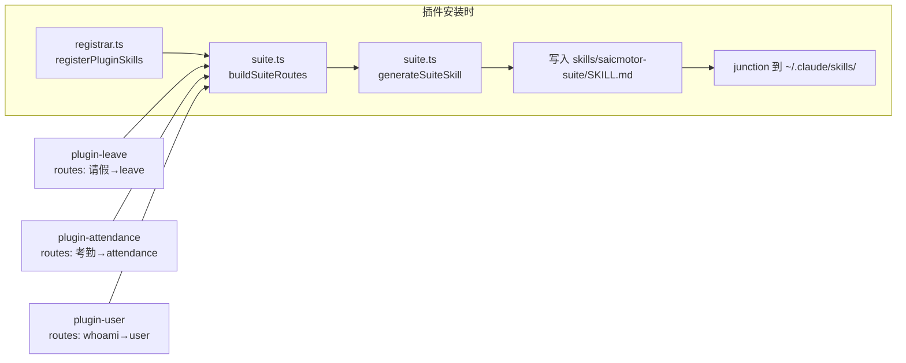

# saicmotor 2.0 架构白皮书

> **@saicmotor/cli 1.0.0** — 面向 AI Agent 的插件化企业 CLI 平台。
> 声明式接口、AI 原生路由、引擎管道执行、插件生态分发。

---

## 目录

- [1. 一句话架构](#1-一句话架构)
- [2. 三层架构全景图](#2-三层架构全景图)
- [3. AI Agent 路径：从意图到执行](#3-ai-agent-路径从意图到执行)
- [4. CLI 执行管道](#4-cli-执行管道)
- [5. 插件生态](#5-插件生态)
- [6. 加载器](#6-加载器)
- [7. Skills 注册器与 Suite 路由聚合](#7-skills-注册器与-suite-路由聚合)
- [8. 开发者工具链](#8-开发者工具链)
- [9. 配置与认证](#9-配置与认证)
- [10. 仓库结构](#10-仓库结构)
- [11. 数据流与序列图](#11-数据流与序列图)

---

## 1. 一句话架构

```
AI Agent 读 SKILL.md 发现能力 → CLI 从 catalog 声明式注册命令 → 引擎管道执行（脚本或 HTTP） → 输出
```

三个角色：**AI Agent（决策者）** → **CLI 引擎（执行者）** → **上游网关（数据源）**。
插件生态贯穿始终——业务系统以独立 npm 包分发，不触碰核心代码。

---

## 2. 三层架构全景图

```
┌─────────────────────────────────────────────────────────────────────┐
│                         🧠 编排层（Skills）                           │
│                                                                     │
│   skills/saicmotor-suite/SKILL.md   ← AI 入口，动态路由表            │
│   skills/saicmotor-leave/SKILL.md   ← 请假业务操作手册               │
│   skills/saicmotor-user/SKILL.md    ← 用户信息操作手册               │
│                                                                     │
│   面向：AI Agent ● 格式：Markdown + YAML Frontmatter                 │
├─────────────────────────────────────────────────────────────────────┤
│                        📋 声明层（Catalog）                           │
│                                                                     │
│   catalog/services/leave.json          ← 核心内置                    │
│   plugins/…/catalog/services/user.json ← 插件贡献                    │
│                                                                     │
│   面向：CLI 引擎 ● 格式：JSON Schema（zod 校验）                      │
├─────────────────────────────────────────────────────────────────────┤
│                      ⚙️ 执行层（Engine）                              │
│                                                                     │
│   run.ts → catalog.ts → script.ts → http.ts → output.ts             │
│   auth/session.ts · auth/transport.ts · auth/store.ts               │
│                                                                     │
│   面向：操作系统 ● 技术：Node 20 + TypeScript + Commander             │
├─────────────────────────────────────────────────────────────────────┤
│                      📦 插件层（Plugin System）                       │
│                                                                     │
│   loader.ts · registrar.ts · suite.ts · paths.ts · state.ts         │
│   plugin-cmds.ts · tooling-cmds.ts                                  │
│   @saicmotor/sdk（类型契约）                                         │
│                                                                     │
│   面向：插件开发者 ● 分发：npm registry                              │
└─────────────────────────────────────────────────────────────────────┘
```

**加新业务系统只改上面两层**——写一份 catalog JSON + 一份 SKILL.md，引擎和插件框架不动。

---

## 3. AI Agent 路径：从意图到执行

### 3.1 路由发现

```
用户说"帮我请年假"
        │
        ▼
┌───────────────────────────────────┐
│  AI Agent 读取                     │
│  saicmotor-suite/SKILL.md         │
│                                    │
│  ┌──────────────────────────┐     │
│  │ 意图       → 入口 Skill   │     │
│  │──────────────────────────│     │
│  │ 请假       → saicmotor-leave   │
│  │ 休假       → saicmotor-leave   │
│  │ leave      → saicmotor-leave   │
│  │ 考勤       → saicmotor-att..   │
│  │ 用户信息   → saicmotor-user    │
│  │ whoami     → saicmotor-user    │
│  └──────────────────────────┘     │
│  （此表由注册器自动聚合）         │
└──────────────┬────────────────────┘
               │ 匹配 "请假"
               ▼
┌───────────────────────────────────┐
│  AI Agent 读取                     │
│  saicmotor-leave/SKILL.md         │
│                                    │
│  了解：                            │
│  - 先查余额 leave balance query   │
│  - 再提交 leave applications …    │
│  - 写操作需 --yes 确认             │
└──────────────┬────────────────────┘
               │ 编排命令链
               ▼
       saicmotor leave applications submit \
         --start-date 2026-09-21 --reason 年假 --yes
```

### 3.2 Suite 路由自动生成



**关键设计：** `saicmotor-suite` 不是手写文件——它由 `registerPluginSkills()` 在每次安装/卸载时重新生成，聚合所有已装插件的 `routes` 字段。

---

## 4. CLI 执行管道

### 4.1 管道全景

```
saicmotor leave applications submit --start-date 2026-09-21 --reason 年假 --yes
│
├─ 1. Commander 动态注册命令
│     cli/index.ts → loadCatalog() + loadPlugins() → 为每个 service.resource.method 注册子命令
│     参数 --kebab-case 自动映射到 catalog 声明字段
│
├─ 2. runMethod(config, service, resource, method, raw, opts)
│     │
│     ├─ coerceFields()         ← 校验参数、类型转换（string→int/float/boolean）
│     │
│     ├─ findScript()           ← 检测脚本覆盖（优先级见 §4.3）
│     │    │
│     │    ├─ 有脚本 → executeScript() → 脚本内自行 HTTP + 认证
│     │    │            └─ ctx.ensureToken() 由引擎注入
│     │    │
│     │    └─ 无脚本 → HTTP 直连管线（以下三步）
│     │
│     ├─ ensureToken()          ← 有缓存用缓存，无缓存触发 auth login
│     │
│     ├─ buildUrl() + buildBody() + send()
│     │    └─ fetch(method, url, headers, body) 超时 15s
│     │
│     ├─ 401？ → clearToken() → ensureToken(force=true) → 重试一次
│     │
│     └─ checkEnvelope()        ← 校验 HTTP status < 400 && body.code === 0
│
└─ 4. formatJson / formatTable / formatEnvelope → stdout
```

### 4.2 引擎模块一览

| 模块 | 文件 | 职责 |
|------|------|------|
| **入口** | `cli/index.ts` | Commander 初始化、动态注册命令、install 子命令 |
| **管道** | `engine/run.ts` | `runMethod()` — 编排整条执行管道 |
| **Catalog** | `engine/catalog.ts` | `loadCatalog()` — 从 `catalog/services/*.json` 加载并 zod 校验 |
| **脚本** | `engine/script.ts` | `findScript()` + `executeScript()` — 四层查找 + 动态 import |
| **HTTP** | `engine/http.ts` | `send()` — fetch 封装、超时、JSON 自动解析 |
| **请求构造** | `engine/request.ts` | `buildUrl/buildBody/coerceFields` |
| **输出** | `engine/output.ts` | JSON / Table / Pretty 三格式 |
| **错误** | `engine/errors.ts` | `SaicmotorError` 结构化错误（code + message + detail） |

### 4.3 脚本查找优先级

```
优先级从高到低：

1. SAICMOTOR_SCRIPTS 环境变量显式覆盖（测试/定制场景）
     → $SAICMOTOR_SCRIPTS/<svc>/<res>/<method>.{js,ts}

2. 已加载插件的 scripts 目录（插件贡献）
     → <plugin-root>/<scripts-dir>/<svc>/<res>/<method>.js

3. 编译产物（npm 安装形态）
     → dist/scripts/<svc>/<res>/<method>.js

4. 源码树（本地 tsx 开发）
     → scripts/<svc>/<res>/<method>.ts
```

---

## 5. 插件生态

### 5.1 插件包结构

```
plugin-<name>/                       ← 独立的 npm 包 / Git 仓库
├── package.json                     ← @saicmotor/plugin-<name>
├── saicmotor.plugin.json            ← 🔑 插件 manifest（核心声明）
├── catalog/
│   └── services/
│       └── <name>.json              ← 服务声明（API 接口 + 参数 schema）
├── skills/
│   └── saicmotor-<name>/
│       └── SKILL.md                 ← AI Agent 操作手册
├── scripts/                         ← 自定义脚本（可选，覆盖 HTTP 回放）
│   └── <service>/
│       └── <resource>/
│           └── <method>.ts
├── src/                             ← 辅助源码（如果有）
└── test/
```

### 5.2 Manifest 字段（saicmotor.plugin.json）

```typescript
{
  name: string;                              // 必须 "@saicmotor/plugin-*"
  engine: string;                            // semver range，如 "^1.0.0"
  catalog?: string[];                        // catalog 文件列表
  skills?: string[];                         // skills 目录列表
  scripts?: string;                          // scripts 根目录
  routes?: Record<string, string>;           // suite 意图路由
}
```

### 5.3 插件安装路径

```
~/.saicmotor/plugins/
├── linked/                           ← dev link（saicmotor dev）
│   └── plugin-my-system/             ← junction → 本地工程目录
├── node_modules/                     ← npm install 安装（registry）
│   └── @saicmotor/
│       └── plugin-leave/
└── state.json                        ← 插件状态清单
```

**双根扫描、linked 优先：** `linked/` 下的同名插件覆盖 `node_modules/`。开发时 `saicmotor dev` 建立 junction，list 命令显示 `linked` 标记。

### 5.4 插件生命周期命令

```
saicmotor plugin install <name>       ← npm install → node_modules → register
saicmotor plugin uninstall <name>     ← npm uninstall → 清理 skills
saicmotor plugin list [--json]        ← 列出所有已装插件 + 状态
saicmotor plugin enable <name>        ← state.enabled = true
saicmotor plugin disable <name>       ← state.enabled = false（不卸载，仅停用）
saicmotor plugin upgrade <name>       ← npm update
```

### 5.5 脚本执行上下文（@saicmotor/sdk）

插件脚本签名：

```typescript
import type { ScriptContext, ScriptFn, RunResult } from "@saicmotor/sdk";

const fn: ScriptFn = async (ctx: ScriptContext): Promise<RunResult> => {
  // ctx.config     — 网关配置
  // ctx.service    — catalog 声明的 service
  // ctx.method     — 当前 method（path / httpMethod / requestBody）
  // ctx.values     — 用户传参（已过 coerceFields）
  // ctx.dryRun     — --dry-run 标志
  // ctx.ensureToken() → Promise<string>  — 获取/刷新 auth token

  const token = await ctx.ensureToken();
  const resp = await fetch(`${ctx.config.gateway}/api/...`, {
    headers: { Authorization: `Bearer ${token}` },
  });
  // ...
};
```

**原则：声明式能解决就不写脚本。** 简单 CRUD 只用 catalog JSON；需要前置校验、多步编排、响应聚合时才落脚本。

---

## 6. 加载器

### 6.1 loadPlugins() 流程图

```
loadPlugins(config)
│
├─ loadState()                         ← 读取 ~/.saicmotor/plugins/state.json
│
├─ for root in [linked/, node_modules/]:    ← linked 优先
│    │
│    ├─ fs.readdirSync(root)           ← 扫描所有目录
│    │
│    ├─ 过滤：只处理 plugin-* 前缀
│    │
│    ├─ 读取 saicmotor.plugin.json     ← 校验 manifest
│    │    └─ 失败 → 警告 + skip
│    │
│    ├─ 同名去重                        ← linked 覆盖 registry
│    │
│    ├─ engine 兼容检查                 ← semver.satisfies(CORE_VERSION, manifest.engine)
│    │    └─ 不兼容 → 警告 + 禁用
│    │
│    ├─ loadPluginServices()           ← 读取 catalog/services/*.json
│    │    └─ 单个文件损坏不影响其他
│    │
│    ├─ service 冲突检测                ← 相同 service.name 拒绝后加载者
│    │
│    └─ state.enabled 检查              ← disabled 插件不加载
│
├─ loaded.sort()                       ← 字母序确保可预测
│
└─ return { plugins, warnings }
```

### 6.2 关键决策

| 决策 | 规则 |
|------|------|
| **同名插件** | linked 优先于 registry |
| **同名 service** | 先加载者优先；后加载者该 service 被过滤（警告） |
| **不兼容 engine** | 跳过加载，输出警告 |
| **disabled 插件** | 跳过不加载（不卸载文件） |
| **catalog 坏文件** | 单文件跳过，其他正常 |

---

## 7. Skills 注册器与 Suite 路由聚合

### 7.1 Skills 注册流程

```
registerPluginSkills(pkgRoot, skillDirs)
│
├─ for each skillDir:
│    │
│    └─ registerSkill(skillDir, skillName)
│         │
│         ├─ 目标：~/.claude/skills/<name>/
│         │         ~/.agents/skills/<name>/
│         │         ~/.codebuddy/skills/<name>/
│         │
│         ├─ 策略：
│         │    ├─ 1. junction（Windows，无管理员需求）
│         │    ├─ 2. 复制目录（降级）
│         │    └─ 3. skipped（目标已存在）
│         │
│         └─ 返回 SkillRegResult[]
│
├─ 刷新 suite：
│    ├─ buildSuiteRoutes()             ← 聚合所有已装插件的 routes
│    ├─ generateSuiteSkill()           ← 生成 SKILL.md（含 YAML frontmatter）
│    ├─ 写入 skills/saicmotor-suite/SKILL.md
│    └─ registerSkill(suiteDir, "saicmotor-suite")
│
└─ return allResults
```

### 7.2 AI 客户端映射

| AI 客户端 | Skills 目录 |
|-----------|-------------|
| Claude | `~/.claude/skills/` |
| Cursor / Agent | `~/.agents/skills/` |
| CodeBuddy | `~/.codebuddy/skills/` |

---

## 8. 开发者工具链

```
saicmotor create plugin <name>    ← 生成标准插件骨架
saicmotor validate <dir>          ← 校验 manifest + catalog 完整性
saicmotor dev [--stop]            ← 建立/解除 linked junction
```

### 8.1 插件开发工作流

```
saicmotor create plugin my-system       ──→  生成 plugin-my-system/ 骨架
cd plugin-my-system && npm install      ──→  安装依赖
# 编辑 catalog/services/my-system.json  ──→  声明 API
# 编辑 skills/saicmotor-my-system/      ──→  写 AI 操作手册
saicmotor dev                            ──→  linked → 全局可用
saicmotor my-system --help               ──→  验证命令
saicmotor validate .                     ──→  校验通过
npm publish --registry=<内部 registry>   ──→  发布
```

---

## 9. 配置与认证

### 9.1 配置加载链

```
环境变量 (SAICMOTOR_GATEWAY / SAICMOTOR_AUTH_TYPE)
        ↓ 覆盖
~/.saicmotor/config.json（用户配置）
        ↓ 覆盖
saicmotor.config.json（包默认值）
        ↓ 兜底
DEFAULT_CONFIG（代码硬编码）
```

### 9.2 认证流程

```
runMethod()
  │
  ├─ ensureToken(config)
  │    ├─ 检查内存缓存（session.ts）
  │    ├─ 未过期 → 返回 token
  │    └─ 过期/无 → auth.login()
  │         ├─ password 类型 → POST /auth/login { username, password }
  │         └─ exchange 类型 → GET /auth/exchange/start → 浏览器回调 → POST /auth/exchange
  │
  ├─ applyAuth(headers, config, token)   ← Authorization: Bearer <token>
  │
  ├─ send() → 401？
  │    └─ clearToken() → ensureToken(force=true) → 重试一次
  │
  └─ 成功
```

### 9.3 安全

- 凭证存储 `~/.saicmotor/credentials.json`，`mode 0600`
- 环境变量覆盖：`SAICMOTOR_USERNAME` / `SAICMOTOR_PASSWORD`
- 写操作（POST/PUT/DELETE）默认拒绝，需 `--yes` 或 `--dry-run`
- Token 不过期不重登，仅 401 触发重登 + 重试一次
- 成功 → stdout + exit 0；错误 → stderr + 结构化 JSON + 语义化退出码

---

## 10. 仓库结构

```
saicmotor-cli/                           ← monorepo（npm workspaces）
│
├── packages/
│   ├── cli/                             ← 🎯 @saicmotor/cli（核心）
│   │   ├── src/cli/                       命令面：index.ts 动态注册 + plugin-cmds + tooling-cmds
│   │   ├── src/engine/                    引擎管道：catalog / run / script / http / request / output
│   │   ├── src/auth/                      认证：store / login / session / transport / provider
│   │   ├── src/plugin/                    插件系统：loader / registrar / suite / paths / state
│   │   ├── src/install/                   Skills 安装器
│   │   ├── src/schema/                    Catalog JSON 的 zod 校验
│   │   ├── catalog/services/             核心内置服务声明（空——业务能力全在插件）
│   │   ├── scripts/                      核心内置脚本
│   │   ├── skills/                       核心 skills（saicmotor-suite + saicmotor-shared）
│   │   └── test/                         89 测试（unit + scripts）
│   │
│   ├── sdk/                              ← 📐 @saicmotor/sdk（类型契约）
│   │   └── src/                            manifest.ts / context.ts / catalog-types.ts / config-types.ts
│   │
│   ├── plugin-user/                      ← 👤 用户信息插件
│   │   ├── catalog/services/user.json    ← GET /api/user/me
│   │   ├── skills/saicmotor-user/        ← AI 操作手册
│   │   └── saicmotor.plugin.json
│   │
│   ├── plugin-leave/                     ← 📅 请假插件
│   │   ├── catalog/services/leave.json
│   │   ├── scripts/leave/applications/submit.ts  ← 前置校验脚本
│   │   ├── skills/saicmotor-leave/
│   │   └── saicmotor.plugin.json
│   │
│   └── plugin-attendance/               ← 🕐 考勤插件
│       ├── catalog/services/attendance.json
│       ├── scripts/attendance/corrections/submit.ts ← 补卡脚本
│       ├── skills/saicmotor-attendance/
│       └── saicmotor.plugin.json
│
├── docs/
│   ├── ARCHITECTURE.2.0.md               ← 你正在读的文档
│   ├── DEVELOPER.md                      ← 插件开发手册
│   └── sprint/                           ← Sprint 规划
│
├── mock-gateway/                         ← 🧪 模拟网关（Spring Boot 8081）
├── mock-services/                        ← 🧪 模拟业务系统（Spring Boot 8080）
└── package.json                          ← monorepo root（workspaces 声明）
```

---

## 11. 数据流与序列图

### 11.1 插件安装全链路

```
用户: saicmotor plugin install leave
        │
CLI     │  plugin-cmds.ts
        │  ├─ npm install @saicmotor/plugin-leave → node_modules/
        │  ├─ loadPlugins()                  ← 重新扫描
        │  ├─ registerPluginSkills()         ← junction skills 到 AI 客户端
        │  │    └─ buildSuiteRoutes()        ← 聚合所有 plugins' routes
        │  │    └─ generateSuiteSkill()      ← 刷新 saicmotor-suite
        │  └─ saveState()                    ← 写入 state.json
        │
结果    │  saicmotor leave --help 可用
        │  AI 在 saicmotor-suite 看到 "请假 → saicmotor-leave"
```

### 11.2 命令执行全链路

```
┌──────────┐    ┌──────────────┐    ┌──────────────┐    ┌──────────┐
│  AI Agent │    │  CLI Engine  │    │  Plugin      │    │  Gateway │
│           │    │              │    │  Script      │    │          │
└─────┬─────┘    └──────┬───────┘    └──────┬───────┘    └────┬─────┘
      │                 │                   │                 │
      │ 读 SKILL.md     │                   │                 │
      │────────────────>│                   │                 │
      │                 │                   │                 │
      │ 执行命令         │                   │                 │
      │────────────────>│                   │                 │
      │                 │                   │                 │
      │                 │ Commander 解析     │                 │
      │                 │ ├─ 动态命令注册    │                 │
      │                 │ ├─ coerceFields   │                 │
      │                 │ └─ findScript     │                 │
      │                 │                   │                 │
      │                 │ 有脚本覆盖         │                 │
      │                 │──────────────────>│                 │
      │                 │                   │                 │
      │                 │                   │ ctx.ensureToken │
      │                 │                   │ (引擎注入)      │
      │                 │<──────────────────│                 │
      │                 │                   │                 │
      │                 │                   │ fetch()         │
      │                 │                   │────────────────>│
      │                 │                   │                 │
      │                 │                   │    HTTP Response│
      │                 │                   │<────────────────│
      │                 │                   │                 │
      │                 │   RunResult       │                 │
      │                 │<──────────────────│                 │
      │                 │                   │                 │
      │                 │ formatEnvelope    │                 │
      │   { ok: true }  │                   │                 │
      │<────────────────│                   │                 │
```

### 11.3 插件加载决策树

```
                    加载插件 X
                        │
              ┌─────────┴──────────┐
              │  manifest 可解析？  │
              └─────────┬──────────┘
                   ✓    │    ✗ → 警告 + skip
              ┌─────────┴──────────┐
              │ engine 兼容？       │
              │ semver.satisfies   │
              │ (CORE_VERSION,     │
              │  manifest.engine)  │
              └─────────┬──────────┘
                   ✓    │    ✗ → 警告 + 禁用
              ┌─────────┴──────────┐
              │ 同名已加载？        │
              │ (linked 覆盖       │
              │  registry)         │
              └─────────┬──────────┘
                  ✗     │    ✓ → skip（linked 胜）
              ┌─────────┴──────────┐
              │ state.enabled?     │
              └─────────┬──────────┘
                  ✓     │    ✗ → skip
              ┌─────────┴──────────┐
              │ service 冲突？      │
              │ (先加载者胜)        │
              └─────────┬──────────┘
                   ✓    │    ✗ → 过滤冲突 service + 警告
                        │
                   ✅ 加载
                   services = 无冲突的子集
```

---

## 技术栈

| 层 | 选型 | 原因 |
|----|------|------|
| 运行时 | Node ≥ 20 + TypeScript 5 | 内置 `fetch`，零 HTTP 依赖 |
| 命令行 | Commander 12 | 支持动态子命令注册 |
| 校验 | zod | 字段级错误信息，类型推导 |
| 测试 | vitest | 原生 TS，快 |
| 数据 | JSON（catalog + manifest） | 声明式，人和 AI 都能读 |
| 包管理 | npm workspaces | monorepo 标准方案 |
| 版本兼容 | semver | 插件 engine 检查 |

---

> **哲学：声明式优先，引擎通用，插件生态。**
> 一份 catalog JSON 定义接口，一份 SKILL.md 教会 AI，一个 npm publish 分发全世界。