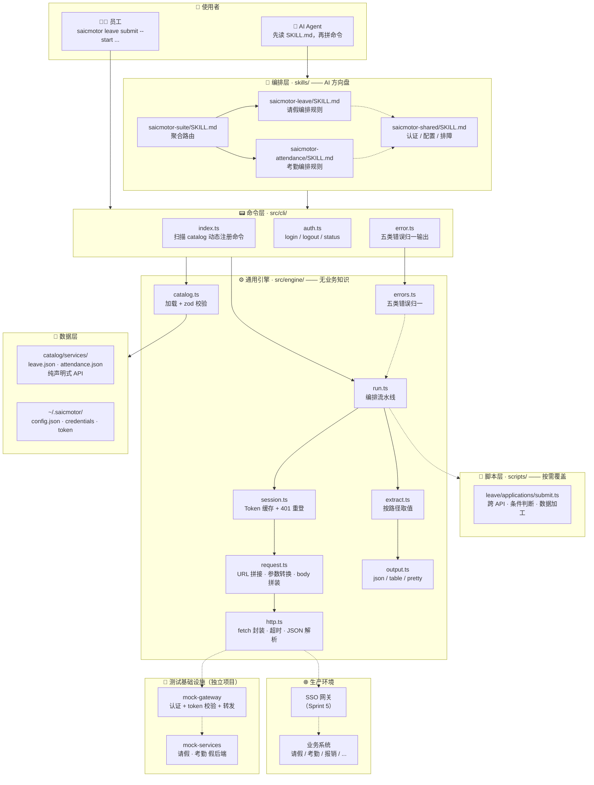
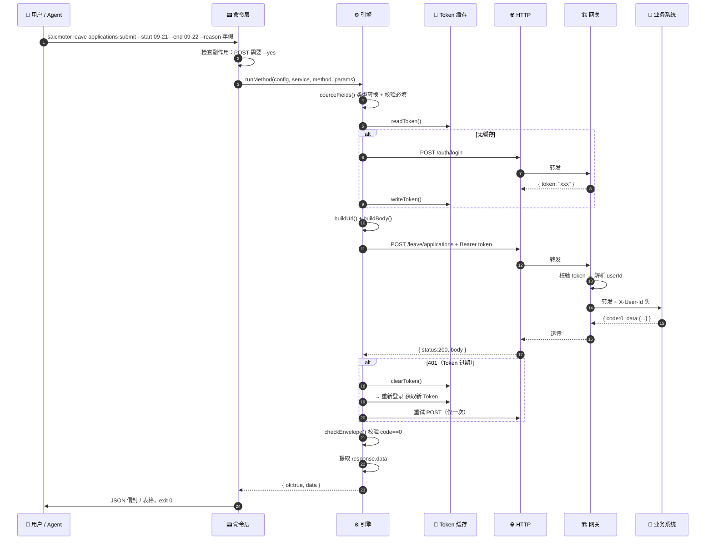
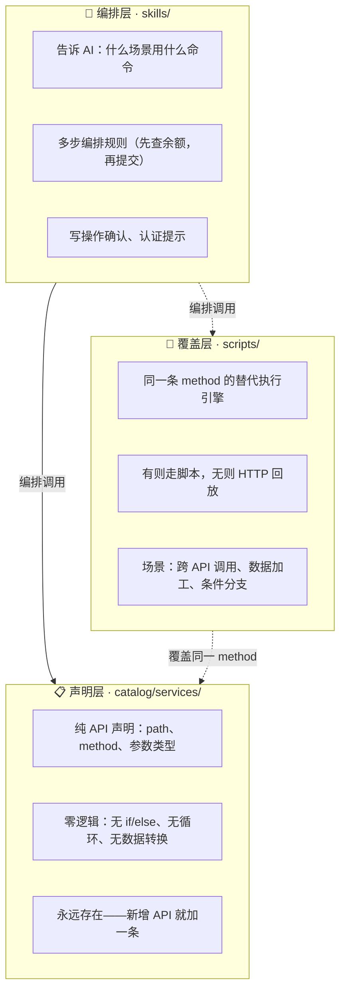
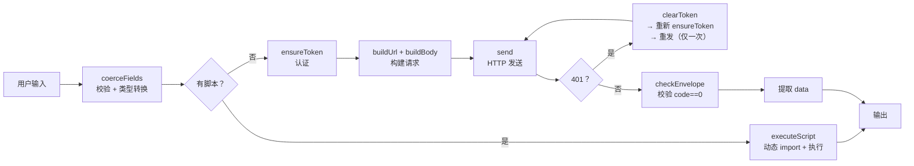
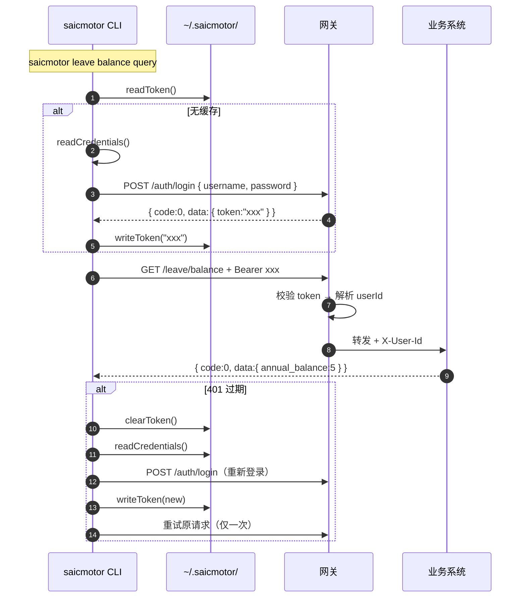
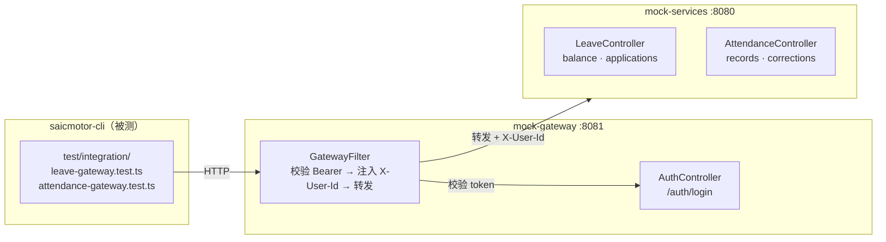
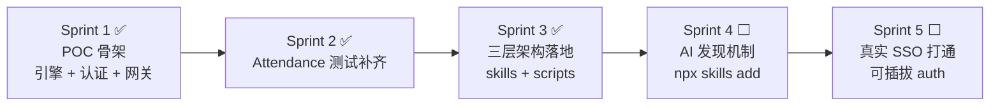

# saicmotor-cli 架构设计

> **给人看的架构文档**——描述 CLI 是什么、怎么分层、怎么演进。
>
> Sprint 状态见 `docs/sprint/总览.md`。

---

## 1. 一句话定位

**saicmotor-cli 是一个面向 AI Agent 的企业 CLI 工具平台——用 skill 编排任务，用 catalog 声明接口，用引擎自动执行。**

员工在网页上点的操作，变成 `saicmotor <系统> <命令> <参数>`。人和 AI Agent 共用同一套接口。AI Agent 先读 skills/SKILL.md 知道怎么编排，再通过 CLI 执行。

**核心约束：**

- 不需要业务系统源码
- 不依赖官方 OpenAPI
- 新增/改系统不改引擎，只改数据文件（catalog JSON）
- 简单接口零代码，复杂逻辑落脚本

---

## 2. 全景架构

按"谁调用 → 谁编排 → 谁执行"分三纵，从左到右分别是 AI 路径、引擎流水线、执行选择：



**读图要点：**

- **左上角是 AI 路径**：Agent 先读 `skills/` 知道怎么用，再调 CLI
- **中间是引擎流水线**：catalog → session → request → http → extract → output，纯函数式，不含业务知识
- **右上角是执行选择**：默认 HTTP 回放，复杂逻辑走 scripts 覆盖
- **底部是环境切换**：测试走 mock-gateway → mock-services，生产走 SSO → 业务系统

---

## 3. 执行链路

从用户或 Agent 敲下命令到拿到结果：



**关键规则（已全部实现）：**

| 规则 | 说明 |
|------|------|
| Token 复用 | 一次登录，多次使用，不过期不重复登录 |
| 401 自动重登 | 过期时清缓存 → 重登 → 重试，只做一次 |
| 写操作不自动重试 | POST/PUT/DELETE 只在 401 时重试一次，普通故障不重试 |
| 写操作要确认 | 不加 `--yes` 就拒绝（或 `--dry-run` 预览） |
| 成败契约 | 按 response envelope（code==0）判定，上游业务错误翻译为统一输出 |
| 脚本覆盖 | scripts/{系统}/{资源}/{方法}.ts 存在 → 走脚本，否则 HTTP 回放 |

---

## 4. 三层模型

CLI 的能力分三层，各司其职：



**各层一句话：**

| 层 | 一句话 | 给谁用 |
|---|---|---|
| `skills/SKILL.md` | 教 AI **什么时候**用什么能力、**按什么顺序**组合 | AI Agent |
| `catalog/*.json` | 声明**每个 API 长什么样**——路径、方法、参数 | CLI 引擎 |
| `scripts/*.ts` | 当 HTTP 回放不够用时，**用代码替代**某条 API 的执行 | CLI 引擎 |

**catalog 和 script 的关系不是"另一个目录"，而是"同一条 method 的两种执行引擎"：**

```
默认路径：catalog 声明 → HTTP 直接回放（零代码）
覆盖路径：catalog 声明 → 检测到同名 script → 执行脚本（有逻辑）
```

**加一个新功能的标准流程：**

1. catalog 里声明接口（不改引擎）
2. 简单的到此为止；复杂的给对应 method 写 script
3. skill 里写上编排规则（告诉 AI 怎么组合）

### 4.1 目录层级

```
skills/                                     🟢 已完成
├── saicmotor-suite/SKILL.md                聚合路由入口
├── saicmotor-leave/SKILL.md                请假编排规则
│   └── references/                         详细 HOW-TO
├── saicmotor-attendance/SKILL.md           考勤编排规则
└── saicmotor-shared/SKILL.md               认证/配置/排障

catalog/services/                           🟢
├── leave.json                              一个系统一个 JSON
└── attendance.json                         含该系统的全部 resource + method

scripts/                                    🟢 已完成（已实现：脚本覆盖 HTTP）
├── leave/applications/submit.ts            按 系统/资源/方法 分目录
└── attendance/corrections/submit.ts        覆盖对应 catalog 里的同一条 method
```

**关键约定：**

| 约定 | 说明 |
|------|------|
| catalog 一个系统一个 JSON | `leave.json` 里声明 leave 的所有 API |
| CLI 命令路径从 catalog 自动生成 | `saicmotor leave balance query` ← `resources.balance.methods.query` |
| script 按 `系统/资源/方法` 路径覆盖 | `scripts/leave/applications/submit.ts` 存在 → 对应的 method 走脚本 |
| skill 平级，`saicmotor-` 前缀 | `saicmotor-suite` 是路由入口，`saicmotor-shared` 是公共层 |

**skill 之间的引用关系（参考 feishu-cli 的 lark-suite / lark-shared 模式）：**

```
saicmotor-suite          ← 聚合路由入口
├── saicmotor-leave      ← 每个子 skill 开头写：先读 ../saicmotor-shared/SKILL.md
├── saicmotor-attendance
└── saicmotor-shared     ← 独立平级 skill，被其他所有 skill 引用
```

---

## 5. 目录结构

标 🟢 已实现。

```
saicmotor-cli/
├── package.json                   🟢  bin: { "saicmotor": "dist/cli/index.js" }
│
├── src/
│   ├── cli/
│   │   ├── index.ts               🟢  命令面：扫描 catalog 动态注册命令
│   │   ├── auth.ts                🟢  login / logout / status
│   │   └── error.ts               🟢  五类错误 → JSON 信封 + 退出码
│   │
│   ├── engine/                    🟢  通用引擎（不含业务知识）
│   │   ├── catalog.ts             🟢  加载 + zod 校验 catalog JSON
│   │   ├── config.ts              🟢  配置加载（默认 + 文件 + 环境变量）
│   │   ├── session.ts             🟢  Token 缓存 + 自动登录
│   │   ├── request.ts             🟢  URL 拼接 · 参数转换 · body 拼装
│   │   ├── http.ts                🟢  fetch 封装 · 超时 · JSON 解析
│   │   ├── extract.ts             🟢  按路径从响应取值
│   │   ├── output.ts              🟢  json / table / pretty
│   │   ├── errors.ts              🟢  五类错误归一
│   │   └── run.ts                 🟢  编排流水线
│   │
│   ├── auth/                      🟢  认证
│   │   ├── store.ts               🟢  凭证/Token 文件存储（mode 0600）
│   │   ├── login.ts               🟢  HTTP 登录
│   │   ├── session.ts             🟢  ensureToken
│   │   └── transport.ts           🟢  Authorization 头注入
│   │
│   └── schema/
│       └── catalog.ts             🟢  Service/Method/Field 的 zod 校验
│
├── catalog/services/              🟢  声明式数据（一个系统一个 JSON）
│   ├── leave.json                 🟢
│   └── attendance.json            🟢
│
├── skills/                        🟢  已完成
│   ├── saicmotor-suite/
│   │   └── SKILL.md               🟢  聚合路由入口
│   ├── saicmotor-leave/
│   │   ├── SKILL.md               🟢  请假编排规则
│   │   └── references/
│   ├── saicmotor-attendance/
│   │   └── SKILL.md               🟢
│   └── saicmotor-shared/
│       └── SKILL.md               🟢  认证/配置/排障
│
├── scripts/                       🟢  已实现：脚本覆盖 HTTP
│   ├── leave/applications/        🟢  leave/applications/submit.ts（验证脚本）
│   └── attendance/corrections/    🟢  attendance/corrections/submit.ts（考勤补签提交流程）
│
├── test/
│   ├── unit/                      🟢  12 个模块，43 个测试
│   ├── integration/               🟢  leave + attendance 网关集成
│   └── helpers/server.ts          🟢  Mock HTTP 服务器
│
└── doc/
    └── ARCHITECTURE.md            🟢  你正在读的这个文件
```

**三个运行时目录（用户机器上）：**

```
~/.saicmotor/
├── config.json          🟢  网关地址 + auth 配置（可 SAICMOTOR_GATEWAY 覆盖）
├── credentials.json     🟢  账号密码（mode 0600，可 SAICMOTOR_USERNAME+PASSWORD 覆盖）
└── token.json           🟢  登录后的 session token（mode 0600）
```

---

## 6. 引擎模块

引擎是 CLI 的核心——不含任何业务知识，只做确定性执行。9 个模块串成一条流水线：

| 模块 | 文件 | 做什么 | 输入 | 输出 |
|------|------|--------|------|------|
| **catalog** | `engine/catalog.ts` | 扫描目录，加载 JSON，zod 校验 | 文件系统 | `Service[]` |
| **spec 校验** | `schema/catalog.ts` | Service / Resource / Method 的 zod schema | 原始 JSON | 校验通过 / 字段级报错 |
| **request** | `engine/request.ts` | URL 拼接、参数类型转换（string→int/bool）、body JSON 序列化 | `config + servicePath + method + 用户输入` | `{ url, headers, body }` |
| **script** | `engine/script.ts` | 脚本查找、动态 import 和执行 | `serviceName + resourceName + methodName` | `RunResult` 或 null（回退 HTTP） |
| **http** | `engine/http.ts` | fetch 封装：超时 15s、自动 JSON 解析、Set-Cookie 合并 | `{ method, url, headers, body }` | `{ status, headers, body }` |
| **session** | `auth/session.ts` | `ensureToken`：有缓存用缓存，无缓存自动登录 | config | Bearer token 字符串 |
| **extract** | `engine/extract.ts` | 按路径从响应取值（如 `data.token`） | 对象 + 路径字符串 | 取到的值 |
| **output** | `engine/output.ts` | JSON 信封 / table / pretty 三种格式 | 引擎返回的 data | 格式化字符串 |
| **errors** | `engine/errors.ts` | 五类错误归一：validation/auth/network/upstream/spec | 错误信息 | `SaicmotorError` |

**编排器 `run.ts` 串起整条链路：**



**核心原则：**

- **引擎不可变**：加新系统只改 catalog JSON 或写 script，不动引擎代码
- **读操作可重试，写操作不重试**（非幂等）
- **401 是唯一的自动重试场景**：重登一次，重发一次

---

## 7. 认证模型

当前只实现了 `password` 类型。Sprint 5 会扩展为可插拔架构。

### 7.1 当前（已实现）：password 直登



### 7.2 未来（Sprint 5）：可插拔 auth

| type | 场景 | 流程 | 状态 |
|------|------|------|------|
| `password` | 单系统直登 | username + password → token | ✅ 已实现 |
| `redirect` | CAS 式 SSO | 请求入口 → 302 → 带 ticket 跳回 → 换 token | 🟡 Sprint 5 |
| `exchange` | OIDC 式 | code → SSO token → 系统 token | 🟡 Sprint 5 |
| `prefetch` | 先取页面拿 token | GET 某页 → 解析页面提取 token → 注入后续请求 | 🟡 Sprint 5 |

**设计原则：换认证方式只改 auth 配置，catalog 和 engine 不动。**

---

## 8. 测试基础设施

`mock-gateway` 和 `mock-services` 是**独立的辅助项目**，不属于 saicmotor-cli npm 包。它们提供可控的假后端来完成集成测试。



- **mock-gateway**（Spring Boot）：模拟生产网关——认证、Token 校验、用户身份注入
- **mock-services**（Spring Boot）：模拟业务系统——请假、考勤的假实现
- **CLI 测试不感知 Java**：测试通过 `test/helpers/server.ts` 起一个 Node http server 替代整套 Java 栈，纯 TypeScript 可运行

---

## 9. 安全设计

| 项 | 措施 |
|----|------|
| **凭证存储** | 写入 `~/.saicmotor/`，`mode 0600`（仅 owner 可读写），明文永不进 git |
| **环境变量覆盖** | `SAICMOTOR_USERNAME` / `SAICMOTOR_PASSWORD` 优先级高于文件，支持 CI/CD |
| **副作用确认** | 所有 POST/PUT/DELETE 默认要求 `--yes`，或 `--dry-run` 仅预览 |
| **Token 不过期不清除** | 只有收到 401 时才清缓存重登 |
| **写操作不自动重试** | 防止重复提交（如请假两次），仅 401 允许重试一次 |
| **输出规范** | 成功 → stdout + exit 0；失败 → stderr + JSON 信封 + 语义化退出码 |

---

## 10. 演进路线



| Sprint | 主题 | 核心交付 |
|--------|------|----------|
| 1 ✅ | POC 基础 | CLI 骨架 + 8 模块引擎 + password 认证 + mock-gateway |
| 2 ✅ | 测试补齐 | Attendance 集成测试，46 个测试全部通过 |
| 3 ✅ | 三层架构 | catalog 保持声明式，scripts 按需覆盖（调度机制 + 验证脚本 + 单测），skills 做编排 |
| 4 ⬜ | AI 发现 | `skills/` 目录填充 + `npx skills add` + postinstall |
| 5 ⬜ | SSO 对接 | 扩展 redirect/exchange auth type，打通真实认证链路 |

---

> Sprint 详情见 [`docs/sprint/总览.md`](sprint/总览.md)