# saicmotor-cli 架构设计

> **给人看的架构文档**——CLI 是什么、怎么分层、怎么分发、怎么演进。
>
> Sprint 状态见 `docs/sprint/总览.md`。

---

## 总览

### 一句话定位

**saicmotor-cli 是一个面向 AI Agent 的企业 CLI 工具平台——用 skill 编排任务，用 catalog 声明接口，用引擎自动执行，用 tarball 一键分发。**

员工在网页上点的操作，变成 `saicmotor <系统> <命令> <参数>`。人和 AI Agent 共用同一套接口。AI Agent 先读 SKILL.md 知道怎么编排，再通过 CLI 执行。

**核心约束：**

- 不需要业务系统源码
- 不依赖官方 OpenAPI
- 新增/改系统不改引擎，只改数据文件（catalog JSON）
- 简单接口零代码，复杂逻辑落脚本
- 一条命令安装，装完即用

---

### 全景架构

按"谁调用 → 谁编排 → 谁执行 → 怎么拿到"四纵：

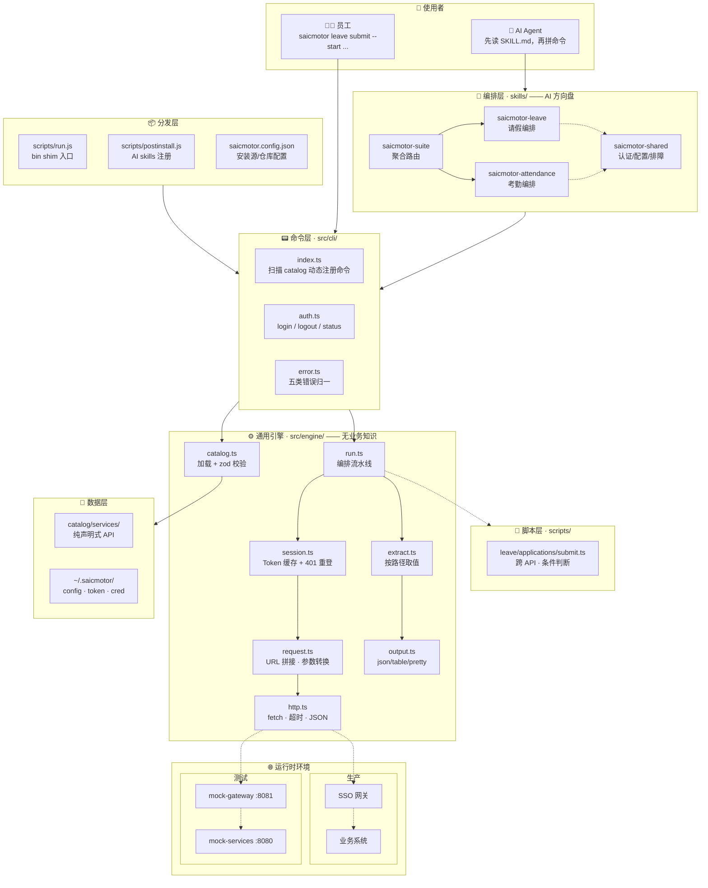

**读图四要点：**

| 区域 | 说明 |
|------|------|
| 左上 → 使用者 | 人敲命令，Agent 先读 skill 再拼命令 |
| 中上 → 编排+命令层 | skill 告诉 AI 怎么用，CLI 层解析命令 |
| 中下 → 引擎 | catalog → session → request → http → extract → output，纯函数式，不含业务知识 |
| 底部分发+运行 | bin shim + postinstall 分发到用户机器；测试走 mock，生产走 SSO |

---

### 执行链路

从敲下命令到拿到结果，一条完整的流水线：

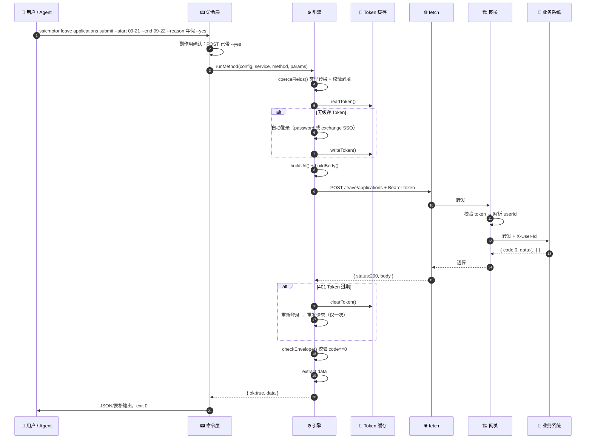

**八条铁律（全部已实现）：**

| # | 规则 | 说明 |
|---|------|------|
| 1 | Token 复用 | 一次登录，多次使用，不过期不重复登录 |
| 2 | 401 自动重登 | 过期 → 清缓存 → 重登 → 重试，只做一次 |
| 3 | 写操作不自动重试 | POST/PUT/DELETE 只在 401 时重试，普通故障不重试 |
| 4 | 写操作要确认 | 不加 `--yes` 拒绝执行（`--dry-run` 可预览） |
| 5 | 成败契约 | response envelope `code==0` 判定成败 |
| 6 | 脚本覆盖 | `scripts/{系统}/{资源}/{方法}.ts` 存在则走脚本，否则 HTTP 回放 |
| 7 | 认证可插拔 | 换认证方式只改 auth 配置，catalog 和 engine 不动 |
| 8 | 引擎不可变 | 加新系统只改 catalog JSON 或写 script，不动引擎代码 |

---

## 分述

以下七个章节按重要性排序，从前端体验到底层原理。

---

### 1. 三层模型：skill、catalog、script

CLI 的能力分三层，各司其职：

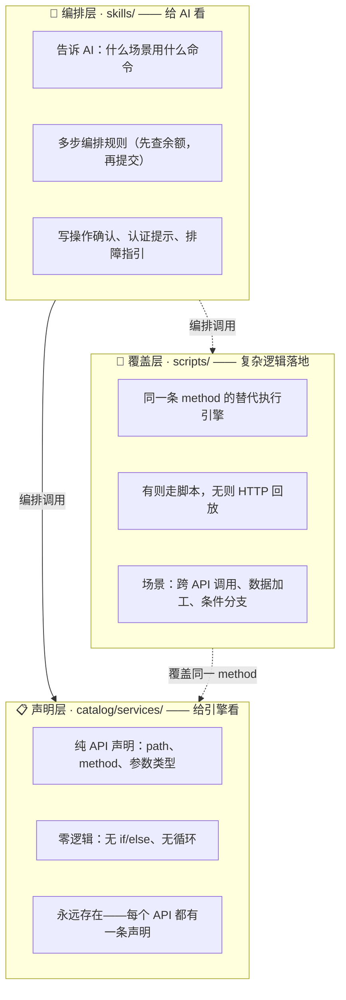

**一句话总结每层的角色：**

| 层 | 给谁用 | 一句话 |
|---|---|---|
| `skills/SKILL.md` | AI Agent | 教 AI **什么时候**用什么能力、**按什么顺序**组合 |
| `catalog/*.json` | CLI 引擎 | 声明**每个 API 长什么样**——路径、方法、参数 |
| `scripts/*.ts` | CLI 引擎 | HTTP 回放不够用时，**用代码替代**某条 API 的执行 |

**catalog 和 script 不是两个目录，而是同一条 method 的两种执行引擎：**

```
简单 API：  catalog 声明 → HTTP 直接回放（零代码）
复杂 API：  catalog 声明 → 检测到同名 script → 执行脚本（有逻辑）
```

**加一个新功能的标准三步：**

```
1. catalog 声明接口（不改引擎）
2. 简单到此为止；复杂则给对应 method 写 script
3. skill 写编排规则（告诉 AI 怎么组合）
```

#### 目录约定

```
skills/                                     🟢
├── saicmotor-suite/SKILL.md                聚合路由入口
├── saicmotor-leave/SKILL.md                请假编排
│   └── references/                         详细 HOW-TO
├── saicmotor-attendance/SKILL.md           考勤编排
└── saicmotor-shared/SKILL.md               认证/配置/排障

catalog/services/                           🟢
├── leave.json                              一个系统一个 JSON
└── attendance.json

scripts/                                    🟢
├── leave/applications/submit.ts            按 系统/资源/方法 覆盖
└── attendance/corrections/submit.ts
```

**skill 引用关系：**

```
saicmotor-suite          ← 聚合路由入口
├── saicmotor-leave      ← 每个子 skill 开头：先读 ../saicmotor-shared/SKILL.md
├── saicmotor-attendance
└── saicmotor-shared     ← 独立平级，被所有 skill 引用
```

---

### 2. 引擎：九模块流水线

引擎是 CLI 的核心——不含任何业务知识，只做确定性执行。9 个模块串成一条流水线：

| 模块 | 文件 | 做什么 | 输入 | 输出 |
|------|------|--------|------|------|
| **catalog** | `engine/catalog.ts` | 扫描目录，加载 JSON，zod 校验 | 文件系统 | `Service[]` |
| **spec** | `schema/catalog.ts` | Service/Resource/Method zod schema | 原始 JSON | 校验通过/报错 |
| **request** | `engine/request.ts` | URL 拼接、类型转换、body 序列化 | config + method + 参数 | `{ url, headers, body }` |
| **script** | `engine/script.ts` | 脚本查找、动态 import 执行 | service+resource+method | `RunResult` 或 null |
| **http** | `engine/http.ts` | fetch 封装：超时 15s、JSON 解析 | `{ method, url, headers, body }` | `{ status, body }` |
| **session** | `auth/session.ts` | `ensureToken`：缓存或自动登录 | config | Bearer token |
| **extract** | `engine/extract.ts` | 按路径取值（如 `data.token`） | 对象 + 路径 | 取到的值 |
| **output** | `engine/output.ts` | json / table / pretty 三种格式 | data | 格式化字符串 |
| **errors** | `engine/errors.ts` | 五类错误归一 | 错误信息 | `SaicmotorError` |

**编排器 `run.ts` 的全链路决策：**

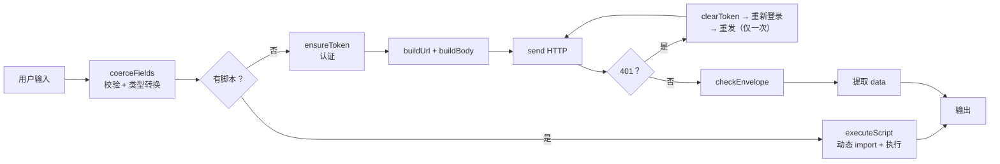

---

### 3. 认证模型：可插拔双模式

已实现 `password`（账号密码）和 `exchange`（飞书 SSO）两种认证。架构以策略模式实现，换认证不改引擎。

#### 3.1 模式切换

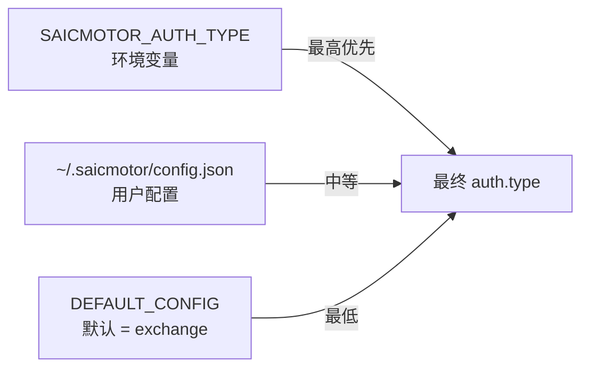

| 方式 | 命令 | 优先级 |
|------|------|:---:|
| 环境变量 | `SAICMOTOR_AUTH_TYPE=password` | 最高 |
| 用户配置 | `~/.saicmotor/config.json` → `auth.type` | 中 |
| 默认值 | `src/config.ts` → `exchange` | 最低 |

生产默认飞书 SSO，本地开发 `SAICMOTOR_AUTH_TYPE=password` 切回密码。详见[开发者指南 §3.3](../../howto/DEVELOPER.md)。

#### 3.2 password 流程（账号密码直登）

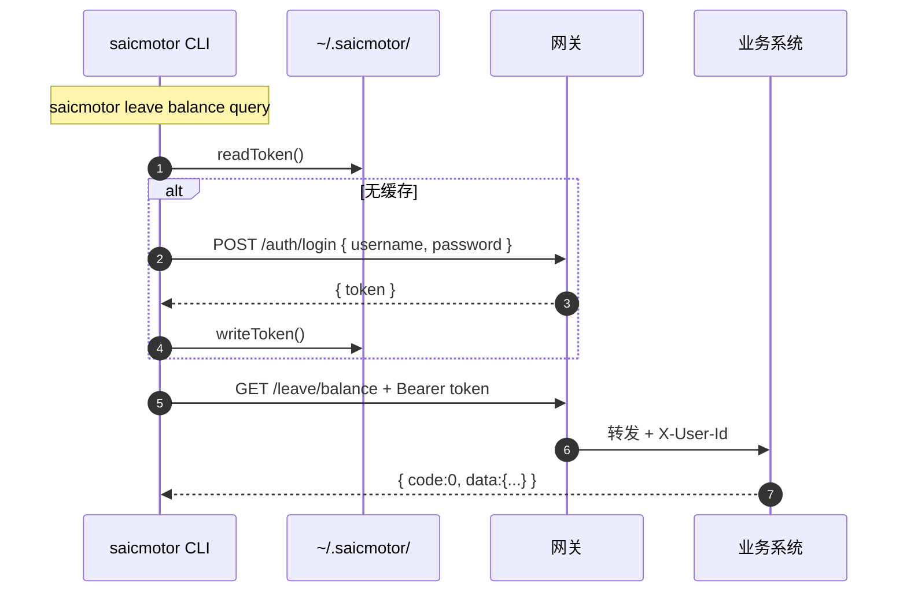

#### 3.3 exchange 流程（飞书 OAuth SSO）

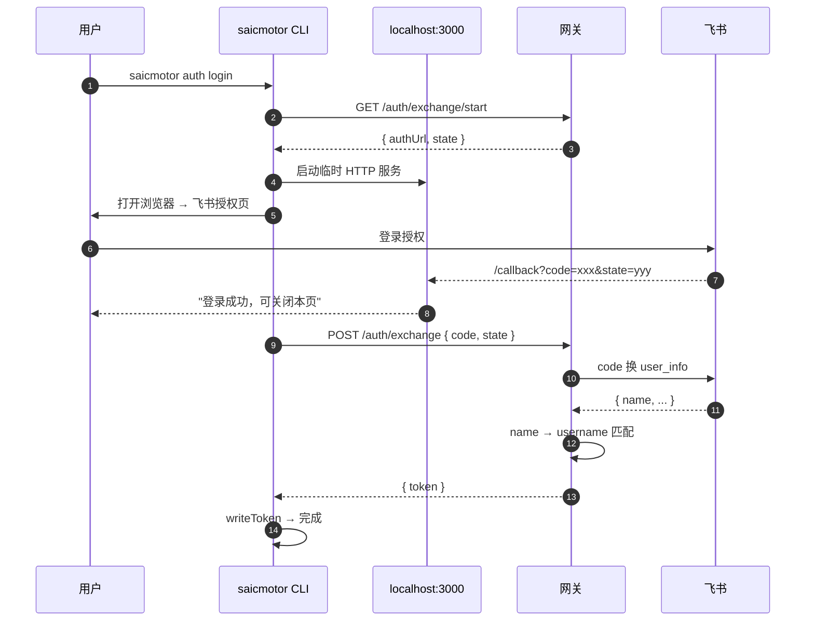

#### 3.4 auth 类型一览

| type | 场景 | 流程 | 状态 |
|------|------|------|:---:|
| `password` | 单系统直登 | username + password → token | ✅ |
| `exchange` | OIDC SSO | loopback → 浏览器授权 → code → 网关换 token | ✅ |
| `redirect` | CAS SSO | 302 → ticket → token | 🔮 |
| `prefetch` | 页面取 token | GET 页面 → 解析提取 → 注入 | 🔮 |

#### 3.5 网关侧可插拔 IdP

```java
public interface IdpProvider {
    String buildAuthorizeUrl(String state, String redirectUri);
    IdpUser exchangeCode(String code, String redirectUri);
}
```

- **FeishuIdpProvider**（当前实现）：飞书网页授权。`app_id`/`secret` 从环境变量注入，不落代码。匹配策略：飞书 `user_info.name` 即公司域账号，直接匹配 gateway `username`。`email` 有值时优先 email（兼容未来 scope 扩展），否则走 name。不做 union_id / feishuName 兜底。
- **未来切换 OIDC**：新增 `OidcIdpProvider`，通过 `.well-known/openid-configuration` 自动发现。CLI 和业务系统**零改动**。
- **用户映射约定**：gateway `username` = 飞书 name；`user-id` 必须 ASCII（`X-User-Id` HTTP 头传中文会乱码）。

---

### 4. 安装与分发：一条命令直达用户

saicmotor-cli 复刻 feishu-cli 的分发架构，采用 **bin shim + postinstall + tarball** 三位一体。

#### 4.1 安装体验

用户只需要一行：

```bash
npm install -g --dangerously-allow-all-scripts \
  https://github.com/a5535772/saicmotor-cli/tarball/master
```

装完后 `saicmotor` 全局可用，AI skills 自动注册。**装完即用，不需额外配置。**

#### 4.2 完整安装流水线

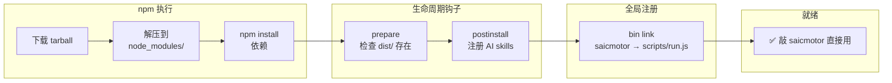

#### 4.3 bin shim 入口模式

`package.json` 的 `bin` 不直接指向编译产物，而是指向 JS shim：

```json
{ "bin": { "saicmotor": "scripts/run.js" } }
```

`scripts/run.js` 的三步逻辑：

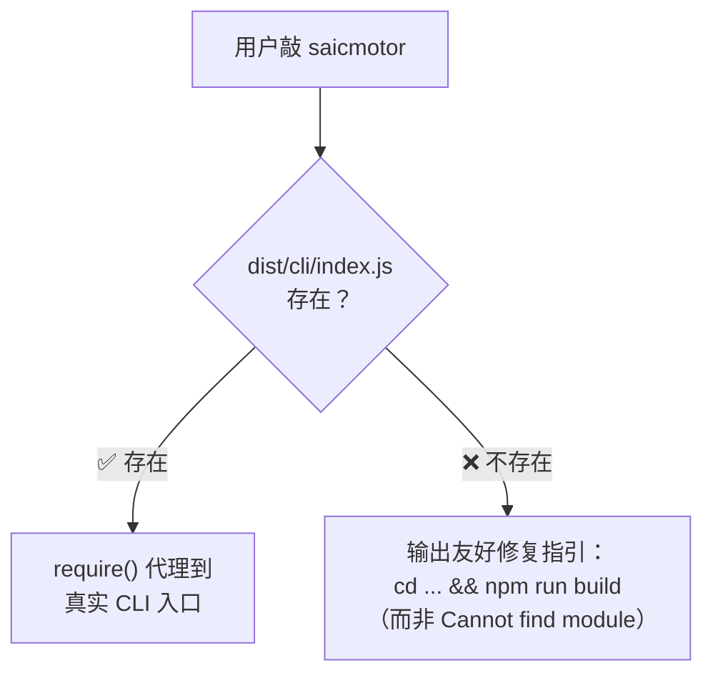

| 直接指向 dist/ | bin shim 模式 |
|---|---|
| 文件缺失 → `Error: Cannot find module` | 文件缺失 → 中文指引 + 修复命令 |
| dist/ 损坏 = CLI 彻底不可用 | shim 极简（~15 行），几乎不可能坏 |

#### 4.4 postinstall：零感知注册 AI skills

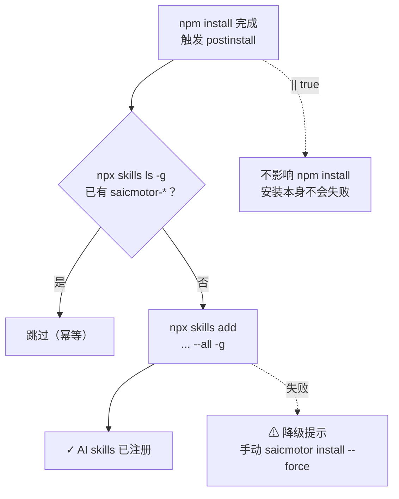

**弹性四项：**

| 措施 | 效果 |
|------|------|
| `node scripts/postinstall.js \|\| true` | postinstall 失败不阻断安装 |
| 已注册则跳过 | 幂等，重复安装不报错 |
| `saicmotor install --force` | 手动补救入口 |
| `SAICMOTOR_SKILLS_REPO` 环境变量 | 公司内部可覆盖 skills 仓库地址 |

#### 4.5 为什么用 tarball 而不是 `github:` 简写

npm v11 全局安装时对 `github:` 的处理变了——用 symlink 而非文件复制，导致安装后文件丢失：

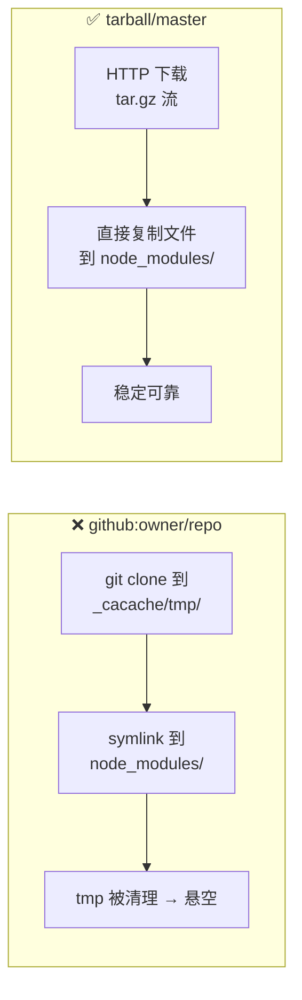

| 命令 | npm v11 行为 | 结果 |
|------|-------------|:---:|
| `github:owner/repo` | clone → symlink | ❌ 文件丢失 |
| `tarball/master` | 下载 → 复制文件 | ✅ |

> feishu-cli 不受影响因为它发布在 npm registry（`@larksuite/cli`），不走 GitHub。

#### 4.6 分发策略演进

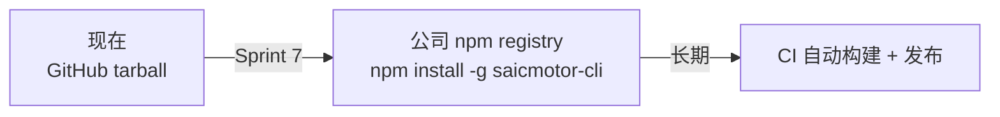

当前 GitHub tarball 是过渡方案。一旦发布到公司内部 npm registry，`saicmotor.config.json` 改 `installUrl` 为包名即可，用户安装命令简化为 `npm install -g saicmotor-cli`。

---

### 5. 配置化：一改全局生效

所有外部引用集中在 `saicmotor.config.json`。公司部署只需改这一个文件——不需要改源码。

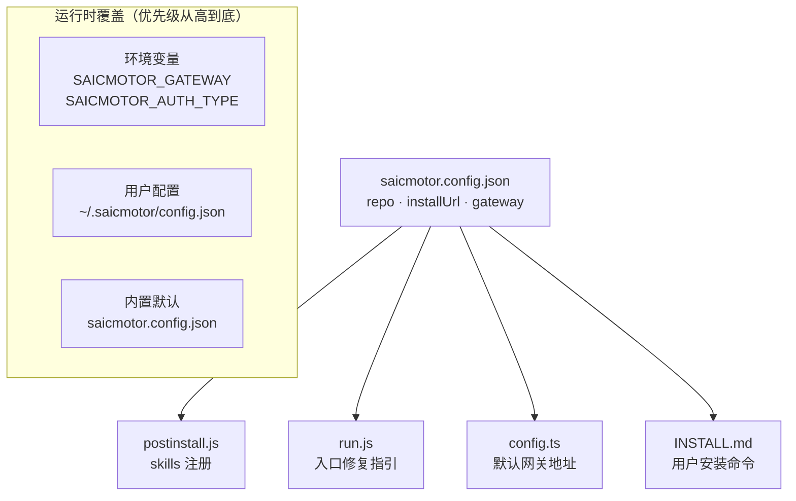

**部署示例：**

| 场景 | `installUrl` | `defaults.gateway` |
|------|-------------|-------------------|
| 开发/测试 | `https://github.com/.../tarball/master` | `http://localhost:8081` |
| 公司内部 | `saicmotor-cli` | `https://gw.internal.example.com` |

**环境变量一览：**

| 变量 | 作用 | 优先级 |
|------|------|:---:|
| `SAICMOTOR_GATEWAY` | 网关地址 | 最高 |
| `SAICMOTOR_AUTH_TYPE` | 认证模式（`password` \| `exchange`） | 最高 |
| `SAICMOTOR_SKILLS_REPO` | skills 仓库 | 最高 |
| `SAICMOTOR_USERNAME` | 用户名（CI/CD） | — |
| `SAICMOTOR_PASSWORD` | 密码（CI/CD） | — |
| `SAICMOTOR_HOME` | 数据目录 | 默认 `~/.saicmotor` |
| `SAICMOTOR_CATALOG` | catalog 目录 | 默认 `catalog/services/` |
| `SAICMOTOR_SCRIPTS` | scripts 目录 | 默认 `scripts/` |

---

### 6. 测试基础设施

`mock-gateway` 和 `mock-services` 是独立 Java 项目，不属于 CLI npm 包。CLI 测试则全部 TypeScript，不依赖 Java。

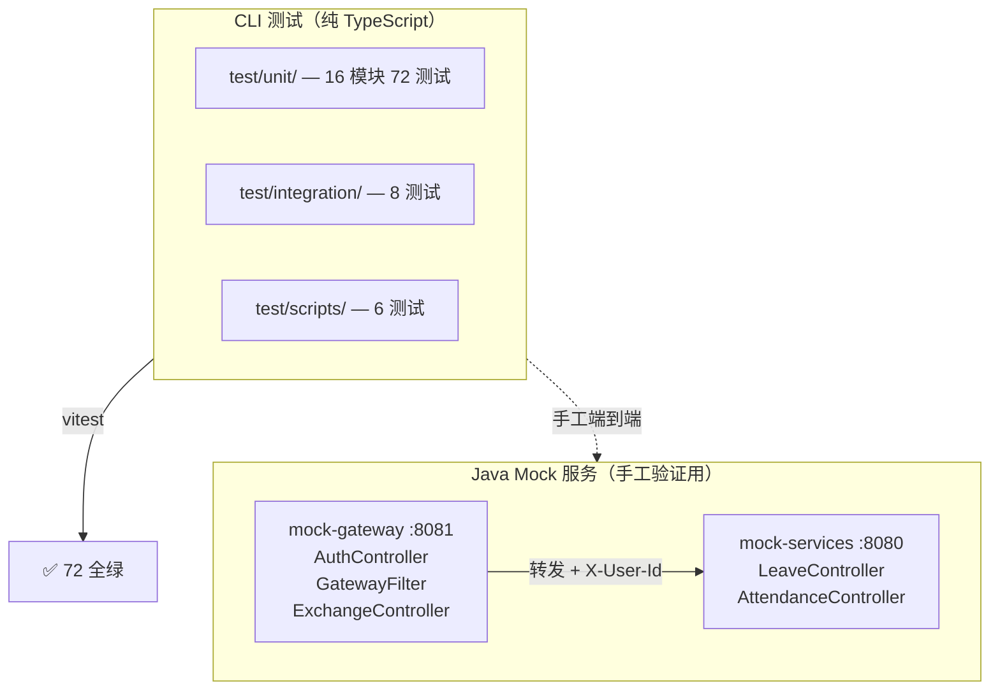

- **CLI 单测**：通过 `test/helpers/server.ts` 起 Node HTTP mock，纯 TypeScript，秒级跑完
- **Java mock**：需要手工验证 SSO 全链路时启动，模拟真实网关 + 业务系统行为
- **Gateway 测试**：另有 90 个 Java 测试（`saicmotor-cli-mock-gateway`），覆盖 auth、token、exchange

---

### 7. 安全设计

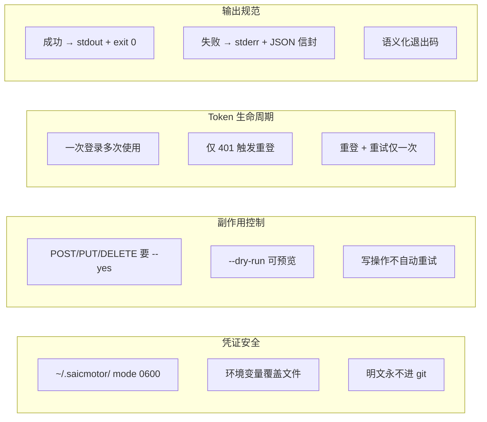

---

## 总结

### 完整目录树（标 🟢 已实现）

```
saicmotor-cli/
├── package.json                        🟢  bin: { "saicmotor": "scripts/run.js" }
├── saicmotor.config.json                🟢  安装源/仓库/默认网关（配置中心）
│
├── src/
│   ├── cli/
│   │   ├── index.ts                    🟢  命令面：扫描 catalog 动态注册命令
│   │   ├── auth.ts                     🟢  login / logout / status
│   │   └── error.ts                    🟢  五类错误 → JSON 信封 + 退出码
│   ├── engine/                         🟢  通用引擎（不含业务知识）
│   │   ├── catalog.ts                  🟢  加载 + zod 校验 catalog JSON
│   │   ├── config.ts                   🟢  默认 → 文件 → 环境变量 优先级加载
│   │   ├── session.ts                  🟢  Token 缓存 + 401 自动重登
│   │   ├── request.ts                  🟢  URL 拼接 · 参数转换 · body 拼装
│   │   ├── http.ts                     🟢  fetch 封装 · 超时 · JSON 解析
│   │   ├── extract.ts                  🟢  按路径从响应取值
│   │   ├── output.ts                   🟢  json / table / pretty
│   │   ├── errors.ts                   🟢  五类错误归一
│   │   └── run.ts                      🟢  编排流水线
│   ├── auth/                           🟢  认证模块
│   │   ├── store.ts                    🟢  凭证/Token 文件存储（0600）
│   │   ├── login.ts                    🟢  HTTP 登录
│   │   ├── session.ts                  🟢  ensureToken
│   │   └── transport.ts                🟢  Authorization 头注入
│   └── schema/catalog.ts               🟢  Service/Method/Field zod 校验
│
├── catalog/services/                   🟢  声明式数据
│   ├── leave.json                      🟢
│   └── attendance.json                 🟢
│
├── skills/                             🟢  AI 编排规则
│   ├── saicmotor-suite/SKILL.md        🟢  聚合路由
│   ├── saicmotor-leave/SKILL.md        🟢  请假编排 + references/
│   ├── saicmotor-attendance/SKILL.md   🟢  考勤编排
│   └── saicmotor-shared/SKILL.md       🟢  认证/配置/排障
│
├── scripts/                            🟢  脚本覆盖 + 分发入口
│   ├── run.js                          🟢  bin shim 入口
│   ├── postinstall.js                  🟢  AI skills 自动注册
│   ├── leave/applications/submit.ts    🟢
│   └── attendance/corrections/submit.ts🟢
│
├── test/
│   ├── unit/                           🟢  16 模块 72 单测
│   ├── integration/                    🟢  网关集成测试
│   ├── scripts/                        🟢  postinstall 脚本测试
│   └── helpers/server.ts               🟢  Mock HTTP 服务器
│
├── docs/
│   ├── ARCHITECTURE.md                 🟢  你正在读的这份文档
│   ├── sprint/                         🟢  Sprint 进度 & 验证指导
│   ├── superpowers/                    🟢  设计 spec + plan
│   └── lessons-learned-the-hard-way/   🟢  踩坑记录
│
├── howto/
│   ├── INSTALL.md                      🟢  用户安装指南
│   ├── DEVELOPER.md                    🟢  开发者手册
│   └── FEISHU-OIDC-SETUP.md            🟢  飞书 SSO 申请手册
│
└── dist/                               🟢  编译产物（已提交 git）
```

**用户机器上的三个运行时文件：**

```
~/.saicmotor/
├── config.json          🟢  网关地址 + auth 类型
├── credentials.json     🟢  账号密码（mode 0600）
└── token.json           🟢  session token（mode 0600）
```

---

### 演进路线

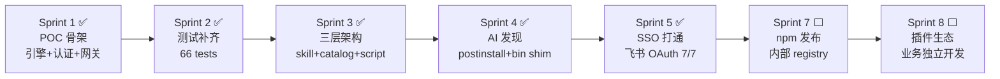

| Sprint | 主题 | 核心交付 |
|:---:|------|----------|
| 1 | POC 基础 | CLI 骨架 + 8 模块引擎 + password 认证 + mock-gateway |
| 2 | 测试补齐 | Attendance 集成，66 测试全绿 |
| 3 | 三层架构 | catalog 声明式 + scripts 按需覆盖 + skills 编排 |
| 4 | AI 发现 | `npx skills add` + postinstall 自动注册 + bin shim 弹性入口 |
| 5 | SSO 打通 | exchange auth type，飞书 OAuth POC 7/7 全通。exchange 生产默认，`SAICMOTOR_AUTH_TYPE=password` 本地回退 |
| 7 | npm 发布 | 迁移到公司内部 npm registry：`npm install -g saicmotor-cli` |
| 8 | 插件生态 | 业务开发者独立开发 skill 插件，内置与外部统一机制 |

---

### 一句总结

**saicmotor-cli = skill 编排（AI 方向盘）+ catalog 声明（API 字典）+ 引擎执行（通用流水线）+ bin shim 分发（一条命令直达）。**

换认证、加系统、改部署——都不动引擎。这就是架构的边界。