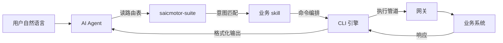
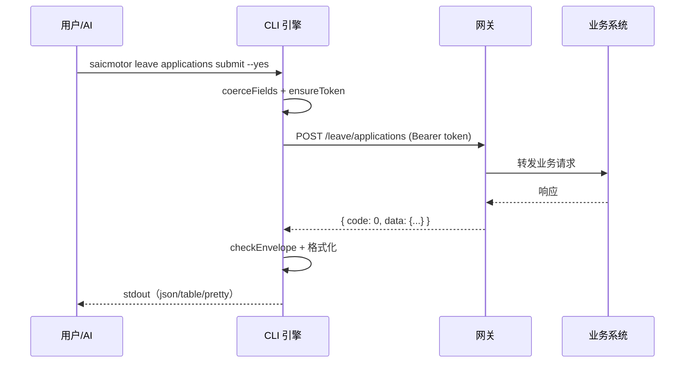

# 01 — 架构总览

> @saicmotor/cli 0.8.0 — 面向 AI Agent 的插件化企业 CLI 平台

## 一句话架构

```
AI Agent 读 SKILL.md 发现能力 → CLI 从 catalog 声明式注册命令 → 引擎管道执行 → 输出
```

三个角色：**AI Agent（决策者）** → **CLI 引擎（执行者）** → **上游网关（数据源）**。
插件生态贯穿始终——业务系统以独立 npm 包分发，不触碰核心代码。

## 四层架构

```
┌──────────────────────────────────────────┐
│           🧠 编排层（Skills）              │
│  SKILL.md — AI Agent 的操作手册           │
│  saicmotor-suite 路由表 + 各插件 skill     │
├──────────────────────────────────────────┤
│           📋 声明层（Catalog）             │
│  catalog/services/*.json — API 声明       │
│  zod 校验，零代码注册命令                  │
├──────────────────────────────────────────┤
│           ⚙️ 执行层（Engine）              │
│  run.ts → 参数校验 → token → HTTP → 输出  │
│  401 自动重试、脚本覆盖、三格式输出        │
├──────────────────────────────────────────┤
│           📦 插件层（Plugin System）       │
│  loader / registrar / suite / state       │
│  双根扫描、engine 校验、声明式路由聚合     │
└──────────────────────────────────────────┘
```

**加新业务系统只改上面两层**——写一份 catalog JSON + 一份 SKILL.md，引擎和插件框架不动。

> **现状注**：CLI 核心自身不内置业务 catalog（`loadCatalog()` 对不存在的目录返回空数组）——全部业务服务声明都由插件包贡献，核心引擎保持通用。

## Monorepo 包拓扑

```
@saicmotor/sdk  ←── 纯类型 + zod schema（契约包）
       ↑ runtime dep              ↑ devDependency
@saicmotor/cli              @saicmotor/plugin-*
  （核心引擎）                  （业务插件，运行时动态加载）
```

**依赖关系：**
- `@saicmotor/cli` → `@saicmotor/sdk`（runtime）：CLI 在 loader.ts、tooling-cmds.ts 中直接 import SDK 的 schema 和类型
- 插件 → `@saicmotor/sdk`（devDependency）：写脚本时参考 `ScriptContext` 类型，不 import 到运行时代码
- CLI → 插件：运行时通过 npm install 安装到 `~/.saicmotor/plugins/node_modules/`，CLI 启动时扫描加载



## 仓库目录

```
saicmotor-cli/                        ← monorepo root
├── packages/
│   ├── cli/                          ← @saicmotor/cli（核心）
│   │   ├── src/cli/                  ← 命令面：index.ts + plugin-cmds + tooling-cmds
│   │   ├── src/engine/               ← 引擎管道：catalog / run / script / http / request / output
│   │   ├── src/auth/                 ← 认证：store / session / transport / provider
│   │   ├── src/plugin/               ← 插件系统：loader / registrar / suite / paths / state
│   │   ├── src/install/              ← Skills 安装器 + 一键卸载
│   │   ├── catalog/services/         ← 核心服务声明挂载点（当前为空，业务 catalog 全在插件）
│   │   ├── skills/                   ← 内核 skills（suite + shared）
│   │   └── scripts/                  ← 核心内置脚本（uninstall.js 等）
│   ├── sdk/                          ← @saicmotor/sdk（类型契约）
│   ├── plugin-leave/                 ← 请假插件（参考实现）
│   ├── plugin-attendance/            ← 考勤插件（参考实现)
│   └── plugin-user/                  ← 用户信息插件（参考实现）
├── docs/
│   ├── framework/                    ← 你正在读的架构文档
│   ├── sprint/                       ← Sprint 规划
│   └── history/                      ← 历史归档
└── howto/                            ← 面向用户的指南
```

## 技术栈

| 层 | 选型 | 原因 |
|----|------|------|
| 运行时 | Node ≥ 18 + TypeScript 5 | 内置 `fetch`，零 HTTP 依赖（包 engines 声明为 >=16，实测以 18 为下限） |
| 命令行 | Commander 12 | 支持动态子命令注册 |
| 校验 | zod | 字段级错误信息，类型推导 |
| 测试 | vitest | 原生 TS，快 |
| 数据 | JSON（catalog + manifest） | 声明式，人和 AI 都能读 |
| 包管理 | npm workspaces | monorepo 标准方案 |
| 版本兼容 | semver | 插件 engine 检查 |

## 数据流

引擎内部管线（命令 → 执行）：

```
用户/AI 输入命令
  → Commander 解析（动态注册的命令树）
    → coerceFields（参数校验 + 类型转换）
      → findScript（检查脚本覆盖）
        ├─ 有脚本 → executeScript（ctx.ensureToken 由引擎注入）
        └─ 无脚本 → ensureToken → buildUrl → send → 401？→ 重试 → checkEnvelope → 输出
```

端到端四方交互（用户 → CLI → 网关 → 业务系统）：



## 核心原则

- **声明式优先**：catalog JSON 能描述的不写代码
- **引擎通用**：HTTP 管线、认证、输出格式化全由引擎处理
- **插件生态**：业务能力以独立 npm 包分发，不碰核心
