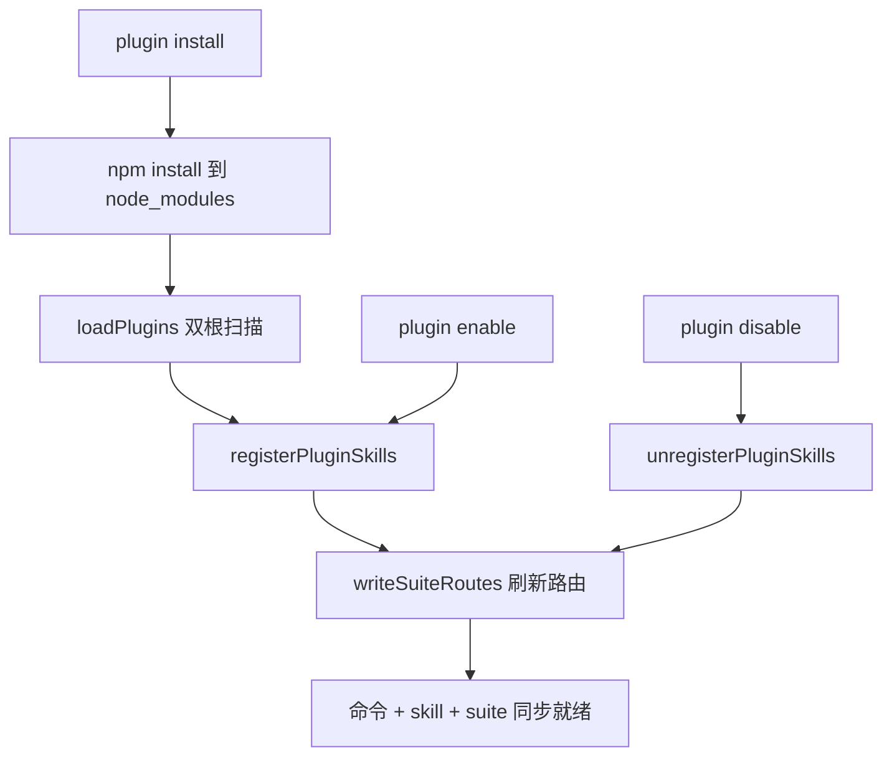

# 02 — 插件系统

> 业务能力以独立 npm 包分发，CLI 启动时扫描加载。本章覆盖插件的加载、生命周期、状态管理。

## 插件包结构

```
plugin-<name>/                       ← 独立的 npm 包
├── package.json                     ← @saicmotor/plugin-<name>
├── saicmotor.plugin.json            ← 插件 manifest（核心声明）
├── catalog/
│   └── services/
│       └── <name>.json              ← 服务声明（API 接口 + 参数 schema）
├── skills/
│   └── saicmotor-<name>/
│       └── SKILL.md                 ← AI Agent 操作手册
├── scripts/                         ← 自定义脚本（可选）
│   └── <service>/
│       └── <resource>/
│           └── <method>.ts
├── src/                             ← 辅助源码
└── test/
```

## Manifest 字段（saicmotor.plugin.json）

```typescript
{
  name: string;                              // 必须 "@saicmotor/plugin-*"
  engine: string;                            // semver range，如 "^0.8.0"
  catalog?: string[];                        // catalog glob 列表
  skills?: string[];                         // skills 目录列表
  scripts?: string;                          // scripts 根目录
  routes?: Record<string, string>;           // suite 意图路由
}
```

## 插件安装路径

```
~/.saicmotor/plugins/
├── linked/                           ← dev link（saicmotor dev）
│   └── plugin-my-system/             ← junction → 本地工程目录
├── node_modules/                     ← npm install 安装（registry）
│   └── @saicmotor/
│       └── plugin-leave/
└── state.json                        ← 插件状态清单
```

## 加载器：loadPlugins()

**双根扫描，linked 优先：**

```
loadPlugins(config)
  ├─ loadState()                      ← 读取 state.json
  ├─ for root in [linked/, node_modules/]:
  │    ├─ scanEntries(root)           ← 扫描 plugin-* 目录
  │    ├─ 读取 + zod 校验 manifest
  │    ├─ 同名去重（linked 覆盖 registry）
  │    ├─ engine 兼容检查（semver.satisfies(CORE_VERSION, engine)）
  │    ├─ service 冲突检测（先加载者胜，后加载者该 service 被过滤）
  │    └─ state.enabled 检查（disabled 跳过）
  ├─ loaded.sort()                    ← 字母序确保可预测
  └─ return { plugins, warnings }
```



### 关键决策表

| 决策 | 规则 |
|------|------|
| **同名插件** | linked 优先于 registry |
| **同名 service** | 先加载者优先；后加载者该 service 被过滤（警告） |
| **不兼容 engine** | 跳过加载，输出警告 |
| **disabled 插件** | 跳过不加载（不卸载文件） |
| **catalog 坏文件** | 单文件跳过，其他正常 |

**注意**：`scanEntries()` 在 Windows 上同时检查 `isDirectory()` 和 `isSymbolicLink()`——因为 dev link 用 junction 建立，而 Windows 的 `fs.Dirent.isDirectory()` 对 junction 返回 `false`。不检查 symlink 会导致所有 linked 插件被跳过。

## 插件生命周期

```
install → (enabled) → disable → enable → uninstall
                ↓                    ↑
           upgrade（npm update，重装最新版）
```

### 命令对应

| 命令 | 行为 |
|------|------|
| `plugin install <name>` | npm install → node_modules → 读 manifest → registerPluginSkills → saveState → writeSuiteRoutes |
| `plugin uninstall <name>` | unregisterPluginSkills → npm uninstall → saveState → writeSuiteRoutes |
| `plugin enable <name>` | state.enabled = true → saveState → registerPluginSkills → writeSuiteRoutes |
| `plugin disable <name>` | state.enabled = false → saveState → unregisterPluginSkills → writeSuiteRoutes |
| `plugin upgrade <name>` | npm update → reload |
| `plugin list [--json]` | loadPlugins() 双根扫描（linked + node_modules） |

### enable/disable 的连锁影响

`disable` 不止隐藏命令——它会：
1. 注销该插件的全部 skills（删除各 AI 客户端目录下的 junction/目录）
2. 重新生成 suite 路由表（移除该插件的路由条目）

`enable` 是逆向操作：重新注册 skills + 刷新 suite 路由表。

这确保 disabled 插件对 AI Agent 完全不可见——AI 不会在 suite 中看到路由、不会读到 skill 内容、不会尝试拼出已被禁用的命令。

## 状态持久化

`~/.saicmotor/plugins/state.json` 记录每个已装插件：

```json
{
  "plugins": {
    "@saicmotor/plugin-leave": {
      "name": "@saicmotor/plugin-leave",
      "version": "0.8.0",
      "enabled": true,
      "source": "registry",
      "skills": ["skills/saicmotor-leave"],
      "routes": { "请假": "saicmotor-leave", "休假": "saicmotor-leave", "leave": "saicmotor-leave" }
    }
  }
}
```

- `source`：`"registry"`（npm 安装）或 `"linked"`（dev link）；`linked` 插件额外带 `linkedPath` 指回本地工程目录
- `enabled`：`false` 时 loader 跳过该插件
- `skills`：记录注册过的 skill 目录，供卸载时清理
- `routes`：缓存插件声明的意图路由（writeSuiteRoutes 聚合的输入）