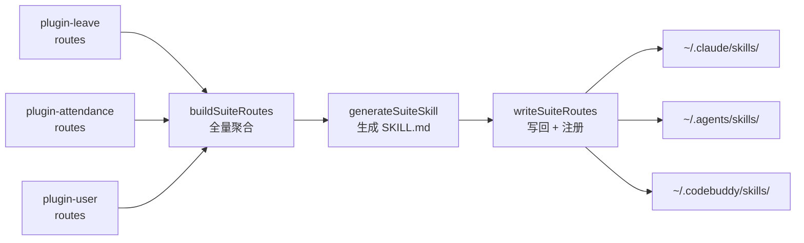

# 03 — Skills 注册与 Suite 路由

> Skills 是 AI Agent 发现和调用 saicmotor 能力的唯一入口。本章覆盖 skills 的注册/注销机制、suite 路由聚合原理、以及卸载时的同步清理。

## AI 客户端映射

Skills 需要注册到各 AI 客户端的 skills 目录才能被 AI 发现：

| AI 客户端 | Skills 目录 |
|-----------|-------------|
| Claude Code | `~/.claude/skills/` |
| Cursor / Agent | `~/.agents/skills/` |
| CodeBuddy | `~/.codebuddy/skills/` |

**新增客户端需两处同步**：
- `packages/cli/src/plugin/registrar.ts` → `AI_CLIENT_SKILL_DIRS`
- `packages/cli/scripts/uninstall.js` → `clientSkillDirs()`

## 注册策略

`registerSkill(skillDir, skillName)` 为每个 AI 客户端目录建立链接：

1. **junction**（Windows）/ **symlink**（Unix）——优先，零拷贝
2. **copy**（降级）——junction/symlink 失败时递归复制整个 skill 目录
3. **skipped**（目标已存在）——不覆盖已有条目

```typescript
// registrar.ts 核心流程
function registerSkill(skillDir: string, skillName: string): SkillRegResult[] {
  for (const [client, clientSkillsDir] of Object.entries(AI_CLIENT_SKILL_DIRS)) {
    const target = path.join(clientSkillsDir, skillName);
    if (fs.existsSync(target)) {
      // 已存在 → skipped
      continue;
    }
    try {
      fs.symlinkSync(skillDir, target, "junction");  // junction
    } catch {
      copyDirSync(skillDir, target);                  // 降级 copy
    }
  }
}
```

## 注册 / 注销 API

| 函数 | 职责 |
|------|------|
| `registerSkill(dir, name)` | 为单个 skill 在各客户端建立 junction/copy |
| `unregisterSkill(name)` | 删除单个 skill 在各客户端的条目 |
| `registerPluginSkills(pkgRoot, skillDirs)` | 注册插件的全部 skills（不刷新 suite） |
| `unregisterPluginSkills(skillDirs)` | 注销插件的全部 skills |
| `unregisterAllSkills()` | 扫描各客户端，删除所有 `saicmotor-*` 前缀的条目（幂等） |
| `writeSuiteRoutes(suiteDir?)` | 重建 suite SKILL.md 并注册到各客户端 |

## Suite 路由聚合

`saicmotor-suite` 是 AI Agent 的入口 skill——Agent 先读它来理解"哪些意图对应哪个 skill"。

路由表**全量重建、非增量追加**——每次调用 `writeSuiteRoutes()` 时：

```
writeSuiteRoutes()
  ├─ buildSuiteRoutes()
  │    └─ loadPlugins() → 扫描所有已装插件的 manifest.routes
  │         plugin-leave:       { "请假": "saicmotor-leave", "休假": "saicmotor-leave" }
  │         plugin-attendance:  { "考勤": "saicmotor-attendance", "打卡": "saicmotor-attendance" }
  │         plugin-user:        { "用户信息": "saicmotor-user", "whoami": "saicmotor-user" }
  │         → 合并为路由表
  ├─ generateSuiteSkill(routes)
  │    → 生成 skills/saicmotor-suite/SKILL.md（含 YAML frontmatter + 路由表）
  └─ registerSkill("saicmotor-suite")
       → junction 到各 AI 客户端
```



**关键设计决策**：

| 决策 | 说明 |
|------|------|
| **全量重建** | 卸载插件后路由自动收缩，无需手动清理 |
| **routes 在 manifest 中声明** | 插件自己定义"我能处理什么意图"，引擎只负责聚合 |
| **两步式但同步发生** | `registerPluginSkills` 只注册 skills（不刷新 suite）；suite 刷新由命令层紧随其后的 `writeSuiteRoutes()` 完成（plugin-cmds.ts），两步在同一命令执行内串联 |
| **不依赖 `saicmotor install`** | `plugin install` 内部调 `registerPluginSkills` + `writeSuiteRoutes`，无需用户手动跑 `saicmotor install` |

> `saicmotor install` 只负责注册内核 skill（suite + shared）。之后每次 `plugin install` / `uninstall` / `enable` / `disable` 都会自动更新 suite 路由表。

## 卸载时的同步清理

两个清理路径：

### 路径 1：`saicmotor uninstall`（用户主动）

```
saicmotor uninstall
  → unregisterAllSkills()     ← 扫描并删除所有 saicmotor-* 条目
  → rm -rf ~/.saicmotor       ← 删除本地数据
  → npm uninstall -g          ← 自删 npm 包
```

### 路径 2：`npm uninstall -g`（preuninstall 兜底）

`scripts/uninstall.js` 在包的 `preuninstall` 生命周期触发：

```javascript
// 守卫：仅全局卸载 + 非 npx 时执行（源码为德摩根等价的提前退出写法）
if (isNpx() || !isGlobalUninstall()) process.exit(0);
cleanup();  // 内联实现：扫描 clientSkillDirs() 删 saicmotor-* + 删 ~/.saicmotor
```

> **重要**：`cleanup()` 是 **CommonJS 内联实现**，不调用 `registrar.ts` 的 `unregisterAllSkills()`（preuninstall 钩子无法 import TS 模块）。两者逻辑等价（都按 `saicmotor-` 前缀扫描删除），这正是上文「新增客户端需两处同步」的根本原因——目录清单在 registrar.ts 与 uninstall.js 中各有一份。

两个守卫确保：
- **`isGlobalUninstall()`**：`npm_config_global === "true"` —— 本地 `npm uninstall`（无 `-g`）不会误删全局数据
- **`isNpx()`**：`npm_command === "exec"` —— `npx @saicmotor/cli` 的临时安装不会触发清理

preuninstall 脚本**永不抛异常**——所有错误被静默吞掉，确保 `npm uninstall -g` 本身不被阻断。
