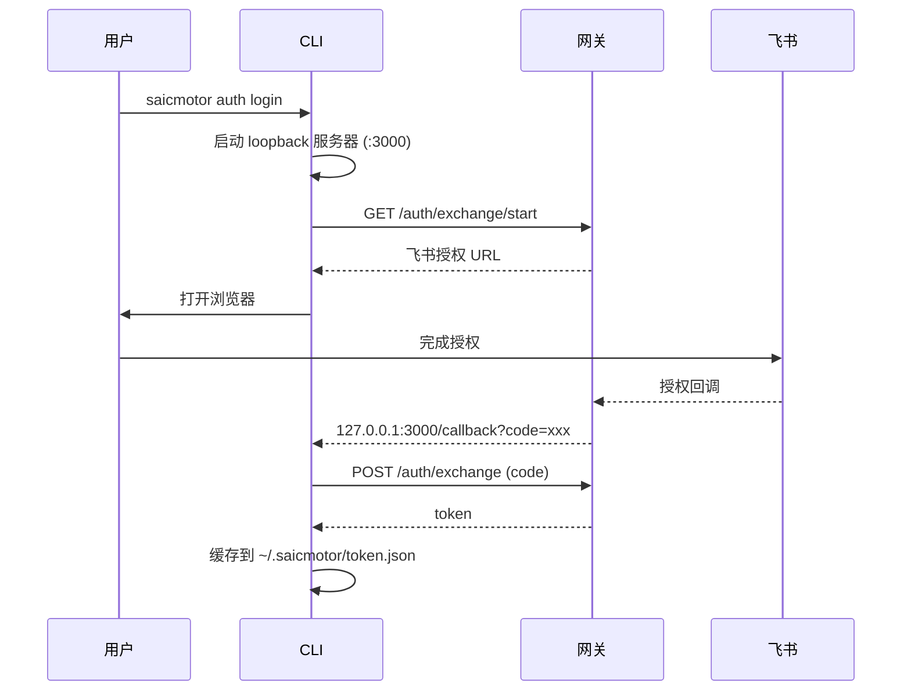

# 04 — 认证体系

> saicmotor 支持 exchange（飞书 OAuth）和 password 两种认证协议，默认 exchange。本章覆盖认证流程、token 管理、自动重试机制。

## 配置加载链

```
环境变量 (SAICMOTOR_GATEWAY / SAICMOTOR_AUTH_TYPE)
        ↓ 覆盖
~/.saicmotor/config.json（用户配置）
        ↓ 覆盖
saicmotor.config.json（包默认值）
        ↓ 兜底
DEFAULT_CONFIG（代码硬编码）
```

优先级：环境变量 > 用户配置 > 包默认值 > 硬编码。

## Exchange 模式（飞书 OAuth，默认）

```
用户执行 saicmotor auth login
  → CLI 在 127.0.0.1:3000 启动 loopback 回调服务器
    → GET /auth/exchange/start（从网关获取飞书授权 URL）
      → openBrowser(authUrl) 弹出浏览器
        → 用户在飞书页面完成授权
          → 飞书回调网关 → 网关回调 127.0.0.1:3000/callback?code=xxx&state=yyy
            → POST /auth/exchange（用 code 交换 token）
              → 缓存 token 到 ~/.saicmotor/token.json
```



## Password 模式

通过环境变量显式启用：

```bash
# Windows PowerShell
$env:SAICMOTOR_AUTH_TYPE="password"
saicmotor auth login --username <工号> --password <密码>

# Mac / Linux
SAICMOTOR_AUTH_TYPE=password saicmotor auth login --username <工号> --password <密码>
```

> **注意**：`SAICMOTOR_AUTH_TYPE` 的默认值是 `"exchange"`（`src/config.ts` 的 `DEFAULT_CONFIG.auth.type`）。password 模式仅用于本地开发/测试，生产环境不使用。

## Token 管理

### ensureToken(config)

```
ensureToken(config)
  ├─ 未强制刷新 → readToken() 读 ~/.saicmotor/token.json（磁盘缓存）
  │    └─ 有 token → 直接返回（无过期检查——过期靠运行时 401 发现）
  ├─ password 模式且无凭证 → 抛"未登录"错误（提示先 auth login）
  └─ 无 token → auth.login()
       ├─ exchange → 启动 loopback → 浏览器授权 → 交换 token
       └─ password → POST /auth/login { username, password }
```

> **注意**：token 缓存是**磁盘文件**（`~/.saicmotor/token.json`，每次调用重新读取），不是内存缓存；token.json 只存 token 字符串本身，**没有过期时间字段**。过期不主动检测，唯一发现途径是运行时 401。

### 401 自动重试

`runMethod()` 中的重试逻辑（engine/run.ts）：

```typescript
let token = await ensureToken(config);
let resp = await execute(config, ...);
if (resp.status === 401) {
  clearToken();                                   // 清除过期 token
  token = await ensureToken(config, { force: true }); // 强制重新登录
  resp = await execute(config, ...);              // 重试一次
}
```

**只重试一次**——如果重试后仍然 401，直接抛错。

### Token 缓存位置

- `~/.saicmotor/token.json` — 缓存的 bearer token
- `~/.saicmotor/credentials.json` — 凭证（password 模式，`mode 0600`）

## Auth Transport

所有 HTTP 请求通过 `applyAuth()` 注入认证头：

```typescript
// 默认配置下（tokenHeader: "Authorization", tokenPrefix: "Bearer"）
headers["Authorization"] = `Bearer ${token}`;
// header 名与前缀可经 config.auth.tokenHeader / tokenPrefix 配置
```

## 环境变量覆盖

| 变量 | 作用 |
|------|------|
| `SAICMOTOR_AUTH_TYPE` | 强制认证类型（`"exchange"` 或 `"password"`） |
| `SAICMOTOR_USERNAME` | password 模式的用户名 |
| `SAICMOTOR_PASSWORD` | password 模式的密码 |
| `SAICMOTOR_GATEWAY` | 网关地址（覆盖 config.json） |

## 安全约束

- 写操作（非 GET 请求，含 POST/PUT/DELETE/PATCH）默认拒绝，需 `--yes` 确认或 `--dry-run` 预览
- 凭证与 token 文件均以 `mode 0600` 写入
- Token 不过期不重登，仅 401 触发重登
- 成功 → stdout + exit 0；错误 → stderr + 结构化 JSON + 语义化退出码
