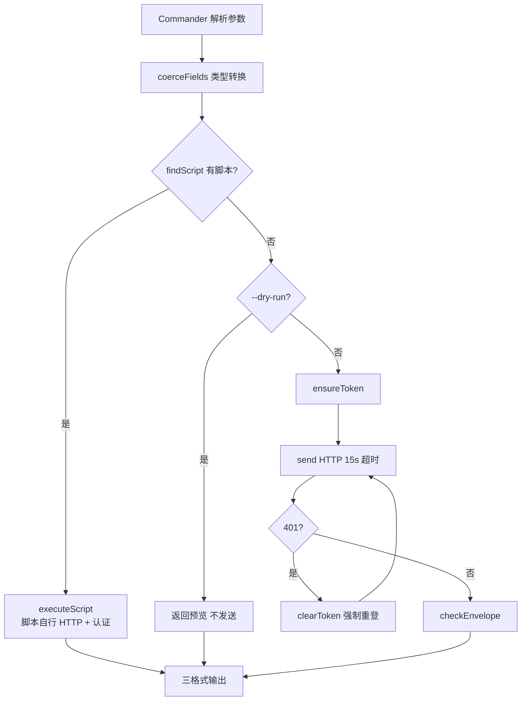

# 05 — 执行引擎

> CLI 执行引擎负责将用户的命令字符串转化为 HTTP 请求、执行脚本、格式化输出。本章覆盖从命令注册到结果输出的完整管道。

## 命令注册

CLI 使用 Commander 12，在启动时动态注册命令树：

```
cli/index.ts
  → loadCatalog()           ← 加载核心 catalog/services/*.json
  → loadPlugins()           ← 扫描已装插件
  → 为每个 service.resource.method 注册 Commander 子命令
```

命名规则：`saicmotor <service> <resource> <method> [--params]`

例如插件 `plugin-leave` 的 `catalog/services/leave.json` 中（简化示意）：
```json
{
  "name": "leave",
  "servicePath": "/api/leave",
  "resources": {
    "balance": {
      "methods": {
        "query": { "id": "balance.query", "path": "/balance", "httpMethod": "GET", "description": "查询余额" }
      }
    }
  }
}
```
自动生成命令：`saicmotor leave balance query`

> **注意**：`name`、`servicePath` 及 method 的 `id`/`path`/`httpMethod` 均为 zod 必填字段，缺失会抛 `spec` 错误。CLI 核心自身不内置业务 catalog——所有服务声明都来自插件包（核心 `catalog/services/` 目前为空）。

## 执行管道

```
saicmotor leave applications submit --start-date 2026-09-21 --reason 年假 --yes
│
├─ 1. Commander 解析参数
│     --kebab-case → catalog 字段名（--start-date → startDate）
│
├─ 2. runMethod(config, service, resource, method, raw, opts)
│     │
│     ├─ coerceFields()         ← 参数校验 + 类型转换（string→int/float/boolean）
│     │
│     ├─ findScript()           ← 四层查找脚本覆盖（见下文）
│     │    ├─ 有脚本 → executeScript() → 脚本内自行 HTTP + 认证
│     │    └─ 无脚本 → HTTP 直连管线
│     │
│     ├─ ensureToken()          ← 获取/刷新 auth token
│     ├─ buildUrl()             ← 拼接 gateway + servicePath + method.path
│     ├─ buildBody()            ← 构造 JSON body（coerceFields 后的值）
│     ├─ send()                 ← fetch(url, { method, headers, body })，超时 15s
│     ├─ 401？→ clearToken() → ensureToken(force=true) → 重试一次
│     └─ checkEnvelope()        ← 校验 HTTP status < 400 && body.code === 0
│
└─ 3. formatJson / formatTable / formatEnvelope → stdout
```



## 引擎模块

| 模块 | 文件 | 职责 |
|------|------|------|
| **入口** | `cli/index.ts` | Commander 初始化、动态注册命令 |
| **管道** | `engine/run.ts` | `runMethod()` — 编排整条执行管道 |
| **Catalog** | `engine/catalog.ts` | `loadCatalog()` — 加载 + zod 校验 |
| **脚本** | `engine/script.ts` | `findScript()` + `executeScript()` — 四层查找 + 动态 import |
| **HTTP** | `engine/http.ts` | `send()` — fetch 封装、超时 15s、JSON 自动解析 |
| **请求构造** | `engine/request.ts` | `buildUrl/buildBody/coerceFields` |
| **输出** | `engine/output.ts` | JSON / Table / Pretty 三格式 |
| **错误** | `engine/errors.ts` | `SaicmotorError` 结构化错误 |

## 脚本查找优先级

```
1. SAICMOTOR_SCRIPTS 环境变量显式覆盖（测试/定制场景）
     → $SAICMOTOR_SCRIPTS/<svc>/<res>/<method>.{js,ts}

2. 已加载插件的 scripts 目录（插件贡献）
     → <plugin-root>/<scripts-dir>/<svc>/<res>/<method>.js

3. 编译产物（npm 安装形态）
     → dist/scripts/<svc>/<res>/<method>.js

4. 源码树（本地 tsx 开发）
     → scripts/<svc>/<res>/<method>.ts
```

## 脚本执行上下文

当 `findScript()` 命中脚本时，引擎注入 `ScriptContext`：

```typescript
interface ScriptContext {
  config: Config;           // 网关配置（含 gateway 地址）
  service: Service;         // catalog service 声明
  method: Method;           // 当前 method（path, httpMethod, requestBody）
  values: Record<string, unknown>;  // 用户传参（已过 coerceFields）
  dryRun: boolean;          // --dry-run 标志
  ensureToken: () => Promise<string>;  // 引擎注入的 token 获取函数
}
```

脚本自行完成 HTTP 调用（Node ≥ 20 内置 `fetch`），引擎不再介入 HTTP 管线。

## 输出格式

| 格式 | 用途 | 示例 |
|------|------|------|
| `json` | 程序/脚本消费（默认） | `{ "ok": true, "data": {...} }` |
| `table` | 人眼快速浏览 | ASCII 表格 |
| `pretty` | 人眼阅读美化 | 缩进键值对 |

## 错误处理

```typescript
type ErrorCategory = "validation" | "auth" | "network" | "upstream" | "spec";

class SaicmotorError extends Error {
  readonly category: ErrorCategory;  // 错误类别
  readonly hint?: string;            // 修复提示
  readonly upstream?: { code?: unknown; message?: string };  // 上游错误详情
  get exitCode(): number;            // 语义化退出码（见下表）
}
```

| category | 触发场景 | exit code |
|----------|----------|:---:|
| `validation` | 参数校验失败 | 2 |
| `auth` | 未登录 / 认证失败 | 3 |
| `network` | 网络不可达 / 超时 | 4 |
| `upstream` | HTTP 4xx/5xx 或上游业务错误（body.code ≠ 0） | 5 |
| `spec` | catalog/manifest 声明不合法 | 6 |
