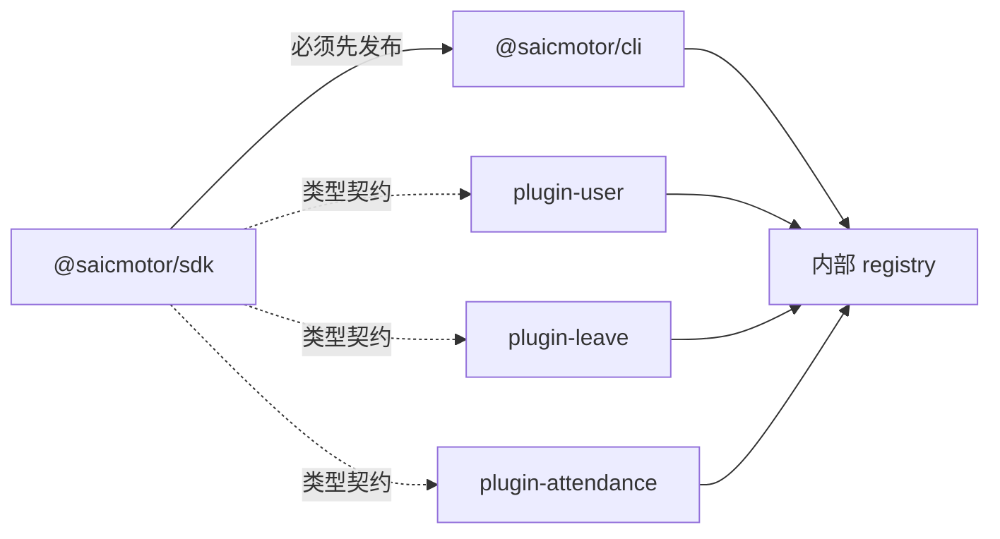

# 06 — 构建与发布

> saicmotor 是 npm workspaces monorepo，5 个包通过内部 registry 分发。本章覆盖构建流程、发布策略、lifecycle hooks 和历史教训。

## Monorepo 构建流程

```
npm run build（根目录）
  → tsc --workspace=packages/sdk       ← SDK 必须先编译（CLI runtime dep）
  → tsc --workspace=packages/cli       ← CLI 编译
  → tsc --workspace=packages/plugin-*  ← 各插件编译
```

**构建顺序约束**：`@saicmotor/sdk` 是 `@saicmotor/cli` 的 runtime dependency，SDK 必须先于 CLI 编译。插件之间无编译依赖，可并行。

### 当前构建脚本

```json
"build": "npm run build --workspace=packages/sdk && npm run build --workspaces"
```

> **已知问题**（todo #8）：`--workspaces` 包含所有 workspace，SDK 会被编译两次——先单独一次，再在 `--workspaces` 中第二次。行为无害，已在待办事项中跟踪。

## npm Workspaces 配置

根 `package.json`：

```json
{
  "workspaces": [
    "packages/cli",
    "packages/sdk",
    "packages/plugin-user",
    "packages/plugin-leave",
    "packages/plugin-attendance"
  ]
}
```

## files 字段策略

**逐文件显式列出，不依赖目录粗粒度通配**（来自飞书 CLI 教训）。CLI 包实际配置：

```json
{
  "files": [
    "README.md",
    "dist/src/**/*.js",
    "dist/scripts/**/*.js",
    "skills/**/*.md",
    "catalog/**/*.json",
    "scripts/run.js",
    "scripts/uninstall.js",
    "saicmotor.config.json"
  ]
}
```

- 不用 `"files": ["*"]` 或 `.npmignore` 排斥法——容易意外泄露源码、测试、配置
- 关键脚本（如 `scripts/run.js`、`scripts/uninstall.js`）**逐文件单列**而非整目录打包，控制发布面
- 新增文件/目录时记得同步更新 `files` 字段

## Lifecycle Hooks

| Hook | 触发时机 | 用途 |
|------|----------|------|
| `prepublishOnly` | `npm publish` 前 | 运行 build + test，确保只发布编译通过且测试全绿的代码 |
| `preuninstall` | `npm uninstall -g` 前 | 清理 skills + 本地数据（`scripts/uninstall.js`） |

> **历史注**：曾有 `postinstall` hook 在安装后自动注册 AI skills，后已移除——skills 注册收回到 `saicmotor install` 命令（CLI 内核），避免对 npm lifecycle 环境的依赖。npm v11 的 `allow-scripts` 白名单对 `-g` 全局安装无效曾导致 postinstall 被阻止，用户需手动执行 `saicmotor install`——这也是移除该 hook 的动因之一。

### preuninstall 守卫

`scripts/uninstall.js` 有两个守卫避免误删：

```javascript
function isGlobalUninstall() {
  return process.env.npm_config_global === "true";
}
function isNpx() {
  return process.env.npm_command === "exec";
}
if (!isNpx() && isGlobalUninstall()) {
  cleanup();  // 清 skills + 删 ~/.saicmotor
}
```

- **`isGlobalUninstall()`**：本地 `npm uninstall`（无 `-g`）不触发清理，防止删掉全局的 `~/.saicmotor`
- **`isNpx()`**：`npx @saicmotor/cli` 临时安装不触发清理
- **永不抛异常**：任何失败都被静默吞掉，确保 `npm uninstall -g` 不被阻断（即使 skills 清理失败，npm 包仍能被正常卸载）

### npm v11 兼容（历史）

npm v11 的 `allow-scripts` 白名单对 `-g` 全局安装无效，曾使 postinstall（自动注册 skills）被阻止。该 hook 移除后，skills 注册由用户显式执行 `saicmotor install` 完成，此坑不再存在。

## 发布流程



### 发布到内部 Registry

```bash
# 1. 清空 + 重新编译
npm run clean
npm run build

# 2. 运行测试（确保全绿）
npm test

# 3. 发布各包（SDK 必须先于 CLI）
npm publish --registry=<内部 registry> --workspace=packages/sdk
npm publish --registry=<内部 registry> --workspace=packages/plugin-user
npm publish --registry=<内部 registry> --workspace=packages/plugin-leave
npm publish --registry=<内部 registry> --workspace=packages/plugin-attendance
npm publish --registry=<内部 registry> --workspace=packages/cli
```

### 验证发布

```bash
npm view @saicmotor/cli version --registry=<内部 registry>
npm view @saicmotor/sdk version --registry=<内部 registry>
npm view @saicmotor/plugin-leave version --registry=<内部 registry>
```

### --registry flag vs .npmrc

**主推 `--registry` flag**：

```bash
npm install -g @saicmotor/cli --registry=<内部 registry>
```

优于全局配置 `.npmrc` scoped registry——flag 是显式的、一次性的，不会影响本机其他 npm 包的安装行为。

## 本地测试发布（Verdaccio）

```bash
# 启动 Verdaccio
docker run -d --rm --name verdaccio -p 4873:4873 verdaccio/verdaccio

# 登录
npm login --registry=http://localhost:4873

# 发布
npm publish --registry=http://localhost:4873 --workspace=packages/cli
```

## 历史教训

- **files 字段必须显式**：逐文件列出（如 `scripts/run.js` 单列）而非 `*` + `.npmignore`
- **npx 检测**：lifecycle 脚本中检测 `npm_command === "exec"` 跳过重量级操作（现用于 preuninstall 的 uninstall.js）
- **preuninstall 有守卫**：`npm_config_global` + npx 双重守卫防止误删数据
- **--registry flag 优于 .npmrc**：不影响用户机器上其他包
- **skills 注册不依赖 lifecycle hook**：postinstall 曾因 npm v11 白名单对 `-g` 失效而不可靠，收回 `saicmotor install` 命令后彻底免疫
