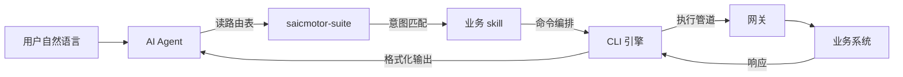
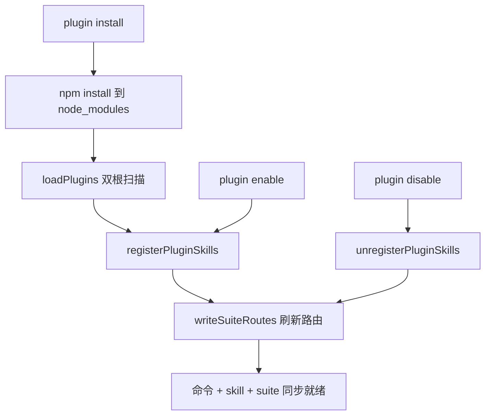
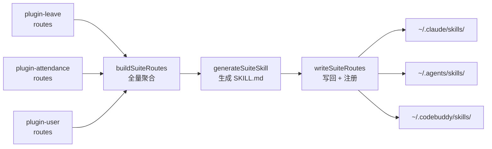
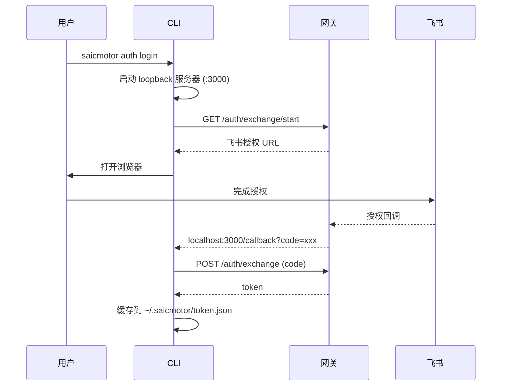
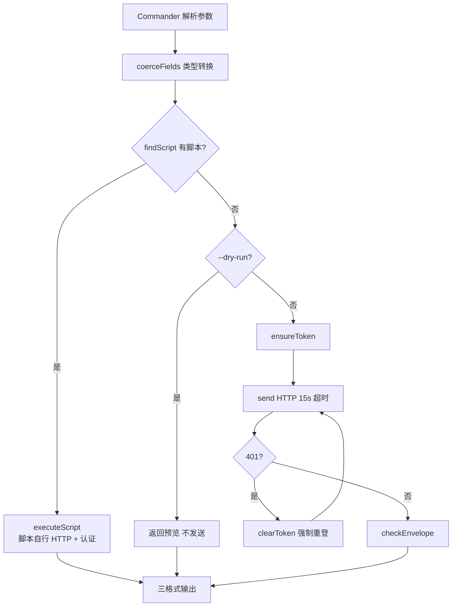
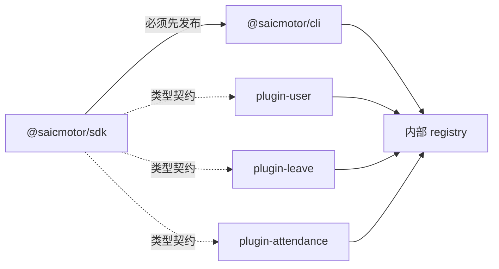

# 文档体系重构 Implementation Plan

> **For agentic workers:** REQUIRED SUB-SKILL: Use superpowers:subagent-driven-development (recommended) or superpowers:executing-plans to implement this plan task-by-task. Steps use checkbox (`- [ ]`) syntax for tracking.

**Goal:** Restructure documentation into 5 targeted documents for 5 audiences: end users, plugin developers, testers (already done), framework developers, and AI agents.

**Architecture:** 3 standalone files in `howto/` + 6-chapter folder in `docs/framework/` + 1 todo.md update. Two documents (USER-GUIDE.md, FOR-AI-INSTALL.md) are net-new; PLUGIN-DEVELOPER.md is an update of the existing `howto/DEVELOPER.md`; the 6 framework chapters extract and reorganize content from `docs/history/ARCHITECTURE.2.0.md` verified against current source code. `howto/MANUAL-TESTING.md` is out of scope (already done).

**Tech Stack:** Markdown (pure documentation, no code changes)

**Diagram requirement (user-approved addition, 2026-09-29):** 所有涉及技术部分的文档必须图文并茂。6 个框架章节保留内容中已嵌入的全部 ASCII 图（任何环境可渲染），并各附一张 mermaid 图描述本章核心机制（GitHub/VS Code 渲染为真正的图形）；Task 2（PLUGIN-DEVELOPER.md）新增两张 ASCII 图（开发工作流 + script 决策流程）。

**Source references:**
- `docs/history/DEVELOPER.md` — existing plugin dev guide (v1.0.0-era, needs v0.8.0 update)
- `docs/history/ARCHITECTURE.2.0.md` — architecture whitepaper (80KB, to be split into 6 chapters)
- `docs/history/howto/INSTALL.md` — old install guide (mixed audience, some outdated)
- Source code: `packages/cli/src/plugin/*.ts`, `packages/cli/src/engine/run.ts`, `packages/cli/src/auth/*.ts`, `packages/cli/scripts/uninstall.js`, `packages/cli/package.json`, `packages/sdk/src/*.ts`

**Key facts verified from source (v0.8.0):**
- `CORE_VERSION = "0.8.0"` (loader.ts:60)
- `AI_CLIENT_SKILL_DIRS` = claude/agents/codebuddy (registrar.ts:9-13)
- Exchange (Feishu OAuth) is default auth; password gated by `SAICMOTOR_AUTH_TYPE=password` env
- Junction on Windows, symlink on Unix, copy fallback (registrar.ts:39-49)
- `--registry` flag is the recommended install approach
- Suite routing: `buildSuiteRoutes()` → `generateSuiteSkill()` → `writeSuiteRoutes()` (registrar.ts:81-92)
- Preuninstall hook at `scripts/uninstall.js` with `npm_config_global` + npx guards
- `files` field in package.json explicitly lists files (per lessons learned)
- Dual-root scan: `linked/` first, then `node_modules/` (loader.ts:72)

---

### Task 1: `howto/USER-GUIDE.md` — End User Guide

**Files:**
- Create: `howto/USER-GUIDE.md`

- [ ] **Step 1: Write the file**

Write the complete file below to `howto/USER-GUIDE.md`:

```markdown
# saicmotor CLI 使用指南

> 装好就能用——在终端里查年假、看考勤、提交请假。人和 AI Agent 都能用同一套命令。

## 环境要求

- **Node.js ≥ 20**（内置 `fetch`，零额外依赖）
- 网络能访问公司内部 npm registry

## 安装

```bash
npm install -g @saicmotor/cli --registry=<公司内部 registry 地址>
```

一行搞定。装完后注册 AI skills：

```bash
saicmotor install
```

> **预期**：`✓ 2 个 AI skills 已注册`（`saicmotor-suite` + `saicmotor-shared`）。

验证安装：

```bash
saicmotor --version   # 应输出版本号
saicmotor --help      # 列出所有可用命令
```

> **npm v11 用户注意**：如果 `saicmotor` 命令找不到或 skills 未注册，手动执行 `saicmotor install` 即可。

## 登录

生产环境走飞书 OAuth（默认），敲命令后浏览器自动弹出授权：

```bash
saicmotor auth login
```

浏览器完成授权后 token 自动缓存，后续命令无需重复登录。

验证登录状态：

```bash
saicmotor auth status   # 应显示"已登录"
```

## 常用命令

### 查年假余额

```bash
saicmotor leave balance query
saicmotor leave balance query --format table    # 表格
saicmotor leave balance query --format json     # JSON（默认）
saicmotor leave balance query --format pretty   # 美化输出
```

### 查考勤记录

```bash
saicmotor attendance records query --format table
```

### 提交请假

```bash
# 先预览（不真正提交）
saicmotor leave applications submit --start-date 2026-09-21 --end-date 2026-09-22 --reason 年假 --dry-run

# 正式提交（必须加 --yes）
saicmotor leave applications submit --start-date 2026-09-21 --end-date 2026-09-22 --reason 年假 --yes
```

### 补卡

```bash
saicmotor attendance corrections submit --date 2026-09-21 --reason 忘记打卡 --dry-run
saicmotor attendance corrections submit --date 2026-09-21 --reason 忘记打卡 --yes
```

### 查看已装插件

```bash
saicmotor plugin list
```

## 输出格式

所有命令支持三种格式，通过 `--format` 切换：

| 格式 | 用途 |
|------|------|
| `json` | 程序/脚本消费（默认） |
| `table` | 人眼快速浏览 |
| `pretty` | 人眼阅读美化 |

## 写操作安全

所有会产生副作用的命令（提交请假、补卡等）：

- **不加 `--yes`**：被拒绝执行，提示"该命令有副作用，加 --yes 确认，或加 --dry-run 预览"
- **加 `--dry-run`**：预览请求内容但不发送
- **加 `--yes`**：确认执行

## 卸载

```bash
saicmotor uninstall
```

一键清除全部 AI skills、本地数据、自删 npm 包。无需手动清理任何残留。

## 常见错误速查

| 症状 | 解决 |
|------|------|
| `saicmotor` 找不到命令 | 关掉终端重新打开；检查 Node.js 全局 bin 是否在 PATH |
| "未登录" | `saicmotor auth login` 重新登录 |
| `401` 错误 | token 过期，`saicmotor auth login` 重新登录 |
| 安装很慢或失败 | 检查 `--registry` 地址是否正确 |
| skills 未注册 | `saicmotor install --force` 手动注册 |
```

- [ ] **Step 2: Verify file line count**

```bash
wc -l howto/USER-GUIDE.md
```

Expected: ~100-120 lines.

- [ ] **Step 3: Commit**

```bash
git add howto/USER-GUIDE.md
git commit -m "docs: add end user guide (howto/USER-GUIDE.md)"
```

---

### Task 2: `howto/PLUGIN-DEVELOPER.md` — Plugin Developer Guide

**Files:**
- Create: `howto/PLUGIN-DEVELOPER.md` (based on the content of `docs/history/DEVELOPER.md` — the archived plugin handbook; `howto/DEVELOPER.md` no longer exists on disk)

**Context:** The archived `docs/history/DEVELOPER.md` (「saicmotor 插件开发手册」, 10 sections + appendix) is structurally excellent but was written against a hypothetical v1.0.0. It needs version/reference corrections for v0.8.0 reality, `--registry` flag emphasis, `routes` field additions, and exchange-default auth notes. Note: `docs/history/howto/DEVELOPER.md` is a DIFFERENT document (framework-takeover guide) — do not use it as source.

- [ ] **Step 1: Apply version/naming corrections**

Read the existing file and apply these targeted edits:

1. **Title + first paragraph** — change version reference:
   - Old: `@saicmotor/cli ≥ 1.0.0` → New: `@saicmotor/cli ≥ 0.8.0`
   - Old: `saicmotor --version  # 应输出 1.0.0` → New: `saicmotor --version  # 应输出 0.8.0`

2. **Section 1 (前置准备)** — update registry guidance:
   - Old: `npm install -g @saicmotor/cli --registry=<内部 registry 地址>` (keep, correct)
   - Add after the install command: `> **推荐使用 `--registry` flag 而非全局 `.npmrc`**：flag 是显式的、一次性的，不会影响本机其他 npm 包。`

3. **Section 2 (项目结构)** — update `routes` mention:
   - In the file structure diagram, ensure `saicmotor.plugin.json` comment mentions `routes` field
   - In the key files table, add a row for `routes` (in manifest):
     ```
     | `saicmotor.plugin.json` 中的 `routes` | CLI 引擎（suite 路由聚合） | ❌（无路由需求可不写） |
     ```

4. **Section 9.3 (写作要点)** — add a 5th bullet about `routes`:
   ```
   5. **声明 routes**：在 manifest 中写 `"routes": { "关键词": "saicmotor-xxx" }`——这是 AI 发现你的插件的入口，不声明 routes 意味着 AI 只能通过 suite 路由表以外的途径发现你的 skill
   ```

5. **Section 10 (排障)** — update troubleshooting commands:
   - Old: `ls ~/.saicmotor/plugins/linked/` → New: keep (still correct)
   - Old: `ls dist/scripts/...` → New: keep (still correct)
   - In the "engine 兼容" tip: Old `当前核心版本 1.0.0` → New: `当前核心版本 0.8.0`

6. **Appendix A (字段参考)** — update engine example:
   - Old: `"engine": "^1.0.0"` → New: `"engine": "^0.8.0"` (throughout the appendix and section 8.2)

7. **新增两处图示**（图文并茂要求）：

   在第 2 节末尾（「3. 快速开始」标题之前）插入开发工作流图：

   ```text
   开发工作流（5 步出插件）

   create plugin ──→ 编辑 catalog + SKILL.md ──→ dev 联调 ──→ validate ──→ publish
     生成骨架          声明 API + AI 手册       linked/ 加载   zod 校验    内部 registry
   ```

   在 4.2 节的判定表格之后插入决策流程图：

   ```text
   何时写 script？

        业务请求
           │
     需要先查再判断 / 多步编排 / 响应聚合？
           │是                    │否
           ▼                      ▼
     写 script 覆盖          声明式 catalog
     scripts/<svc>/<res>/<method>.ts    （零代码）
   ```

- [ ] **Step 2: Commit**

```bash
git add howto/PLUGIN-DEVELOPER.md
git commit -m "docs: add plugin developer guide for v0.8.0 (howto/PLUGIN-DEVELOPER.md)"
```

- [ ] **Step 2: Verify the new file is correct**

```bash
wc -l howto/PLUGIN-DEVELOPER.md
```

Expected: ~490 lines (original ~465 + 2 diagrams + routes rows).

---

### Task 3: `howto/FOR-AI-INSTALL.md` — AI Agent Install Guide

**Files:**
- Create: `howto/FOR-AI-INSTALL.md`

- [ ] **Step 1: Write the file**

Write the complete file below to `howto/FOR-AI-INSTALL.md`:

```markdown
# saicmotor CLI 安装指引

> 面向 AI Agent —— 通过 WebFetch 抓取本页面，按指引完成安装。

## 安装

```bash
npm install -g @saicmotor/cli --registry=<公司内部 registry 地址>
```

> 如果用户在内网且 registry 地址未知，询问用户"公司内部 npm registry 地址是什么"。

## 代理环境

如果用户环境需要代理访问 registry：

```bash
# Windows PowerShell
$env:HTTP_PROXY="http://代理地址:端口"
$env:HTTPS_PROXY="http://代理地址:端口"

# Mac / Linux
export HTTP_PROXY=http://代理地址:端口
export HTTPS_PROXY=http://代理地址:端口
```

设置完代理后再执行安装命令。

## 注册 AI skills

```bash
saicmotor install
```

> **预期**：`✓ 2 个 AI skills 已注册`。

npm v11 用户如果 skills 未自动注册，手动执行此命令即可。

## 验证安装

```bash
saicmotor --version
```

输出版本号即安装成功。如果提示"找不到命令"，让用户关掉终端重新打开。

## 安装失败排查

- **registry 不可达**：确认 registry 地址正确，检查网络/代理
- **Node.js 版本过低**：需要 Node.js ≥ 20
- **权限不足**：Windows 上尝试以管理员身份运行终端；Mac/Linux 检查 npm 全局目录权限
- **npm v11 allow-scripts 阻止**：手动执行 `saicmotor install` 注册 skills

## 安装完成后

1. 配置网关地址（询问用户，写入 `~/.saicmotor/config.json`）：
   ```json
   { "gateway": "http://网关地址" }
   ```
2. 引导用户登录：
   ```bash
   saicmotor auth login
   ```
   浏览器弹出飞书授权页面，用户完成授权后即可使用。
3. 当用户说"帮我查年假"/"帮我请假"等意图时，先读 `saicmotor-suite` skill 查找路由，再读对应业务 skill 了解命令拼法。
```

- [ ] **Step 2: Verify file line count**

```bash
wc -l howto/FOR-AI-INSTALL.md
```

Expected: ~55-65 lines.

- [ ] **Step 3: Commit**

```bash
git add howto/FOR-AI-INSTALL.md
git commit -m "docs: add AI agent install guide (howto/FOR-AI-INSTALL.md)"
```

---

### Task 4: `docs/framework/01-architecture.md` — Architecture Overview

**Files:**
- Create: `docs/framework/01-architecture.md`

**Source mapping from ARCHITECTURE.2.0.md:** §§1, 2, 10, 12 + tech stack table

- [ ] **Step 1: Create directory**

```bash
mkdir -p docs/framework
```

- [ ] **Step 2: Write the file**

Write to `docs/framework/01-architecture.md`:

```markdown
# 01 — 架构总览

> @saicmotor/cli 0.8.0 — 面向 AI Agent 的插件化企业 CLI 平台

## 一句话架构

```
AI Agent 读 SKILL.md 发现能力 → CLI 从 catalog 声明式注册命令 → 引擎管道执行 → 输出
```

三个角色：**AI Agent（决策者）** → **CLI 引擎（执行者）** → **上游网关（数据源）**。
插件生态贯穿始终——业务系统以独立 npm 包分发，不触碰核心代码。

## 四层架构

```
┌──────────────────────────────────────────┐
│           🧠 编排层（Skills）              │
│  SKILL.md — AI Agent 的操作手册           │
│  saicmotor-suite 路由表 + 各插件 skill     │
├──────────────────────────────────────────┤
│           📋 声明层（Catalog）             │
│  catalog/services/*.json — API 声明       │
│  zod 校验，零代码注册命令                  │
├──────────────────────────────────────────┤
│           ⚙️ 执行层（Engine）              │
│  run.ts → 参数校验 → token → HTTP → 输出  │
│  401 自动重试、脚本覆盖、三格式输出        │
├──────────────────────────────────────────┤
│           📦 插件层（Plugin System）       │
│  loader / registrar / suite / state       │
│  双根扫描、engine 校验、声明式路由聚合     │
└──────────────────────────────────────────┘
```

**加新业务系统只改上面两层**——写一份 catalog JSON + 一份 SKILL.md，引擎和插件框架不动。

## Monorepo 包拓扑

```
@saicmotor/sdk  ←── 纯类型 + zod schema（契约包）
       ↑ runtime dep              ↑ devDependency
@saicmotor/cli              @saicmotor/plugin-*
  （核心引擎）                  （业务插件，运行时动态加载）
```

**依赖关系：**
- `@saicmotor/cli` → `@saicmotor/sdk`（runtime）：CLI 在 loader.ts、tooling-cmds.ts 中直接 import SDK 的 schema 和类型
- 插件 → `@saicmotor/sdk`（devDependency）：写脚本时参考 `ScriptContext` 类型，不 import 到运行时代码
- CLI → 插件：运行时通过 npm install 安装到 `~/.saicmotor/plugins/node_modules/`，CLI 启动时扫描加载

## 仓库目录

```
saicmotor-cli/                        ← monorepo root
├── packages/
│   ├── cli/                          ← @saicmotor/cli（核心）
│   │   ├── src/cli/                  ← 命令面：index.ts + plugin-cmds + tooling-cmds
│   │   ├── src/engine/               ← 引擎管道：catalog / run / script / http / request / output
│   │   ├── src/auth/                 ← 认证：store / session / transport / provider
│   │   ├── src/plugin/               ← 插件系统：loader / registrar / suite / paths / state
│   │   ├── src/install/              ← Skills 安装器 + 一键卸载
│   │   ├── catalog/services/         ← 核心内置服务声明
│   │   ├── skills/                   ← 内核 skills（suite + shared）
│   │   └── scripts/                  ← 核心内置脚本（uninstall.js 等）
│   ├── sdk/                          ← @saicmotor/sdk（类型契约）
│   ├── plugin-leave/                 ← 请假插件（参考实现）
│   ├── plugin-attendance/            ← 考勤插件（参考实现）
│   └── plugin-user/                  ← 用户信息插件（参考实现）
├── docs/
│   ├── framework/                    ← 你正在读的架构文档
│   ├── sprint/                       ← Sprint 规划
│   └── history/                      ← 历史归档
└── howto/                            ← 面向用户的指南
```

## 技术栈

| 层 | 选型 | 原因 |
|----|------|------|
| 运行时 | Node ≥ 20 + TypeScript 5 | 内置 `fetch`，零 HTTP 依赖 |
| 命令行 | Commander 12 | 支持动态子命令注册 |
| 校验 | zod | 字段级错误信息，类型推导 |
| 测试 | vitest | 原生 TS，快 |
| 数据 | JSON（catalog + manifest） | 声明式，人和 AI 都能读 |
| 包管理 | npm workspaces | monorepo 标准方案 |
| 版本兼容 | semver | 插件 engine 检查 |

## 数据流

```
用户/AI 输入命令
  → Commander 解析（动态注册的命令树）
    → coerceFields（参数校验 + 类型转换）
      → findScript（检查脚本覆盖）
        ├─ 有脚本 → executeScript（ctx.ensureToken 由引擎注入）
        └─ 无脚本 → ensureToken → buildUrl → send → 401？→ 重试 → checkEnvelope → 输出
```



## 核心原则

- **声明式优先**：catalog JSON 能描述的不写代码
- **引擎通用**：HTTP 管线、认证、输出格式化全由引擎处理
- **插件生态**：业务能力以独立 npm 包分发，不碰核心
```

- [ ] **Step 3: Commit**

```bash
git add docs/framework/01-architecture.md
git commit -m "docs: add framework chapter 01 — architecture overview"
```

---

### Task 5: `docs/framework/02-plugin-system.md` — Plugin System

**Files:**
- Create: `docs/framework/02-plugin-system.md`

**Source mapping:** ARCHITECTURE.2.0.md §§5, 6 + loader.ts + paths.ts + state.ts

- [ ] **Step 1: Write the file**

Write to `docs/framework/02-plugin-system.md`:

```markdown
# 02 — 插件系统

> 业务能力以独立 npm 包分发，CLI 启动时扫描加载。本章覆盖插件的加载、生命周期、状态管理。

## 插件包结构

```
plugin-<name>/                       ← 独立的 npm 包
├── package.json                     ← @saicmotor/plugin-<name>
├── saicmotor.plugin.json            ← 插件 manifest（核心声明）
├── catalog/
│   └── services/
│       └── <name>.json              ← 服务声明（API 接口 + 参数 schema）
├── skills/
│   └── saicmotor-<name>/
│       └── SKILL.md                 ← AI Agent 操作手册
├── scripts/                         ← 自定义脚本（可选）
│   └── <service>/
│       └── <resource>/
│           └── <method>.ts
├── src/                             ← 辅助源码
└── test/
```

## Manifest 字段（saicmotor.plugin.json）

```typescript
{
  name: string;                              // 必须 "@saicmotor/plugin-*"
  engine: string;                            // semver range，如 "^0.8.0"
  catalog?: string[];                        // catalog glob 列表
  skills?: string[];                         // skills 目录列表
  scripts?: string;                          // scripts 根目录
  routes?: Record<string, string>;           // suite 意图路由
}
```

## 插件安装路径

```
~/.saicmotor/plugins/
├── linked/                           ← dev link（saicmotor dev）
│   └── plugin-my-system/             ← junction → 本地工程目录
├── node_modules/                     ← npm install 安装（registry）
│   └── @saicmotor/
│       └── plugin-leave/
└── state.json                        ← 插件状态清单
```

## 加载器：loadPlugins()

**双根扫描，linked 优先：**

```
loadPlugins(config)
  ├─ loadState()                      ← 读取 state.json
  ├─ for root in [linked/, node_modules/]:
  │    ├─ scanEntries(root)           ← 扫描 plugin-* 目录
  │    ├─ 读取 + zod 校验 manifest
  │    ├─ 同名去重（linked 覆盖 registry）
  │    ├─ engine 兼容检查（semver.satisfies(CORE_VERSION, engine)）
  │    ├─ service 冲突检测（先加载者胜，后加载者该 service 被过滤）
  │    └─ state.enabled 检查（disabled 跳过）
  ├─ loaded.sort()                    ← 字母序确保可预测
  └─ return { plugins, warnings }
```

### 关键决策表

| 决策 | 规则 |
|------|------|
| **同名插件** | linked 优先于 registry |
| **同名 service** | 先加载者优先；后加载者该 service 被过滤（警告） |
| **不兼容 engine** | 跳过加载，输出警告 |
| **disabled 插件** | 跳过不加载（不卸载文件） |
| **catalog 坏文件** | 单文件跳过，其他正常 |

**注意**：`scanEntries()` 在 Windows 上同时检查 `isDirectory()` 和 `isSymbolicLink()`——因为 dev link 用 junction 建立，而 Windows 的 `fs.Dirent.isDirectory()` 对 junction 返回 `false`。不检查 symlink 会导致所有 linked 插件被跳过。

## 插件生命周期

```
install → (enabled) → disable → enable → uninstall
                ↓                    ↑
           upgrade（npm update，重装最新版）
```

### 命令对应

| 命令 | 行为 |
|------|------|
| `plugin install <name>` | npm install → node_modules → loadPlugins → registerPluginSkills → writeSuiteRoutes → saveState |
| `plugin uninstall <name>` | unregisterPluginSkills → writeSuiteRoutes → npm uninstall → saveState |
| `plugin enable <name>` | state.enabled = true → registerPluginSkills → writeSuiteRoutes → saveState |
| `plugin disable <name>` | state.enabled = false → unregisterPluginSkills → writeSuiteRoutes → saveState |
| `plugin upgrade <name>` | npm update → reload |
| `plugin list [--json]` | 读取 state.json + 扫描 linked/ |



### enable/disable 的连锁影响

`disable` 不止隐藏命令——它会：
1. 注销该插件的全部 skills（删除各 AI 客户端目录下的 junction/目录）
2. 重新生成 suite 路由表（移除该插件的路由条目）

`enable` 是逆向操作：重新注册 skills + 刷新 suite 路由表。

这确保 disabled 插件对 AI Agent 完全不可见——AI 不会在 suite 中看到路由、不会读到 skill 内容、不会尝试拼出已被禁用的命令。

## 状态持久化

`~/.saicmotor/plugins/state.json` 记录每个已装插件：

```json
{
  "plugins": {
    "@saicmotor/plugin-leave": {
      "name": "@saicmotor/plugin-leave",
      "version": "0.8.0",
      "enabled": true,
      "source": "registry",
      "skills": ["skills/saicmotor-leave"]
    }
  }
}
```

- `source`：`"registry"`（npm 安装）或 `"linked"`（dev link）
- `enabled`：`false` 时 loader 跳过该插件
- `skills`：记录注册过的 skill 目录，供卸载时清理
```

- [ ] **Step 2: Commit**

```bash
git add docs/framework/02-plugin-system.md
git commit -m "docs: add framework chapter 02 — plugin system"
```

---

### Task 6: `docs/framework/03-skills-registration.md` — Skills Registration & Suite Routing

**Files:**
- Create: `docs/framework/03-skills-registration.md`

**Source mapping:** ARCHITECTURE.2.0.md §7 + registrar.ts + suite.ts + scripts/uninstall.js

- [ ] **Step 1: Write the file**

Write to `docs/framework/03-skills-registration.md`:

```markdown
# 03 — Skills 注册与 Suite 路由

> Skills 是 AI Agent 发现和调用 saicmotor 能力的唯一入口。本章覆盖 skills 的注册/注销机制、suite 路由聚合原理、以及卸载时的同步清理。

## AI 客户端映射

Skills 需要注册到各 AI 客户端的 skills 目录才能被 AI 发现：

| AI 客户端 | Skills 目录 |
|-----------|-------------|
| Claude Code | `~/.claude/skills/` |
| Cursor / Agent | `~/.agents/skills/` |
| CodeBuddy | `~/.codebuddy/skills/` |

**新增客户端需两处同步**：
- `packages/cli/src/plugin/registrar.ts` → `AI_CLIENT_SKILL_DIRS`
- `packages/cli/scripts/uninstall.js` → `clientSkillDirs()`

## 注册策略

`registerSkill(skillDir, skillName)` 为每个 AI 客户端目录建立链接：

1. **junction**（Windows）/ **symlink**（Unix）——优先，零拷贝
2. **copy**（降级）——junction/symlink 失败时递归复制整个 skill 目录
3. **skipped**（目标已存在）——不覆盖已有条目

```typescript
// registrar.ts 核心流程
function registerSkill(skillDir: string, skillName: string): SkillRegResult[] {
  for (const [client, clientSkillsDir] of Object.entries(AI_CLIENT_SKILL_DIRS)) {
    const target = path.join(clientSkillsDir, skillName);
    if (fs.existsSync(target)) {
      // 已存在 → skipped
      continue;
    }
    try {
      fs.symlinkSync(skillDir, target, "junction");  // junction
    } catch {
      copyDirSync(skillDir, target);                  // 降级 copy
    }
  }
}
```

## 注册 / 注销 API

| 函数 | 职责 |
|------|------|
| `registerSkill(dir, name)` | 为单个 skill 在各客户端建立 junction/copy |
| `unregisterSkill(name)` | 删除单个 skill 在各客户端的条目 |
| `registerPluginSkills(pkgRoot, skillDirs)` | 注册插件的全部 skills（不刷新 suite） |
| `unregisterPluginSkills(skillDirs)` | 注销插件的全部 skills |
| `unregisterAllSkills()` | 扫描各客户端，删除所有 `saicmotor-*` 前缀的条目（幂等） |
| `writeSuiteRoutes(suiteDir?)` | 重建 suite SKILL.md 并注册到各客户端 |

## Suite 路由聚合

`saicmotor-suite` 是 AI Agent 的入口 skill——Agent 先读它来理解"哪些意图对应哪个 skill"。

路由表**全量重建、非增量追加**——每次调用 `writeSuiteRoutes()` 时：

```
writeSuiteRoutes()
  ├─ buildSuiteRoutes()
  │    └─ loadPlugins() → 扫描所有已装插件的 manifest.routes
  │         plugin-leave:       { "请假": "saicmotor-leave", "休假": "saicmotor-leave" }
  │         plugin-attendance:  { "考勤": "saicmotor-attendance", "打卡": "saicmotor-attendance" }
  │         plugin-user:        { "用户信息": "saicmotor-user", "whoami": "saicmotor-user" }
  │         → 合并为路由表
  ├─ generateSuiteSkill(routes)
  │    → 生成 skills/saicmotor-suite/SKILL.md（含 YAML frontmatter + 路由表）
  └─ registerSkill("saicmotor-suite")
       → junction 到各 AI 客户端
```

**关键设计决策**：

| 决策 | 说明 |
|------|------|
| **全量重建** | 卸载插件后路由自动收缩，无需手动清理 |
| **routes 在 manifest 中声明** | 插件自己定义"我能处理什么意图"，引擎只负责聚合 |
| **原子操作** | registerPluginSkills 内一步完成 skill 注册 + suite 刷新 |
| **不依赖 `saicmotor install`** | `plugin install` 内部直接调 registerSkill + writeSuiteRoutes |

> `saicmotor install` 只负责注册内核 skill（suite + shared）。之后每次 `plugin install` / `uninstall` / `enable` / `disable` 都会自动更新 suite 路由表。



## 卸载时的同步清理

两个清理路径：

### 路径 1：`saicmotor uninstall`（用户主动）

```
saicmotor uninstall
  → unregisterAllSkills()     ← 扫描并删除所有 saicmotor-* 条目
  → rm -rf ~/.saicmotor       ← 删除本地数据
  → npm uninstall -g          ← 自删 npm 包
```

### 路径 2：`npm uninstall -g`（preuninstall 兜底）

`scripts/uninstall.js` 在包的 `preuninstall` 生命周期触发：

```javascript
// 守卫：仅全局卸载 + 非 npx 时执行
if (!isNpx() && isGlobalUninstall()) {
  cleanup();  // 调用 unregisterAllSkills() + 删除 ~/.saicmotor
}
```

两个守卫确保：
- **`isGlobalUninstall()`**：`npm_config_global === "true"` —— 本地 `npm uninstall`（无 `-g`）不会误删全局数据
- **`isNpx()`**：`npm_command === "exec"` —— `npx @saicmotor/cli` 的临时安装不会触发清理

preuninstall 脚本**永不抛异常**——所有错误被静默吞掉，确保 `npm uninstall -g` 本身不被阻断。
```

- [ ] **Step 2: Commit**

```bash
git add docs/framework/03-skills-registration.md
git commit -m "docs: add framework chapter 03 — skills registration & suite routing"
```

---

### Task 7: `docs/framework/04-auth.md` — Authentication

**Files:**
- Create: `docs/framework/04-auth.md`

**Source mapping:** ARCHITECTURE.2.0.md §9 + auth/*.ts + session.ts + store.ts + transport.ts

- [ ] **Step 1: Write the file**

Write to `docs/framework/04-auth.md`:

```markdown
# 04 — 认证体系

> saicmotor 支持 exchange（飞书 OAuth）和 password 两种认证协议，默认 exchange。本章覆盖认证流程、token 管理、自动重试机制。

## 配置加载链

```
环境变量 (SAICMOTOR_GATEWAY / SAICMOTOR_AUTH_TYPE)
        ↓ 覆盖
~/.saicmotor/config.json（用户配置）
        ↓ 覆盖
saicmotor.config.json（包默认值）
        ↓ 兜底
DEFAULT_CONFIG（代码硬编码）
```

优先级：环境变量 > 用户配置 > 包默认值 > 硬编码。

## Exchange 模式（飞书 OAuth，默认）

```
用户执行 saicmotor auth login
  → CLI 在 localhost:3000 启动 loopback 回调服务器
    → GET /auth/exchange/start（从网关获取飞书授权 URL）
      → openBrowser(authUrl) 弹出浏览器
        → 用户在飞书页面完成授权
          → 飞书回调网关 → 网关回调 localhost:3000/callback?code=xxx&state=yyy
            → POST /auth/exchange（用 code 交换 token）
              → 缓存 token 到 ~/.saicmotor/token.json
```

## Password 模式

通过环境变量显式启用：

```bash
# Windows PowerShell
$env:SAICMOTOR_AUTH_TYPE="password"
saicmotor auth login --username <工号> --password <密码>

# Mac / Linux
SAICMOTOR_AUTH_TYPE=password saicmotor auth login --username <工号> --password <密码>
```

> **注意**：`SAICMOTOR_AUTH_TYPE` 的默认值是 `"exchange"`（auth/config.ts）。password 模式仅用于本地开发/测试，生产环境不使用。



## Token 管理

### ensureToken(config)

```
ensureToken(config)
  ├─ 检查内存缓存（session.ts）
  │    └─ 未过期 → 返回 token
  └─ 过期/无缓存 → auth.login()
       ├─ exchange → 启动 loopback → 浏览器授权 → 交换 token
       └─ password → POST /auth/login { username, password }
```

### 401 自动重试

`runMethod()` 中的重试逻辑（engine/run.ts）：

```typescript
let token = await ensureToken(config);
let resp = await execute(config, ...);
if (resp.status === 401) {
  clearToken();                                   // 清除过期 token
  token = await ensureToken(config, { force: true }); // 强制重新登录
  resp = await execute(config, ...);              // 重试一次
}
```

**只重试一次**——如果重试后仍然 401，直接抛错。

### Token 缓存位置

- `~/.saicmotor/token.json` — 缓存的 bearer token
- `~/.saicmotor/credentials.json` — 凭证（password 模式，`mode 0600`）

## Auth Transport

所有 HTTP 请求通过 `applyAuth()` 注入认证头：

```typescript
headers["Authorization"] = `Bearer ${token}`;
```

## 环境变量覆盖

| 变量 | 作用 |
|------|------|
| `SAICMOTOR_AUTH_TYPE` | 强制认证类型（`"exchange"` 或 `"password"`） |
| `SAICMOTOR_USERNAME` | password 模式的用户名 |
| `SAICMOTOR_PASSWORD` | password 模式的密码 |
| `SAICMOTOR_GATEWAY` | 网关地址（覆盖 config.json） |

## 安全约束

- 写操作（POST/PUT/DELETE）默认拒绝，需 `--yes` 确认或 `--dry-run` 预览
- 凭证文件 `mode 0600`
- Token 不过期不重登，仅 401 触发重登
- 成功 → stdout + exit 0；错误 → stderr + 结构化 JSON + 语义化退出码
```

- [ ] **Step 2: Commit**

```bash
git add docs/framework/04-auth.md
git commit -m "docs: add framework chapter 04 — authentication"
```

---

### Task 8: `docs/framework/05-engine.md` — Execution Engine

**Files:**
- Create: `docs/framework/05-engine.md`

**Source mapping:** ARCHITECTURE.2.0.md §4 + engine/run.ts + engine/catalog.ts + engine/script.ts + engine/http.ts + engine/request.ts + engine/output.ts

- [ ] **Step 1: Write the file**

Write to `docs/framework/05-engine.md`:

```markdown
# 05 — 执行引擎

> CLI 执行引擎负责将用户的命令字符串转化为 HTTP 请求、执行脚本、格式化输出。本章覆盖从命令注册到结果输出的完整管道。

## 命令注册

CLI 使用 Commander 12，在启动时动态注册命令树：

```
cli/index.ts
  → loadCatalog()           ← 加载核心 catalog/services/*.json
  → loadPlugins()           ← 扫描已装插件
  → 为每个 service.resource.method 注册 Commander 子命令
```

命名规则：`saicmotor <service> <resource> <method> [--params]`

例如 `catalog/services/leave.json` 中：
```json
{ "name": "leave", "resources": { "balance": { "methods": { "query": {...} } } } }
```
自动生成命令：`saicmotor leave balance query`

## 执行管道

```
saicmotor leave applications submit --start-date 2026-09-21 --reason 年假 --yes
│
├─ 1. Commander 解析参数
│     --kebab-case → catalog 字段名（--start-date → startDate）
│
├─ 2. runMethod(config, service, resource, method, raw, opts)
│     │
│     ├─ coerceFields()         ← 参数校验 + 类型转换（string→int/float/boolean）
│     │
│     ├─ findScript()           ← 四层查找脚本覆盖（见下文）
│     │    ├─ 有脚本 → executeScript() → 脚本内自行 HTTP + 认证
│     │    └─ 无脚本 → HTTP 直连管线
│     │
│     ├─ ensureToken()          ← 获取/刷新 auth token
│     ├─ buildUrl()             ← 拼接 gateway + servicePath + method.path
│     ├─ buildBody()            ← 构造 JSON body（coerceFields 后的值）
│     ├─ send()                 ← fetch(url, { method, headers, body })，超时 15s
│     ├─ 401？→ clearToken() → ensureToken(force=true) → 重试一次
│     └─ checkEnvelope()        ← 校验 HTTP status < 400 && body.code === 0
│
└─ 3. formatJson / formatTable / formatEnvelope → stdout
```

## 引擎模块

| 模块 | 文件 | 职责 |
|------|------|------|
| **入口** | `cli/index.ts` | Commander 初始化、动态注册命令 |
| **管道** | `engine/run.ts` | `runMethod()` — 编排整条执行管道 |
| **Catalog** | `engine/catalog.ts` | `loadCatalog()` — 加载 + zod 校验 |
| **脚本** | `engine/script.ts` | `findScript()` + `executeScript()` — 四层查找 + 动态 import |
| **HTTP** | `engine/http.ts` | `send()` — fetch 封装、超时 15s、JSON 自动解析 |
| **请求构造** | `engine/request.ts` | `buildUrl/buildBody/coerceFields` |
| **输出** | `engine/output.ts` | JSON / Table / Pretty 三格式 |
| **错误** | `engine/errors.ts` | `SaicmotorError` 结构化错误 |



## 脚本查找优先级

```
1. SAICMOTOR_SCRIPTS 环境变量显式覆盖（测试/定制场景）
     → $SAICMOTOR_SCRIPTS/<svc>/<res>/<method>.{js,ts}

2. 已加载插件的 scripts 目录（插件贡献）
     → <plugin-root>/<scripts-dir>/<svc>/<res>/<method>.js

3. 编译产物（npm 安装形态）
     → dist/scripts/<svc>/<res>/<method>.js

4. 源码树（本地 tsx 开发）
     → scripts/<svc>/<res>/<method>.ts
```

## 脚本执行上下文

当 `findScript()` 命中脚本时，引擎注入 `ScriptContext`：

```typescript
interface ScriptContext {
  config: Config;           // 网关配置（含 gateway 地址）
  service: Service;         // catalog service 声明
  method: Method;           // 当前 method（path, httpMethod, requestBody）
  values: Record<string, unknown>;  // 用户传参（已过 coerceFields）
  dryRun: boolean;          // --dry-run 标志
  ensureToken: () => Promise<string>;  // 引擎注入的 token 获取函数
}
```

脚本自行完成 HTTP 调用（Node ≥ 20 内置 `fetch`），引擎不再介入 HTTP 管线。

## 输出格式

| 格式 | 用途 | 示例 |
|------|------|------|
| `json` | 程序/脚本消费（默认） | `{ "ok": true, "data": {...} }` |
| `table` | 人眼快速浏览 | ASCII 表格 |
| `pretty` | 人眼阅读美化 | 缩进键值对 |

## 错误处理

```typescript
class SaicmotorError extends Error {
  code: string;      // "auth" | "upstream" | "validation" | ...
  detail?: unknown;  // 结构化错误详情
}
```

- HTTP 4xx/5xx → `upstream` 错误
- 上游业务错误（body.code ≠ 0）→ `upstream` 错误
- 参数校验失败 → `validation` 错误
- 未登录 → `auth` 错误（exit code 3）
```

- [ ] **Step 2: Commit**

```bash
git add docs/framework/05-engine.md
git commit -m "docs: add framework chapter 05 — execution engine"
```

---

### Task 9: `docs/framework/06-build-publish.md` — Build & Publish

**Files:**
- Create: `docs/framework/06-build-publish.md`

**Source mapping:** ARCHITECTURE.2.0.md §8 (partial) + package.json + lessons learned from memory files

- [ ] **Step 1: Write the file**

Write to `docs/framework/06-build-publish.md`:

```markdown
# 06 — 构建与发布

> saicmotor 是 npm workspaces monorepo，5 个包通过内部 registry 分发。本章覆盖构建流程、发布策略、lifecycle hooks 和历史教训。

## Monorepo 构建流程

```
npm run build（根目录）
  → tsc --workspace=packages/sdk       ← SDK 必须先编译（CLI runtime dep）
  → tsc --workspace=packages/cli       ← CLI 编译
  → tsc --workspace=packages/plugin-*  ← 各插件编译
```

**构建顺序约束**：`@saicmotor/sdk` 是 `@saicmotor/cli` 的 runtime dependency，SDK 必须先于 CLI 编译。插件之间无编译依赖，可并行。

### 当前构建脚本

```json
"build": "npm run build --workspace=packages/sdk && npm run build --workspaces"
```

> **已知问题**（todo #8）：`--workspaces` 包含所有 workspace，SDK 会被编译两次——先单独一次，再在 `--workspaces` 中第二次。行为无害，已在待办事项中跟踪。

## npm Workspaces 配置

根 `package.json`：

```json
{
  "workspaces": [
    "packages/sdk",
    "packages/cli",
    "packages/plugin-user",
    "packages/plugin-leave",
    "packages/plugin-attendance"
  ]
}
```

## files 字段策略

**显式列出文件，不依赖目录通配**（来自飞书 CLI 教训，见 [[feishu-cli-explicit-files]]）：

```json
{
  "files": [
    "dist/",
    "catalog/",
    "skills/",
    "scripts/",
    "saicmotor.plugin.json",
    "saicmotor.config.json"
  ]
}
```

- 不用 `"files": ["*"]` 或 `".npmignore"` 排斥法——容易意外泄露源码、测试、配置
- 新增文件/目录时记得同步更新 `files` 字段

## Lifecycle Hooks

| Hook | 触发时机 | 用途 |
|------|----------|------|
| `prepublishOnly` | `npm publish` 前 | 运行 build + test，确保只发布编译通过且测试全绿的代码 |
| `postinstall` | `npm install -g` 后 | 注册 AI skills（`saicmotor install`） |
| `preuninstall` | `npm uninstall -g` 前 | 清理 skills + 本地数据（`scripts/uninstall.js`） |

### preuninstall 守卫

`scripts/uninstall.js` 有两个守卫避免误删：

```javascript
function isGlobalUninstall() {
  return process.env.npm_config_global === "true";
}
function isNpx() {
  return process.env.npm_command === "exec";
}
if (!isNpx() && isGlobalUninstall()) {
  cleanup();  // 清 skills + 删 ~/.saicmotor
}
```

- **`isGlobalUninstall()`**：本地 `npm uninstall`（无 `-g`）不触发清理，防止删掉全局的 `~/.saicmotor`
- **`isNpx()`**：`npx @saicmotor/cli` 临时安装不触发清理
- **永不抛异常**：任何失败都被静默吞掉，确保 `npm uninstall -g` 不被阻断（即使 skills 清理失败，npm 包仍能被正常卸载）

### npm v11 兼容

npm v11 的 `allow-scripts` 白名单对 `-g` 全局安装无效，postinstall 可能被阻止。出现此情况时用户手动执行 `saicmotor install` 即可注册 skills。



## 发布流程

### 发布到内部 Registry

```bash
# 1. 清空 + 重新编译
npm run clean
npm run build

# 2. 运行测试（确保全绿）
npm test

# 3. 发布各包（SDK 必须先于 CLI）
npm publish --registry=<内部 registry> --workspace=packages/sdk
npm publish --registry=<内部 registry> --workspace=packages/plugin-user
npm publish --registry=<内部 registry> --workspace=packages/plugin-leave
npm publish --registry=<内部 registry> --workspace=packages/plugin-attendance
npm publish --registry=<内部 registry> --workspace=packages/cli
```

### 验证发布

```bash
npm view @saicmotor/cli version --registry=<内部 registry>
npm view @saicmotor/sdk version --registry=<内部 registry>
npm view @saicmotor/plugin-leave version --registry=<内部 registry>
```

### --registry flag vs .npmrc

**主推 `--registry` flag**（来自 [[installation-command-preference]]）：

```bash
npm install -g @saicmotor/cli --registry=<内部 registry>
```

优于全局配置 `.npmrc` scoped registry——flag 是显式的、一次性的，不会影响本机其他 npm 包的安装行为。

## 本地测试发布（Verdaccio）

```bash
# 启动 Verdaccio
docker run -d --rm --name verdaccio -p 4873:4873 verdaccio/verdaccio

# 登录
npm login --registry=http://localhost:4873

# 发布
npm publish --registry=http://localhost:4873 --workspace=packages/cli
```

## 历史教训

- **files 字段必须显式**：`"files": ["dist"]` 而非依赖 `*` + `.npmignore`（见 [[feishu-cli-explicit-files]]）
- **npx 检测**：postinstall 中检测 `npm_command === "exec"` 跳过重量级操作（见 [[feishu-cli-npx-detection]]）
- **preuninstall 有守卫**：`npm_config_global` + npx 双重守卫防止误删数据（Sprint 5 review 发现并修复）
- **--registry flag 优于 .npmrc**：不影响用户机器上其他包（见 [[installation-command-preference]]）
```

- [ ] **Step 2: Commit**

```bash
git add docs/framework/06-build-publish.md
git commit -m "docs: add framework chapter 06 — build & publish"
```

---

### Task 10: Update todo.md — close #12 and update #3

**Files:**
- Modify: `docs/sprint/todo.md`
- Modify: `docs/sprint/done.md`

- [ ] **Step 1: Add #12 closure to done.md**

In `docs/sprint/done.md`, add after the #11 entry (after line 185):

```markdown
---

## [x] 12. [文档] 文档体系重构

**提出时间**：2026-09-26
**优先级**：🟡 中
**完成记录**（2026-09-29）：按 5 类用户重构全文档体系：

| 用户 | 文档 | 状态 |
|------|------|:---:|
| 使用者 | `howto/USER-GUIDE.md` | ✅ 新建 |
| 业务开发者 | `howto/PLUGIN-DEVELOPER.md` | ✅ 由 `DEVELOPER.md` 重命名 + 更新 |
| 测试人员 | `howto/MANUAL-TESTING.md` | ✅ 此前已完成 |
| 框架开发人员 | `docs/framework/`（6 章） | ✅ 新建 |
| AI Agent | `howto/FOR-AI-INSTALL.md` | ✅ 新建 |

框架 6 章：01-architecture / 02-plugin-system / 03-skills-registration / 04-auth / 05-engine / 06-build-publish。
```

- [ ] **Step 2: Remove #12 from todo.md and update #3**

In `docs/sprint/todo.md`:
- Remove the entire #12 row from the table and the #12 section
- Update #3 description: add note that FOR-AI-INSTALL.md satisfies the "HTTP 安装指引" requirement (the AI-fetchable install guide is done; the uninstall skill part remains or is superseded by `saicmotor uninstall` command)

For #3, add this note at the end of its section:

```markdown
**部分完成**（2026-09-29）：HTTP 安装指引已由 `howto/FOR-AI-INSTALL.md` 覆盖——AI 可通过 WebFetch 获取安装步骤。卸载已由 `saicmotor uninstall` 命令 + `saicmotor-shared` skill 中的卸载指引覆盖，uninstall skill 的独立需求已退化。
```

- [ ] **Step 3: Verify the todo/done files are consistent**

Check that the todo table in `todo.md` shows correct remaining items (#3, #7, #8) and that `done.md` indexes #12 correctly.

- [ ] **Step 4: Commit**

```bash
git add docs/sprint/todo.md docs/sprint/done.md
git commit -m "docs: close todo #12 — document architecture restructure complete"
```

---

### Final Verification

- [ ] **Run a file listing to confirm all expected files exist**

```bash
echo "=== howto/ ===" && ls howto/
echo "=== docs/framework/ ===" && ls docs/framework/
```

Expected:
- `howto/`: USER-GUIDE.md, PLUGIN-DEVELOPER.md, MANUAL-TESTING.md, FOR-AI-INSTALL.md (DEVELOPER.md should be gone)
- `docs/framework/`: 01-architecture.md, 02-plugin-system.md, 03-skills-registration.md, 04-auth.md, 05-engine.md, 06-build-publish.md