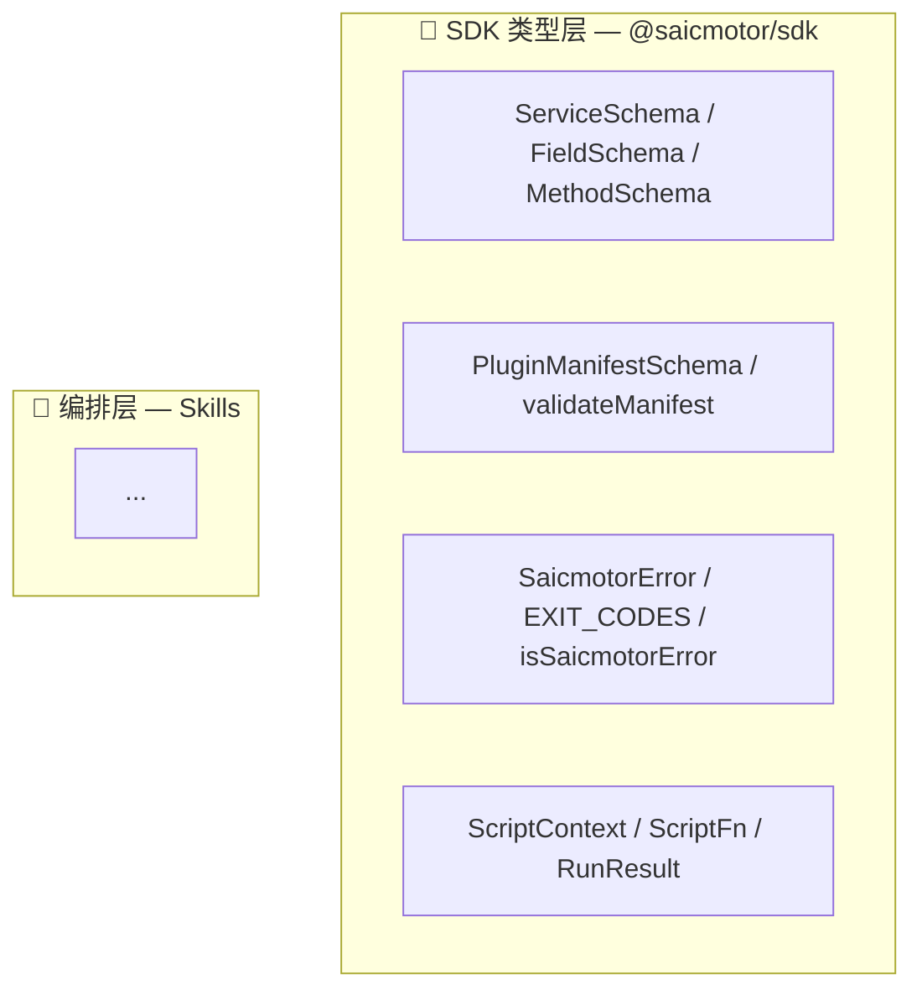

# framework-v2 文档刷新 — 实现计划

> **For agentic workers:** Use superpowers:executing-plans to implement this plan task-by-task.

**Goal:** 将 `howto/framework-v2/` 全部 15 篇文档对齐到 Sprint 9+10 完成后的当前代码。

**Architecture:** 15 篇文档按主题分为 5 个任务组，每组 2-4 篇。每个实现者打开指定的源文件验证签名、类型、值，然后更新文档中的代码示例、mermaid 图、解释文字。大学教师口吻——先讲是什么、再讲为什么、最后讲后果。

**Tech Stack:** Markdown, mermaid, ascii diagrams

**Spec:** [2026-10-01-framework-v2-refresh-design.md](../../../../docs/superpowers/specs/2026-10-01-framework-v2-refresh-design.md)

## Global Constraints

- **零代码改动**：只改 `howto/framework-v2/*.md`，不动 `packages/**/*.ts`
- 自包含：不引用 sprint 文档、"发生了什么"系列、或外部 URL
- 逐字验证：每个代码示例都能在以下源文件中找到对应：`packages/cli/src/**/*.ts`、`packages/sdk/src/**/*.ts`
- 大学教师口吻：先"是什么" → "为什么这样设计" → "改它会怎样"。不写"注意"——写后果
- 不改变文档组织结构、编号、阅读路线
- mermaid 图保留 `flowchart` 和 `stateDiagram` 风格与现有一致

## Review Focus

1. `loadPlugins()` 签名在所有出现处必须一致——无参数，返回 `{ plugins, warnings }`
2. `loadPluginServices` 返回值在所有出现处必须一致——`{ services, warnings }` 对象
3. `SaicmotorError` 所有提及处必须指向 `@saicmotor/sdk`，判断方式为 `isSaicmotorError()` 结构判断
4. `engine` 字段——脚手架生成用 `>=`，已有插件 manifest 用 `^`（历史事实），任何文档不可混淆
5. `Config` 类型——SDK 侧只有 `{ gateway }`，auth 类型在 CLI 侧独立定义——任何文档写到 Config 时不可包含 auth 字段

---

### Task 1: 入口与概念层 (00, 01)

**Files:**
- Modify: `howto/framework-v2/00-quick-overview.md`
- Modify: `howto/framework-v2/01-concepts.md`

**要验证的源文件：** `packages/cli/src/cli/index.ts`、`packages/sdk/src/index.ts`、`packages/sdk/src/catalog.ts`、`packages/sdk/src/manifest.ts`

- [ ] **Step 1: 读源文件确认当前代码中的关键签名和值**

打开 `packages/cli/src/cli/index.ts` — 确认 `program.version(getCoreVersion())`（不是 `"0.8.0"`）。打开 `packages/cli/src/version.ts` — 确认 `getCoreVersion()` 签名。打开 `packages/sdk/src/index.ts` — 确认当前导出的所有符号（`SaicmotorError`、`EXIT_CODES`、`ServiceSchema`、`PluginManifestSchema`、`validateManifest`——没有 `definePlugin`）。打开 `packages/sdk/src/catalog.ts` — 确认 `ServiceSchema`、`FieldSchema`、`MethodSchema`、`ResourceSchema` 的 zod 定义和类型导出。

- [ ] **Step 2: 更新 `00-quick-overview.md`**

  - **数据目录一览**：确认 state.json 的 `version` 字段存在
  - **一页全貌图**：命令旅程中 `loadPlugins()` 无参数
  - **五个关键角色表**：加 "SDK — 类型契约" 行，说明 SDK 是 CLI 和插件之间的共享类型基础
  - **三层开发者模型**：确认 "引擎层" 描述与当前 `src/` 结构一致

- [ ] **Step 3: 更新 `01-concepts.md`**

  - **Catalog 段**：加说明——catalog 的 zod schema 由 `@saicmotor/sdk` 的 `ServiceSchema` 定义，CLI 和插件共享同一份校验逻辑。示例 JSON 不变（字段结构未变）。
  - **插件段（1.5）**：manifest 的 `engine` 字段解释——"当前 0.x 阶段用 `>=0.8.0`（开放上界），而不是 semver 标准 `^0.8.0`（0.x 阶段 `^` 不跨小版本，会导致 CLI 小版本升级后插件被禁用）"。概念关系全图加 SDK 角色——从"声明层"引一根箭头指向"SDK 类型层"。
  - **CLI 引擎段（1.4）**：确认 pipeline 流程图与当前 `engine/run.ts` 一致——`findScript` 含 `within()` 围栏检查、错误处理走 `isSaicmotorError()` 结构判断。

- [ ] **Step 4: Commit**

```bash
git add howto/framework-v2/00-quick-overview.md howto/framework-v2/01-concepts.md
git commit -m "docs: framework-v2 入口与概念层对齐当前代码（Sprint 9+10）"
```

---

### Task 2: 架构文档 (02)

**Files:**
- Modify: `howto/framework-v2/02-architecture.md`

**要验证的源文件：** `packages/sdk/src/index.ts`、`packages/cli/src/plugin/loader.ts`、`packages/cli/src/engine/run.ts`、`packages/cli/src/version.ts`

- [ ] **Step 1: 读源文件确认包拓扑和依赖关系**

打开 `packages/cli/package.json` — 确认 `dependencies` 含 `@saicmotor/sdk`（runtime dep，不是 devDep）。打开 `packages/plugin-leave/package.json` — 确认 `dependencies` 含 `@saicmotor/sdk`（也是 runtime dep）。打开 `packages/sdk/src/index.ts` — 确认全部导出列表。

- [ ] **Step 2: 重绘四层架构图**

原图四层（编排层 / 声明层 / 执行层 / 插件层）——加第五个横向角色 **SDK 类型层**：



箭头：L4 插件层 → SDK（runtime import），L3 执行层 → SDK（runtime import），L1/L2 声明层 → SDK（类型导入，编译时擦除）。

- [ ] **Step 3: 重绘包拓扑图**

```
@saicmotor/sdk  ←── @saicmotor/cli (runtime dep)
     ↑                    ↑
     ├── @saicmotor/plugin-leave (runtime dep)
     ├── @saicmotor/plugin-attendance (runtime dep)
     └── @saicmotor/plugin-user (runtime dep)
```

关键说明：插件把 `@saicmotor/sdk` 放在 **dependencies**（非 devDependencies），因为脚本在运行时 `import { SaicmotorError } from "@saicmotor/sdk"`。

- [ ] **Step 4: 更新仓库目录结构**

删 `packages/sdk/src/catalog-types.ts`（已删除）。加 `packages/cli/src/version.ts`（新增）。加 `scripts/sync-versions.mjs`（新增）。确认 `packages/sdk/src/error.ts` 存在。

- [ ] **Step 5: 更新数据流图**

加一列：Catalog JSON → `ServiceSchema.parse()`（SDK 的 zod schema）→ 类型校验 → Commander 命令注册。说明中间这个 parse 步骤就是 SSOT 的物理落点——一份 schema 定义、CLI 和插件都信任它。

- [ ] **Step 6: Commit**

```bash
git add howto/framework-v2/02-architecture.md
git commit -m "docs: framework-v2 架构文档对齐当前包拓扑和 SDK 角色"
```

---

### Task 3: 插件系统 + Skills + 引擎管道 (04, 05, 06)

**Files:**
- Modify: `howto/framework-v2/04-plugin-system.md`
- Modify: `howto/framework-v2/05-skills-and-suite.md`
- Modify: `howto/framework-v2/06-engine-pipeline.md`

**要验证的源文件：** `packages/cli/src/plugin/loader.ts`、`packages/cli/src/plugin/registrar.ts`、`packages/cli/src/plugin/suite.ts`、`packages/cli/src/engine/run.ts`、`packages/cli/src/engine/script.ts`、`packages/cli/src/cli/error.ts`、`packages/sdk/src/error.ts`、`packages/sdk/src/context.ts`

- [ ] **Step 1: 读源文件确认全部插件和引擎相关的签名**

打开 `packages/cli/src/plugin/loader.ts` — 确认：
- `loadPlugins(): LoadResult`（无参数，返回 `{ plugins: LoadedPlugin[], warnings: string[] }`）
- 冲突警告格式：`` `service "${svc.name}" 冲突：${manifest.name} 与 ${existing.manifest.name} 均提供。当前 ${existing.manifest.name} 生效；若要 ${manifest.name} 生效请先 plugin disable ${existing.manifest.name}` ``
- engine 校验：`semver.satisfies(CORE_VERSION, manifest.engine)`，`CORE_VERSION` 来自 `getCoreVersion()`
- loadPluginServices 返回 `{ services, warnings }` 对象

打开 `packages/cli/src/engine/script.ts` — 确认 `within()` 函数和各候选路线的 .filter/.within 用法。

打开 `packages/cli/src/cli/error.ts` — 确认 `isSaicmotorError()` 结构判断函数。

打开 `packages/sdk/src/context.ts` — 确认 `ScriptContext`、`ScriptFn`、`RunResult` 类型定义。

- [ ] **Step 2: 更新 `04-plugin-system.md`**

  - **Manifest 字段详解**：`engine` 字段加说明——"当前 0.x 阶段推荐 `>=0.8.0`（开放上界）。如果用了 `^0.8.0`，semver 在 0.x 阶段会限制 `<0.9.0`，CLI 从小版本升级后插件会被禁用。`>=0.8.0` 避免了这个问题。跳 1.0 后恢复标准 `^1.0.0`。"
  - **loadPlugins 流程图**：节点 "loadPlugins(config)" → `loadPlugins()`（无参数）。确认双根扫描、同名去重、engine 兼容、冲突检测、enabled 检查的顺序不变。
  - **关键决策表**：加一行——"catalog 坏文件" 规则从 "静默跳过" 改为 "跳过 + push 到 warnings channel"，说明 `loadPluginServices` 现在返回 `{ services, warnings }`。
  - **冲突警告示例**：换新格式（含 winner/loser）。
  - **插件开发者常犯 5 错误**：加第 6 条——"engine 用了 `^0.8.0` 导致 CLI 升级后插件被禁用" → 纠正为 `>=0.8.0`。

- [ ] **Step 3: 更新 `05-skills-and-suite.md`**

  - **generateSuiteSkill**：确认 `version` 字段来自 `` `version: ${getCoreVersion()}` ``（不硬编码 `"0.8.0"`）。
  - **注册策略**：确认 `registerSkill` 的描述与 `registrar.ts` 当前逻辑一致——junction 创建逻辑、错误处理（catch 块有注释）。

- [ ] **Step 4: 更新 `06-engine-pipeline.md`**

  - **执行管道流程图**：`findScript` 节点说明加 `within()` 围栏——四条候选路线每条都过 `within(baseDir, candidate)` 检测，路径穿越攻击被阻止。图可加一个菱形判断节点 `within?`。
  - **SaicmotorError 段落重写**：改成讲解 `isSaicmotorError()` 结构判断。要解释的问题——为什么不用 `instanceof`（跨包两份 SDK 副本的问题）、结构判断为什么可靠（它不看原型链、只看对象 shape）。代码示例：
    ```ts
    import { type SaicmotorError } from "@saicmotor/sdk";
    export function isSaicmotorError(e: unknown): e is SaicmotorError {
      return typeof e === "object" && e !== null &&
        typeof (e as { category?: unknown }).category === "string" &&
        typeof (e as { exitCode?: unknown }).exitCode === "number";
    }
    ```
  - **脚本覆盖段**：`ScriptContext` 来自 `@saicmotor/sdk`（不是 CLI 本地定义）。`executeScript` 注入的 context 类型为 `ScriptContext`（含 `gateway`、`token`、`logger` 等字段——如有变化同步更新）。
  - **9 个 catch 块**：简要说明引擎管道的容错哲学——每个 catch 都有注释解释"为什么这个错误可以在这里被降级"。不需要逐个列出。

- [ ] **Step 5: Commit**

```bash
git add howto/framework-v2/04-plugin-system.md howto/framework-v2/05-skills-and-suite.md howto/framework-v2/06-engine-pipeline.md
git commit -m "docs: framework-v2 插件/引擎文档对齐 loadPlugins/within/isSaicmotorError"
```

---

### Task 4: 安装 + 认证 + 配置 (03, 07, 08)

**Files:**
- Modify: `howto/framework-v2/03-installation-flow.md`
- Modify: `howto/framework-v2/07-auth-flow.md`
- Modify: `howto/framework-v2/08-config-system.md`

**要验证的源文件：** `packages/cli/src/config.ts`、`packages/cli/src/auth/session.ts`、`packages/cli/src/cli/auth.ts`、`packages/sdk/src/config-types.ts`

- [ ] **Step 1: 读源文件确认配置和认证相关的当前代码**

打开 `packages/sdk/src/config-types.ts` — 确认 `Config` 只有 `{ gateway: string }`（不含 auth）。打开 `packages/cli/src/config.ts` — 确认 CLI 侧完整 config 结构（含 auth 字段、合并逻辑）。打开 `packages/cli/src/cli/auth.ts` — 确认登录成功消息 `"已登录，token 已缓存"`（无 token 前缀）。打开 `packages/cli/src/auth/session.ts` — 确认 token 获取和 401 重试逻辑。

- [ ] **Step 2: 更新 `03-installation-flow.md`**

  - 三步安装模型：`saicmotor --version` 现在输出 `getCoreVersion()` 动态值（当前为 `0.8.0`）
  - 验证步骤中如果引用了硬编码版本号 → 改为说明 `saicmotor --version` 输出与 `package.json` 同步

- [ ] **Step 3: 更新 `07-auth-flow.md`**

  - Exchange 流程图：登录成功后 CLI 打印 `已登录，token 已缓存`——不包含 token 前缀
  - Config 相关代码：auth 配置在 CLI 侧（`src/config.ts` 的 `DEFAULT_CONFIG.auth`），不在 SDK 的 `Config` 类型中

- [ ] **Step 4: 更新 `08-config-system.md`**

  - **DEFAULT_CONFIG 代码块替换**：`Config` 类型已窄化为 `{ gateway: string }`。AuthConfig 是 CLI 内部结构，不在 SDK 暴露。更新 `DEFAULT_CONFIG` 示例——确认 gateway 字段和其他配置项与当前 `config.ts` 一致。
  - **"SDK 只关心 gateway"说明**：加一段——`@saicmotor/sdk` 的 `Config` 接口仅含 `gateway`（接口隔离原则——SDK 不需要知道 auth 细节，它只传网关 URL 给脚本上下文）。CLI 侧的完整 config 包含 `auth` 字段，但在传给 SDK/插件时只取 `gateway`。
  - **配置瀑布图**：确认环境变量表与 `config.ts` 中 `process.env` 引用一致
  - **配置加载全链路图**：loadPlugins 节点无 config 参数

- [ ] **Step 5: Commit**

```bash
git add howto/framework-v2/03-installation-flow.md howto/framework-v2/07-auth-flow.md howto/framework-v2/08-config-system.md
git commit -m "docs: framework-v2 安装/认证/配置文档对齐窄化 Config 和去 token 前缀"
```

---

### Task 5: 发布 + 开发 + 附录 (09, 10, A1, A2, A3, README)

**Files:**
- Modify: `howto/framework-v2/09-build-and-publish.md`
- Modify: `howto/framework-v2/10-plugin-development.md`
- Modify: `howto/framework-v2/A1-faq.md`
- Modify: `howto/framework-v2/A2-troubleshooting.md`
- Modify: `howto/framework-v2/A3-glossary.md`
- Modify: `howto/framework-v2/README.md`

**要验证的源文件：** `packages/cli/src/cli/tooling-cmds.ts`、`packages/cli/src/version.ts`、`scripts/sync-versions.mjs`、`packages/sdk/src/error.ts`、`packages/sdk/src/context.ts`、`packages/plugin-leave/scripts/`、`packages/plugin-attendance/scripts/`

- [ ] **Step 1: 读源文件确认发布和插件开发相关代码**

打开 `packages/cli/src/cli/tooling-cmds.ts` — 确认脚手架生成的：
- `engine: \`>=${CORE_VERSION}\``（不是 `"^0.8.0"`）
- `"@saicmotor/sdk": \`>=${CORE_VERSION}\``（不是 `"^0.8.0"`）
- `CORE_VERSION` 来自 `getCoreVersion()`

打开 `scripts/sync-versions.mjs` — 确认同步逻辑：读 CLI version → 比较 SDK version → 如果不同则覆写。

打开 `packages/plugin-leave/scripts/leave/applications/submit.ts` — 确认 `import { SaicmotorError } from "@saicmotor/sdk"`（不是本地 `UpstreamError` 类）。

- [ ] **Step 2: 更新 `09-build-and-publish.md`**

  - **构建顺序**：加说明——SDK 和 CLI 的版本号同步由 `scripts/sync-versions.mjs` 保证，发布 CLI 前必须运行 `npm run sync-versions`
  - **发布流程**：加步骤——"④ 同步版本号：`npm run sync-versions`"（在 publish 前）
  - **files 字段**：确认与当前 `packages/cli/package.json` 的 `files` 字段一致
  - **SDK README 引导**：如果有引用 SDK README 的地方——确认描述与当前 `packages/sdk/README.md` 一致（"types-only → devDependencies，runtime → dependencies"）

- [ ] **Step 3: 更新 `10-plugin-development.md`**

  - **骨架生成**：`saicmotor create plugin my-system` 生成的 `saicmotor.plugin.json` 中 `engine` 字段现在是 `` `>=${getCoreVersion()}` ``（如 `>=0.8.0`）。`package.json` 中 `@saicmotor/sdk` 的版本声明也是 `>=`。
  - **SDK 依赖类型**：加重点说明——如果脚本里 import 了 `SaicmotorError`（runtime import），`@saicmotor/sdk` 必须放在 `dependencies` 而非 `devDependencies`。只用来做类型注解时放 `devDependencies`。
  - **脚本覆盖段**：错误示例更新——用 `SaicmotorError` 而非自定义 `UpstreamError`：
    ```ts
    import { SaicmotorError } from "@saicmotor/sdk";
    throw new SaicmotorError("upstream", `上游 HTTP ${resp.status}`);
    ```
  - **Catalog 声明段**：提示——schema 由 `@saicmotor/sdk` 提供（`ServiceSchema`），插件不需要自己定义 zod schema。

- [ ] **Step 4: 更新 `A1-faq.md`**

  检查并刷新所有涉及以下概念的问答：
  - `loadPlugins` 有没有参数？（无——Sprint 9 A1）
  - `engine` 该用 `^` 还是 `>=`？（0.x 阶段 `>=`）
  - Config 为什么不包含 auth？（接口隔离——SDK 只知道 gateway）
  - 自测答案同步：确保每道题的答案中引用的代码与当前源码一致

- [ ] **Step 5: 更新 `A2-troubleshooting.md`**

  - 错误信息样例：确认任何示例中的错误格式与当前代码一致（`handleError` 的 envelope 格式、warnings 格式）
  - 引擎管道各阶段错误信号：确认对应位置描述

- [ ] **Step 6: 更新 `A3-glossary.md`**

  加术语：
  - **getCoreVersion** — 从 `packages/cli/package.json` 动态读取版本号的函数（`version.ts`）。缓存结果，全体系唯一版本源。
  - **isSaicmotorError** — 结构判断函数，检查对象是否有 `category`（string）和 `exitCode`（number）字段，用于替代跨包 `instanceof`。
  - **within(base, candidate)** — 路径围栏函数，验证候选路径在基础目录范围内，用于 `findScript` 的路径穿越防护。
  
  更新术语：
  - **SaicmotorError** — 现在在 `@saicmotor/sdk` 中定义（`packages/sdk/src/error.ts`），CLI 和插件共享。
  - **Config** — SDK 侧只有 `{ gateway }`（窄化后），CLI 侧包含完整认证配置。
  - **engine** — 插件的 semver 兼容声明。0.x 阶段推荐 `>=`（开放上界），跳 1.0 后恢复 `^`。

- [ ] **Step 7: 更新 `README.md`**

  - V1 vs V2 对照表：确认映射关系不变
  - 约定栏：确认 "💡 提示 / ⚠️ 注意 / 🔗 参见 / ❓ 自学检查" 格式一致

- [ ] **Step 8: Commit**

```bash
git add howto/framework-v2/09-build-and-publish.md howto/framework-v2/10-plugin-development.md howto/framework-v2/A1-faq.md howto/framework-v2/A2-troubleshooting.md howto/framework-v2/A3-glossary.md howto/framework-v2/README.md
git commit -m "docs: framework-v2 发布/开发/附录文档对齐 >= engine / sync-versions / SaicmotorError"
```

---

## Self-Review

**1. Spec coverage:** 15 篇文档全部覆盖在 5 个任务中——每组对应 spec 中的文档列表。

**2. Step scan:** 每个 step 都有明确的检查和修改目标——先读源文件验证、再改文档、然后 commit。

**3. Type consistency:** 跨任务的共享概念——`loadPlugins()`、`getCoreVersion()`、`isSaicmotorError()`、`Config { gateway }`、`engine: >=`——在全部 5 个任务中描述一致。

**4. Review Focus:** 5 条 Review Focus 分布在最相关的任务中——引擎管道（Task 3）、配置（Task 4）、插件开发（Task 5）。

**5. Proportion:** 5 个任务，计划长度约 200 行——合理。