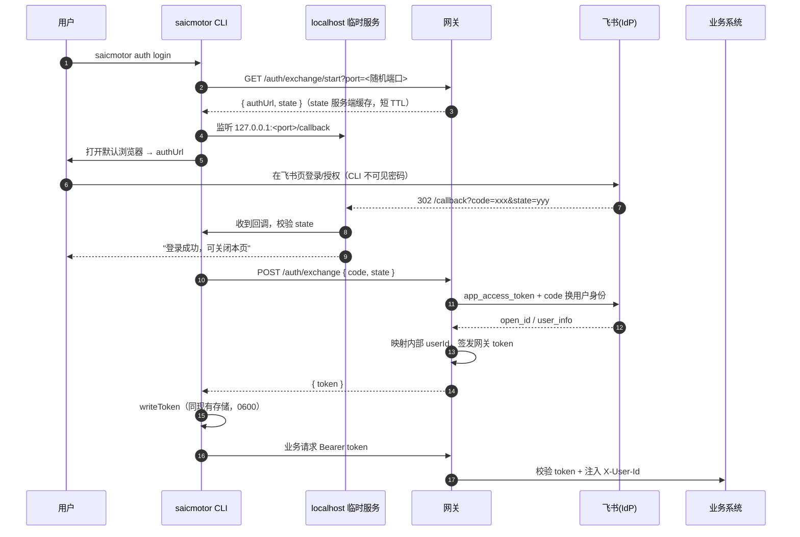

# Sprint 5 设计：真实 SSO 打通（飞书 OIDC POC）

> **日期**: 2026-09-22 | **状态**: 已评审，待编写实现计划
> **对应**: [sprint-5-sso-integration.md](../../sprint/sprint-5-sso-integration.md) · [ARCHITECTURE.md](../../ARCHITECTURE.md) §7

## 1. 目标与范围

### 目标

打通一条真实的 OIDC/OAuth2 认证链路，验证 CLI 的 auth 模型在生产形态下可行，并让"切换公司 SSO"成为纯配置 + 一个 Provider 实现的工作。

### 范围内

- CLI auth 重构为可插拔：保留 `password`，新增 `exchange`（OIDC 式：code → SSO 身份 → 网关 token）。
- 网关扩展为 OIDC 客户端，对接**飞书网页授权登录**作为 POC IdP。
- CLI 用 loopback 本地服务自动接收回调 code。
- 网关侧抽象 `IdpProvider`，方便未来新增公司 SSO 实现。
- 所有环境相关内容（地址、凭证、路径、回调白名单、超时）配置化。
- 测试：CLI 集成测试（Node helper）、网关单测（WireMock mock 飞书）、真实飞书人工端到端验证。

### 范围外（YAGNI）

- `redirect`（CAS 式）、`prefetch` 两种 type 不实现，仅在文档中保留概念。
- 不做多 IdP 并存、不做 token 刷新（沿用"401 才清缓存重登"）。
- 不改造业务系统（leave / attendance 零改动）。

## 2. 信任边界

| 角色 | 能接触到 | 接触不到 |
|---|---|---|
| 用户浏览器 | 飞书登录页、输入凭证/扫码 | — |
| CLI | 一次性短 TTL `code`、网关签发的 token | 飞书 app_secret、用户密码 |
| 网关 | app_id/app_secret、code 换得的用户身份 | 用户密码 |
| 业务系统 | 网关注入的 X-User-Id | IdP 细节、所有密钥 |

关键原则：**业务系统只信任网关；OIDC client 注册在网关上；网关签发自己的 token，飞书 token 不直接下发给业务系统。**

## 3. 总体流程



失败/边界：

- state 过期或不匹配 → 拒绝，提示重新登录。
- 回调超时（默认 120s，可配置）→ 关闭临时服务，报错退出。
- 飞书用户映射不到内部工号 → 明确报错（"未找到对应员工"），不签发 token。
- 业务请求遇 401 → 沿用现有逻辑：清 token、重新登录一次（exchange 下重新走浏览器）。

## 4. CLI 设计（TypeScript）

### 4.1 模块

| 文件 | 职责 |
|---|---|
| `src/auth/provider.ts`（新） | `AuthProvider` 接口：`login(): Promise<string>`；按 `config.auth.type` 选择实现 |
| `src/auth/password.ts`（由 login.ts 重构） | 现有 POST /auth/login 逻辑，行为不变 |
| `src/auth/exchange.ts`（新） | start → loopback 监听 → 开浏览器 → 回调 → exchange 换 token |
| `src/auth/session.ts`（改） | `ensureToken` 改为调用 provider；401 重试逻辑不变 |
| `src/cli` auth 命令（改） | exchange 模式下 `auth login` 不要求 `--username/--password` |

### 4.2 loopback 实现要点

- 绑定 `127.0.0.1`，**默认固定端口 3000**（飞书重定向 URL 只支持精确匹配、不支持端口段）；3000 被占用时自动递增寻找可用端口，找到后通过 start 请求的 `port` 参数告知网关拼 redirect_uri——此时需在飞书后台补登对应回调 URL，故 POC 推荐固定 3000。
- 开浏览器：Windows `start <url>`（沿用跨平台 start 命令封装）。
- 仅接受路径 `/callback`；只读取 `code`、`state`；任何请求都返回固定 HTML（成功/失败两个文案），不回显用户输入。
- 拿到首个合法回调即关闭服务。

### 4.3 配置项（全部可覆盖：包默认 → 用户配置 → SAICMOTOR_* 环境变量）

```jsonc
{
  "auth": {
    "type": "exchange",              // password | exchange
    "startPath": "/auth/exchange/start",
    "exchangePath": "/auth/exchange",
    "tokenPath": "data.token",
    "callbackTimeoutMs": 120000,
    "loopbackHost": "127.0.0.1",
    "loopbackPort": 3000             // 飞书后台精确登记的端口；占用时自动递增但需补登回调
  }
}
```

## 5. 网关设计（Java mock-gateway，Spring Boot）

### 5.1 接口

- `GET /auth/exchange/start?port=<n>` → `{ code:0, data:{ authUrl, state } }`
  - 生成 state（随机串，服务端缓存 5 分钟，单次使用）。
  - redirect_uri 必须匹配白名单形态 `http://localhost:<port>/callback`，port 做范围校验。
- `POST /auth/exchange` body `{ code, state }` → `{ code:0, data:{ token } }`
  1. 校验并消费 state；
  2. 取 app_access_token（tenant 级，可缓存）；
  3. 用 code 调飞书 `authen/v1/oidc/access_token` 得用户 access_token/id_token；
  4. 调用户信息接口拿邮箱/工号字段；
  5. 映射内部 userId；
  6. 复用现有 token 签发逻辑。

### 5.2 IdpProvider 抽象（面向公司 SSO 切换）

```java
public interface IdpProvider {
    String buildAuthorizeUrl(String state, String redirectUri);
    IdpUser exchangeCode(String code, String redirectUri); // 含 open_id/邮箱/工号
}
```

- `FeishuIdpProvider` 为首个实现（接口地址、字段映射写进配置）。
- 未来公司标准 OIDC：新增 `OidcIdpProvider`，通过 issuer 的 `.well-known/openid-configuration` 自动发现端点；CLI、业务系统、token 模型全部不动。

### 5.3 配置（application.yml）

```yaml
saicmotor:
  idp:
    provider: feishu
    feishu:
      base-url: https://open.feishu.cn
      app-id: ${FEISHU_APP_ID}
      app-secret: ${FEISHU_APP_SECRET}
      user-id-field: email      # 映射内部工号所用字段
    state-ttl-seconds: 300
    redirect-allowlist: "http://localhost:[1024-65535]/callback"
```

app-id/secret 只从环境变量/部署配置注入，不入库。

### 5.4 错误处理

沿用现有错误信封 `{ code, msg }` + 语义化语义：state 失效、code 失效、IdP 不可达（5xx 上游）、用户映射失败各自明确 msg/hint。

## 6. 测试策略

| 层 | 方式 | 覆盖 |
|---|---|---|
| CLI 单测/集成 | `test/helpers` Node server 增加 start/exchange 假端点 | 成功换 token、state 不匹配、回调超时、401 重登、password 回归 |
| 网关单测 | WireMock mock 飞书 API | exchange 成功、code 失效、app_access_token 缓存、用户映射失败、redirect 白名单 |
| 真实端到端 | 人工验证文档（参照 Sprint 4 形式） | 飞书建应用 → 配回调 → auth login → leave/attendance 命令 |

## 7. 交付物

1. CLI exchange provider + 可插拔重构；2. 网关两个接口 + FeishuIdpProvider；3. 配置样例；4. 自动化测试；5. 人工验证文档；6. [飞书对接申请手册](../../../howto/FEISHU-OIDC-SETUP.md)；7. 更新 sprint-5 文档与 ARCHITECTURE.md §7。
