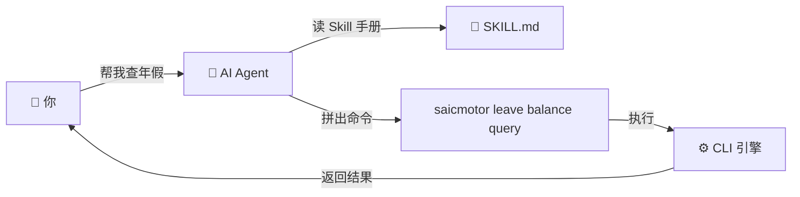
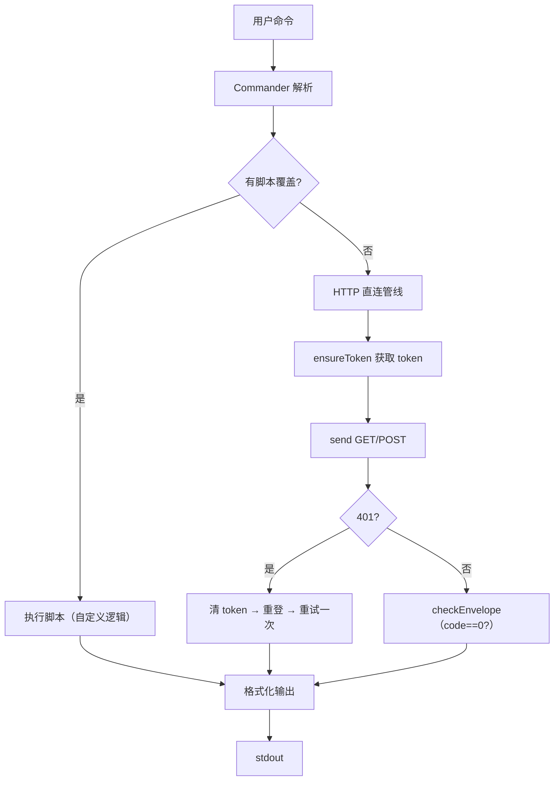
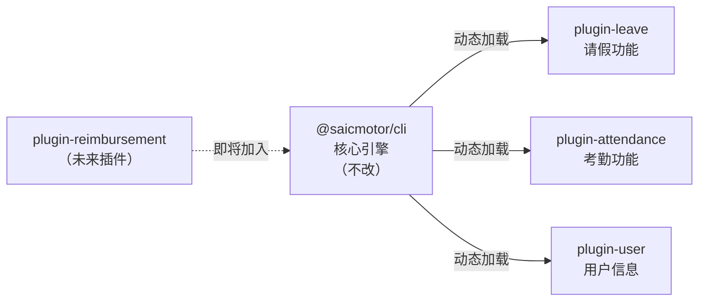
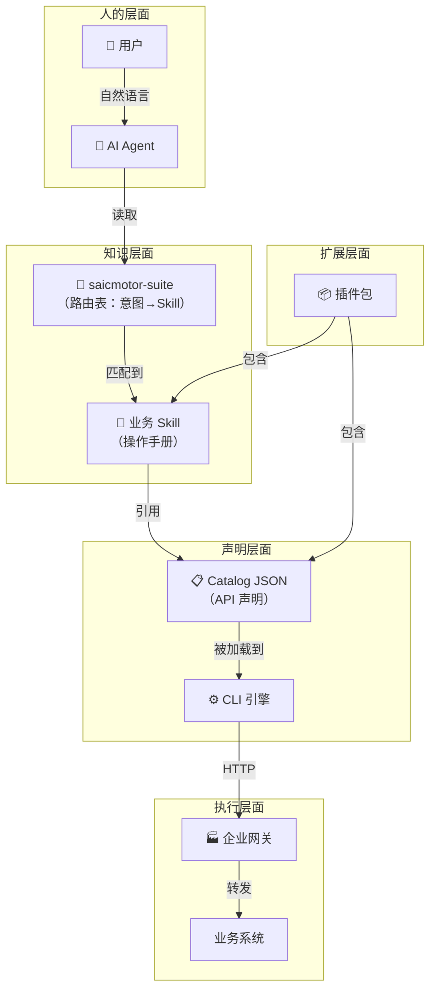

# 01 — 核心概念

> 用生活类比理解 saicmotor-cli 的五个核心概念。读完本章，你应该能用白话向同事解释"这个系统做什么"。

---

## 1.1 AI Agent — 聪明的秘书



**生活类比**：AI Agent 就像一个聪明的秘书。你说"帮我请个假"，秘书会翻岗位手册（Skill）找到"请假流程"，然后按手册里的步骤操作（拼命令 → 调接口 → 汇报结果）。

**技术本质**：AI Agent（如 Claude Code、Cursor、CodeBuddy）是一个大语言模型驱动的编程助手。它通过读取 `.md` 文件来理解它能调度哪些工具。

> 💡 **关键理解**：AI Agent 不会"猜"你的命令——它只会执行 SKILL.md 里明确写好的操作。写好 Skill 文档 = 教会秘书你的业务流程。

---

## 1.2 Skill — 秘书的岗位手册

```
skills/saicmotor-leave/SKILL.md
──────────────────────────────
---
name: saicmotor-leave           ← 技能名
description: "请假系统：查询年假余额、提交请假申请"
---
# 请假系统

## 命令

### 查余额
saicmotor leave balance query

### 提交请假
saicmotor leave applications submit --start-date <日期> --reason <原因> --yes
```

**生活类比**：Skill 是给秘书看的**岗位手册**。手册里写了：
- 这项技能负责什么（请假）：不越权处理考勤
- 怎么执行（具体命令格式）：不瞎拼参数
- 有什么注意事项（写操作要 `--yes`）：不出安全事故

**技术本质**：Skill 是一个 YAML frontmatter + Markdown 的文件。AI Agent 启动时扫描 `~/.claude/skills/` 目录，加载所有 SKILL.md。saicmotor 通过**文件系统 junction** 把自己的 skill 目录映射进去。

> ⚠️ **注意**：Skill 不是 saicmotor 发明的概念——它是 AI 客户端（Claude Code 等）的通用机制。saicmotor 只是把自己的 skill 文件注册到 AI 客户端的 skills 目录里。

**Skill 是怎么被 AI "发现"的？**

```
saicmotor 做的事                        AI 客户端做的事
─────────────────────                   ─────────────────
1. plugin install 时                    3. 启动时扫描 skills/ 目录
   → 创建 junction：                      → 发现 saicmotor-suite/SKILL.md
   ~/.claude/skills/saicmotor-leave     → 加载到 AI 的"知识库"
   → 指向插件包 skills/ 目录
                                        4. 你问 AI "帮我请假"
2. 同样注册 suite 路由                    → AI 先读 suite 路由表
   → saicmotor-suite/SKILL.md            → 找到"请假 → saicmotor-leave"
   → 包含所有插件的意图路由               → 再读 saicmotor-leave/SKILL.md
                                         → 拼出命令并执行
```

> 💡 **核心洞察**：所有信息都存在 `SKILL.md` 里——AI 不连接数据库、不调 API。只要 SKILL.md 写对了，AI 就能正确路由和执行。

---

## 1.3 Catalog — API 说明书

```json
// catalog/services/leave.json
{
  "name": "leave",                    ← 命令的一级子命令
  "title": "请假系统",
  "servicePath": "/api/leave",        ← 网关路由前缀
  "resources": {
    "balance": {                       ← 命令的二级子命令
      "methods": {
        "query": {                     ← 命令的三级子命令
          "id": "balance.query",
          "path": "/balance",          ← 拼在 servicePath 后面
          "httpMethod": "GET",         ← HTTP 方法
          "description": "查询年假余额"
        }
      }
    }
  }
}
```

**这条 JSON 自动生成命令**：`saicmotor leave balance query`

**生活类比**：Catalog 是**API 说明书**。它用结构化的 JSON 描述了：
- 这个接口叫什么（`leave`）
- 它的 URL 是什么（`/api/leave/balance`）
- 用什么 HTTP 方法（`GET`）
- 需要什么参数（`requestBody` 字段）

**技术本质**：Catalog JSON 的三层嵌套直接映射到 CLI 的三级命令结构：

```
service.name  →  resource.name  →  method.name
    leave      →    balance      →    query
      ↓               ↓                ↓
 saicmotor leave balance query --format json
```

> 💡 **核心洞察**：声明式 catalog 的好处——你不用写任何注册代码。引擎在启动时读取 JSON，自动注册 Commander 命令。加一个 API 就是加一段 JSON。

---

## 1.4 CLI 引擎 — 执行者



**生活类比**：引擎是**执行者**。你给秘书（AI Agent）下了指令，秘书把命令（`saicmotor leave balance query`）交给引擎，引擎负责：
1. 把 `--start-date` 转成 `startDate`（参数转换）
2. 找 token（认证）
3. 拼 URL + 发 HTTP（通信）
4. 检查返回结果（校验）
5. 格式化输出（呈现）

**技术本质**：引擎是一个无状态的管道（pipeline）——每个请求都走相同的步骤，不缓存中间结果。

---

## 1.5 插件 — 功能模块



**生活类比**：插件是**功能模块**。核心引擎就像手机的 USB-C 接口——它定义了插拔的规范（manifest + catalog JSON），但不内置任何业务。请假、考勤、报销这些"业务 App"都是插件，想加就加，不用改核心。

**技术本质**：插件是独立的 npm 包（`@saicmotor/plugin-*`），通过 `saicmotor plugin install` 安装到 `~/.saicmotor/plugins/node_modules/`。CLI 启动时扫描并动态加载。

> 💡 **关键理解**：核心 CLI 自身不内置任何业务命令——`saicmotor --help` 在装插件前只显示框架命令（`install`、`plugin`、`auth` 等）。`leave`、`attendance` 等业务命令全是插件贡献的。

---

## 核心概念关系全图



---

## ❓ 自学检查

1. AI Agent 是怎么"知道"它能用 `saicmotor leave balance query` 这个命令的？描述从 suite 路由表到 skill 到命令的完整链路。
2. 如果我想加一个新的业务系统（如"会议室预订"），我需要创建哪些文件？需要改核心代码吗？
3. `saicmotor install` 和 `saicmotor plugin install leave` 分别做了什么？它们的职责有什么区别？

> **答案** → [A1 FAQ §自测答案](./A1-faq.md#自测答案)

## 下一步

- [02 系统架构](./02-architecture.md) — 深入四层架构 + 包拓扑
- 想看安装全流程？→ [03 安装全流程](./03-installation-flow.md)
- 想开发插件？→ [10 插件开发指南](./10-plugin-development.md)