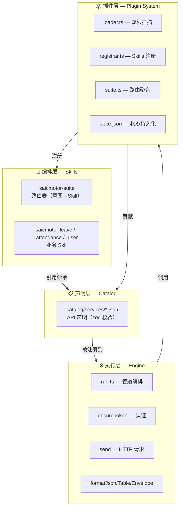
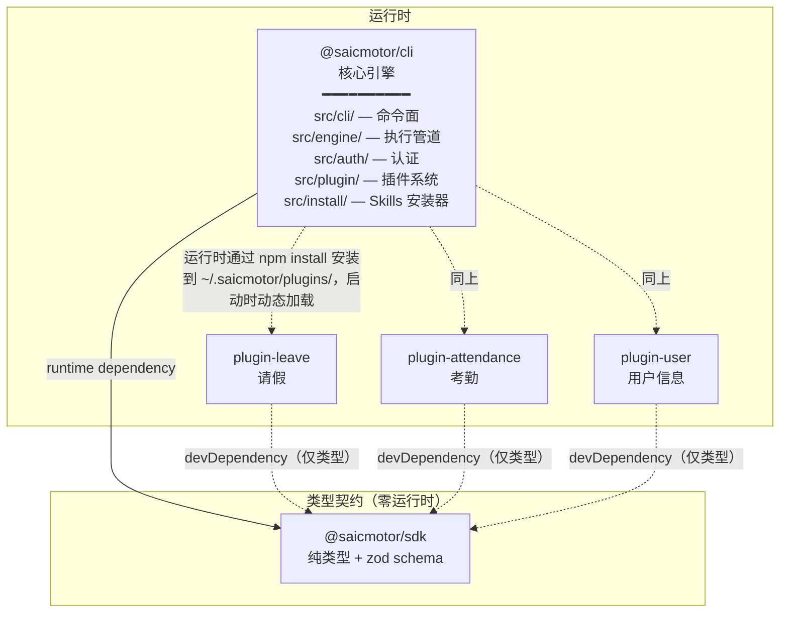
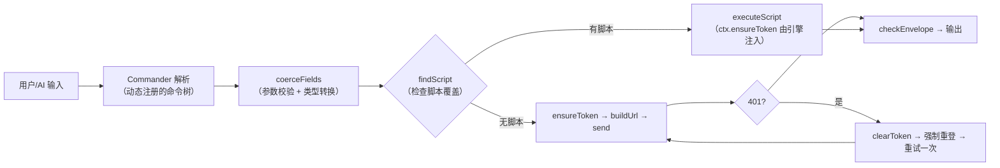
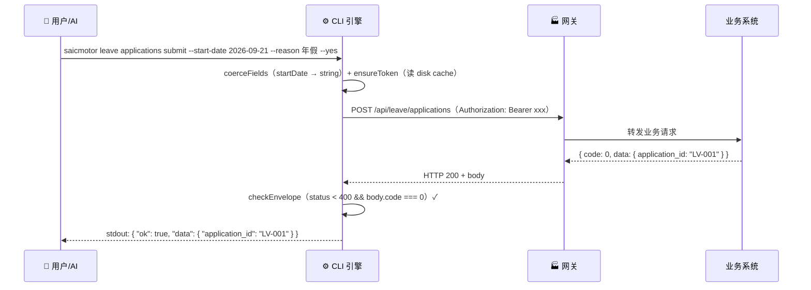

# 02 — 系统架构

> 深入 saicmotor-cli 的四层架构、Monorepo 包拓扑、仓库目录结构、数据流。

---

## 2.1 四层架构



### 层 1：编排层（Skills）

**职责**：告诉 AI Agent "我能做什么、怎么调用我"。

- `saicmotor-suite` — 统一入口，路由表
- 各业务 `saicmotor-<name>` — 具体操作手册

> 💡 **关键**：加新业务只改这一层 + Catalog 层。引擎和插件框架完全不动。

### 层 2：声明层（Catalog）

**职责**：用 JSON 声明 API 接口结构。

每个 catalog JSON 经 `zod` 校验（`ServiceSchema.parse(raw)`），不合法直接抛 `spec` 错误（退出码 6）。

### 层 3：执行层（Engine）

**职责**：把命令字符串变成 HTTP 请求，把 HTTP 响应变成格式化输出。

核心管道（`engine/run.ts:40-82`）：

```
Commander 解析 → coerceFields → findScript → ensureToken → send → checkEnvelope → format
```

### 层 4：插件层（Plugin System）

**职责**：插件加载、生命周期管理、Skills 注册、Suite 路由聚合。

> ⚠️ **注意**：CLI 核心自身不内置业务 catalog（`catalog/services/` 目录为空）。全部业务服务声明都由插件包贡献，核心引擎保持完全通用。

---

## 2.2 Monorepo 包拓扑



### 依赖关系详解

| 方向 | 类型 | 说明 |
|------|------|------|
| CLI → SDK | **runtime dependency** | CLI 在 `loader.ts`、`tooling-cmds.ts` 中直接 `import { PluginManifestSchema } from "@saicmotor/sdk"` |
| 插件 → SDK | **devDependency** | 写脚本时参考 `ScriptContext` 类型，不 import 到运行时代码 |
| CLI → 插件 | **运行时动态加载** | 通过 npm install 安装到 `~/.saicmotor/plugins/node_modules/`，CLI 启动时 `loadPlugins()` 扫描 |

> 💡 **核心洞察**：SDK 是纯类型包，零运行时逻辑。这意味着：
> - SDK 发布新版本不会破坏任何已有的运行时行为
> - 插件不需要在 `dependencies` 中声明 SDK——引擎提供了运行时所需的一切

---

## 2.3 仓库目录（谁改什么）

```
saicmotor-cli/                           ← monorepo 根
├── packages/
│   ├── cli/                             ← 🔴 核心团队维护
│   │   ├── src/cli/                     ← 命令面（index.ts + plugin-cmds + tooling-cmds）
│   │   ├── src/engine/                  ← 引擎管道：catalog / run / script / http / request / output
│   │   ├── src/auth/                    ← 认证：store / session / transport / provider
│   │   ├── src/plugin/                  ← 插件系统：loader / registrar / suite / paths / state
│   │   ├── src/install/                 ← Skills 安装器 + 一键卸载
│   │   ├── catalog/services/            ← 核心服务挂载点（当前为空）
│   │   ├── skills/                      ← 内核 skills（suite + shared）
│   │   └── scripts/                     ← 核心内置脚本（uninstall.js）
│   ├── sdk/                             ← 🔴 核心团队维护（类型契约）
│   ├── plugin-leave/                    ← 🟡 插件开发者维护
│   ├── plugin-attendance/               ← 🟡 插件开发者维护
│   └── plugin-user/                     ← 🟡 插件开发者维护
├── docs/
│   ├── sprint/                          ← Sprint 规划
│   ├── history/                         ← 历史归档
│   ├── superpowers/                     ← Superpowers 产物（specs/plans）
│   └── lessons-learned-the-hard-way/    ← 实践教训
└── howto/                               ← 📖 面向用户的指南
    ├── framework/                       ← V1 架构文档
    ├── framework-v2/                    ← V2 架构文档（你正在读）
    ├── user-guide.md                    ← 用户指南
    └── plugin-developer.md              ← 插件开发手册
```

| 颜色 | 角色 | 修改场景 |
|:---:|------|----------|
| 🔴 | 核心团队 | 引擎功能、认证、插件框架 |
| 🟡 | 插件开发者 | catalog JSON、SKILL.md、自定义脚本 |
| 📖 | 所有人 | 读文档、了解架构 |

---

## 2.4 数据流全景

### 引擎内管线（命令 → 执行）



### 端到端四方交互



---

## 2.5 核心设计原则

| 原则 | 含义 | 体现 |
|------|------|------|
| **声明式优先** | catalog JSON 能描述的不写代码 | 90% 的业务 API 只需 JSON 声明 |
| **引擎通用** | HTTP 管线、认证、输出格式化全由引擎处理 | 插件不需要写 HTTP 调用代码 |
| **插件生态** | 业务能力以独立 npm 包分发 | 不碰核心代码就能加新业务系统 |
| **错误可读** | 所有错误都结构化、带退出码、带修复提示 | `SaicmotorError` 统一分类 |
| **安全默认** | 写操作需 `--yes` 确认 | 提交请假不加 `--yes` 被拦截 |

---

## 2.6 linked/ 目录设计：为什么不是 `@saicmotor/plugin-*`？

```
~/.saicmotor/plugins/
├── linked/                    ← dev link（junction）
│   └── plugin-reimbursement/  ← 直接以 plugin-* 命名，不走 @saicmotor/ scope
└── node_modules/              ← npm 安装
    └── @saicmotor/            ← npm scope 目录
        └── plugin-leave/
```

**原因**：`saicmotor dev` 命令用 `fs.symlinkSync(src, dest, "junction")` 建立链接。npm 的 `@saicmotor/` scope 目录只在 `node_modules/` 下存在——它不是 linked/ 的一部分。`linked/` 是 saicmotor 自己的约定目录，不走 npm 的 scope 解析逻辑。

> 💡 **设计意图**：`scanEntries()` 函数对 linked/ 和 node_modules/ 采用不同策略——linked/ 下直接找 `plugin-*`，node_modules/ 下需要先进入 `@saicmotor/` scope。这样两边都能正确解析。详见 [04 插件系统 §加载器](./04-plugin-system.md#43-加载器-loadplugins)。

---

## ❓ 自学检查

1. 四层架构中，加一个新业务系统需要修改哪几层？不需要修改哪几层？
2. `@saicmotor/sdk` 在 CLI 和插件中的依赖类型有什么不同？为什么？
3. 从用户输入命令到终端输出 JSON，引擎内部经过哪些步骤？每步的输入和输出是什么？

> **答案** → [A1 FAQ §自测答案](./A1-faq.md#自测答案)

## 下一步

- [03 安装全流程](./03-installation-flow.md) — 从 npm install 到第一个命令的完整旅程
- [04 插件系统](./04-plugin-system.md) — 插件深入