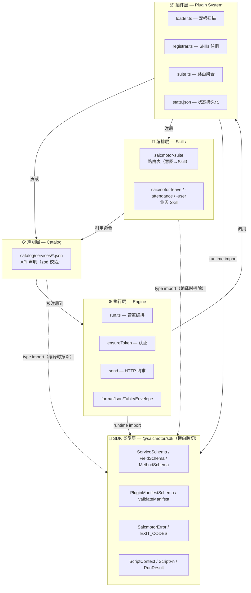
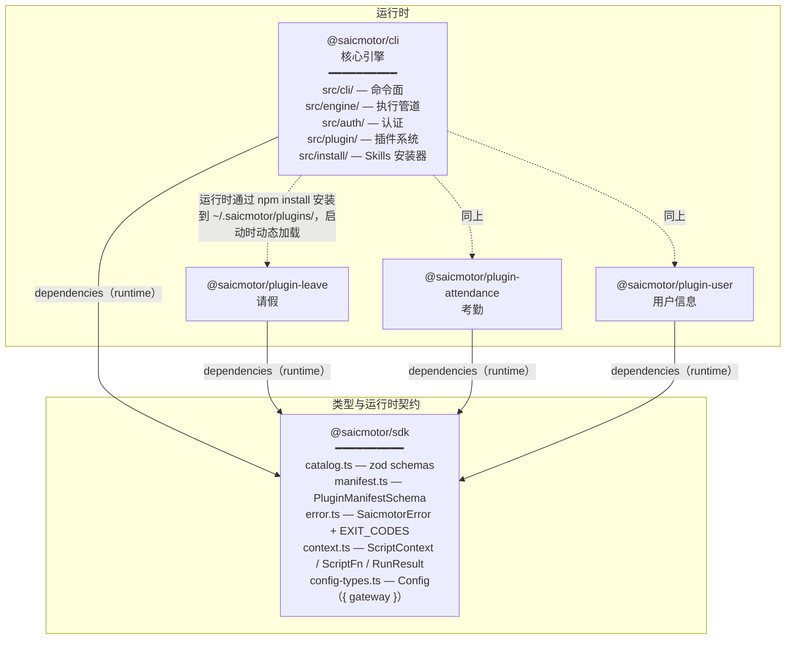
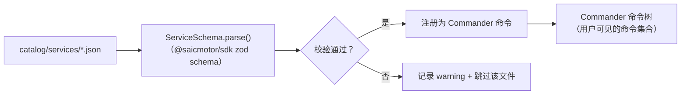
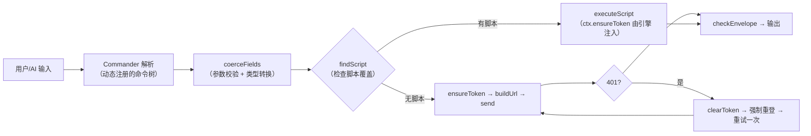
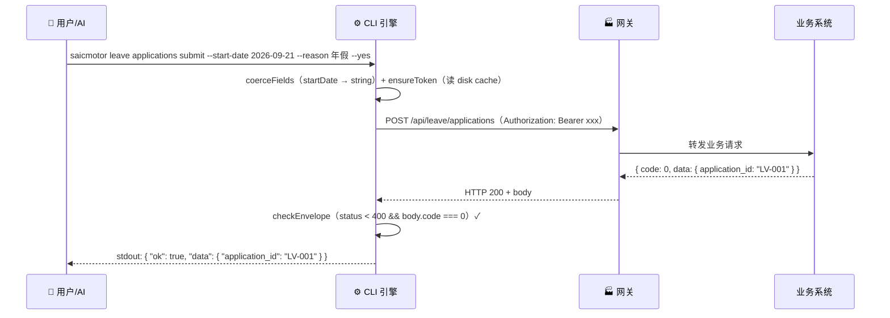

# 02 — 系统架构

> 深入 saicmotor-cli 的五层架构（含 SDK 跨切层）、Monorepo 包拓扑、仓库目录结构、数据流。

---

## 2.1 五层架构（含 SDK 跨切层）

SDK 类型层（`@saicmotor/sdk`）是横跨四层的类型与运行时契约——既提供 zod schema 在引擎和插件层做运行时校验，也提供 TypeScript 类型让声明层和编排层在设计时引用。它不是"第五层"（不在调用链中占一个位置），而是一个**横向角色**——被 L3 执行层和 L4 插件层在运行时导入，被 L1 编排层和 L2 声明层在编译时引用。



### SDK 类型层：设计意图

这个层存在的理由是**单一真相源（SSOT）**。在 SDK 出现之前，CLI 核心和插件各自定义 `Service` 类型、各自实现错误分类。当 CLI 升级时，插件不知道自己的类型定义是否仍然兼容——结果就是无声的运行时崩溃。

SDK 作为一个独立包被 CLI 和所有插件共同依赖，解决了三个问题：

1. **类型一致性**：`Service`、`Method`、`ScriptContext` 等核心类型只有一份定义。CLI 改了 Schema，插件的 TypeScript 编译立即报错，而不是等到运行时才发现。
2. **错误共享**：`SaicmotorError` 类和 `EXIT_CODES` 在 SDK 中定义，CLI 和插件 `import { SaicmotorError } from "@saicmotor/sdk"`，两边拿到同一个类。但要注意：npm 安装时每个包有自己的一份 SDK 副本（存在各自 `node_modules/` 中），所以 `instanceof SaicmotorError` 跨包比较会失败——CLI 侧使用结构判断 `isSaicmotorError()` 作为替代方案。
3. **校验共享**：`ServiceSchema` 和 `PluginManifestSchema` 是 zod schema，CLI 的 `engine/catalog.ts` 和 `plugin/loader.ts` 都在运行时调用 `.safeParse()` / `.parse()` 做校验。一份 schema 定义、多处理解——如果 SDK 升级收紧校验规则，所有消费方同步生效。

### 层 1：编排层（Skills）

**职责**：告诉 AI Agent "我能做什么、怎么调用我"。

- `saicmotor-suite` — 统一入口，路由表
- 各业务 `saicmotor-<name>` — 具体操作手册

> 加新业务只改这一层 + Catalog 层。引擎和插件框架完全不动。

### 层 2：声明层（Catalog）

**职责**：用 JSON 声明 API 接口结构。

每个 catalog JSON 经 SDK 的 zod schema 校验（`ServiceSchema.safeParse(raw)`），不合法记 warning 并跳过（不阻断 CLI 启动）。校验逻辑的物理落点有两处：

- **核心 catalog**：`engine/catalog.ts` — `loadCatalog()` 扫描 `catalog/services/*.json`，逐个 `ServiceSchema.safeParse()`。
- **插件 catalog**：`plugin/loader.ts` — `loadPluginServices()` 扫描插件包内的 catalog 文件，同样用 `ServiceSchema.parse()`。

### 层 3：执行层（Engine）

**职责**：把命令字符串变成 HTTP 请求，把 HTTP 响应变成格式化输出。

核心管道（`engine/run.ts:35-77`）：

```
Commander 解析 → coerceFields → findScript → ensureToken → send → checkEnvelope → format
```

### 层 4：插件层（Plugin System）

**职责**：插件加载、生命周期管理、Skills 注册、Suite 路由聚合。

CLI 核心自身不内置业务 catalog（`catalog/services/` 目录为空）。全部业务服务声明都由插件包贡献，核心引擎保持完全通用。

---

## 2.2 Monorepo 包拓扑



箭头方向即依赖方向——谁 import 谁就指向谁。

### 依赖关系详解

| 方向 | 类型 | 说明 |
|------|------|------|
| CLI → SDK | **dependencies** | CLI 在 `loader.ts`、`catalog.ts`、`run.ts`、`error.ts` 等多处直接 `import { ... } from "@saicmotor/sdk"`，需 SDK 在运行时可用 |
| 插件 → SDK | **dependencies** | 插件脚本在运行时 `import { SaicmotorError } from "@saicmotor/sdk"`。若放在 devDependencies，npm install 插件时不安装 SDK，脚本执行时报 MODULE_NOT_FOUND |
| CLI → 插件 | **运行时动态加载** | 通过 npm install 安装到 `~/.saicmotor/plugins/node_modules/`，CLI 启动时 `loadPlugins()` 扫描 |

SDK 既是编译时类型契约（`ScriptContext`、`ScriptFn` 等 interface），也是运行时能力（`SaicmotorError` 类、`ServiceSchema.parse()` 等 zod 校验）。这意味着：

- SDK 版本变更是**有运行时影响的**——zod schema 收紧会导致之前能通过校验的 catalog 被拒绝
- 插件必须在 `dependencies` 中声明 SDK，不能依赖 CLI 间接提供（npm 不保证间接依赖的解析路径）
- CLI 和插件通过共享同一份 SDK 类型契约保证接口一致性——CLI 升级 SDK 版本后，插件重新 `npm install` 即同步契约

---

## 2.3 仓库目录（谁改什么）

```
saicmotor-cli/                           ← monorepo 根
├── packages/
│   ├── cli/                             ← 🔴 核心团队维护
│   │   ├── src/cli/                     ← 命令面（index.ts + plugin-cmds + tooling-cmds）
│   │   ├── src/engine/                  ← 引擎管道：catalog / run / script / http / request / output / extract
│   │   ├── src/auth/                    ← 认证：store / session / transport / provider / exchange / loopback / open / password
│   │   ├── src/plugin/                  ← 插件系统：loader / registrar / suite / paths / state
│   │   ├── src/install/                 ← Skills 安装器 + 一键卸载
│   │   ├── src/version.ts              ← 核心版本号（自 package.json 读取，缓存）
│   │   ├── catalog/services/            ← 核心服务挂载点（当前为空）
│   │   ├── skills/                      ← 内核 skills（suite + shared）
│   │   └── scripts/                     ← 核心内置脚本（uninstall.js）
│   ├── sdk/                             ← 🔴 核心团队维护（类型契约）
│   │   └── src/
│   │       ├── catalog.ts              ← ServiceSchema / FieldSchema / MethodSchema / ResourceSchema
│   │       ├── config-types.ts          ← Config（{ gateway }，不含 auth）
│   │       ├── context.ts              ← ScriptContext / ScriptFn / RunResult
│   │       ├── error.ts                ← SaicmotorError / EXIT_CODES / ErrorCategory / UpstreamInfo
│   │       ├── manifest.ts             ← PluginManifestSchema / validateManifest
│   │       └── index.ts                ← 统一导出
│   ├── plugin-leave/                    ← 🟡 插件开发者维护
│   ├── plugin-attendance/               ← 🟡 插件开发者维护
│   └── plugin-user/                     ← 🟡 插件开发者维护
├── scripts/
│   └── sync-versions.mjs               ← SDK 版本同步脚本（以 CLI 版本为基准对齐 SDK）
├── docs/
│   ├── sprint/                          ← Sprint 规划
│   ├── history/                         ← 历史归档
│   ├── superpowers/                     ← Superpowers 产物（specs/plans）
│   └── lessons-learned-the-hard-way/    ← 实践教训
└── howto/                               ← 📖 面向用户的指南
    ├── framework/                       ← V1 架构文档
    ├── framework-v2/                    ← V2 架构文档（你正在读）
    ├── user-guide.md                    ← 用户指南
    └── plugin-developer.md              ← 插件开发手册
```

| 颜色 | 角色 | 修改场景 |
|:---:|------|----------|
| 🔴 | 核心团队 | 引擎功能、认证、插件框架、SDK 类型契约 |
| 🟡 | 插件开发者 | catalog JSON、SKILL.md、自定义脚本 |
| 📖 | 所有人 | 读文档、了解架构 |

### 关键文件说明

**`packages/cli/src/version.ts`** — 核心版本号读取模块。`getCoreVersion()` 从 CLI 的 `package.json` 读取 `version` 字段，结果缓存。在 `plugin/loader.ts` 中被调用，用于与插件的 `engine` semver 范围做兼容检查。同时 `plugin/suite.ts` 用它生成 suite SKILL.md 的 version 元数据。

**`scripts/sync-versions.mjs`** — SDK 版本同步脚本。以 CLI 的 `package.json` version 为基准，将 SDK 的 `package.json` version 对齐到相同值。在发布流程中执行，确保 SDK 和 CLI 始终版本号一致。设计意图：CLI 和 SDK 作为耦合的契约对，版本号应同步——当 CLI 升级 SDK 的 schema 时，版本号变化意味着契约变化。

---

## 2.4 数据流全景

### Catalog 加载管线（启动时）

在用户输入任何命令之前，CLI 启动时先完成 catalog 加载与命令注册。这是 SSOT 的物理落点——一份 SDK zod schema 定义，所有消费方（核心 engine、插件 loader）都信任它。



这里有两条并行的加载路径：

1. **核心 catalog**：`engine/catalog.ts` → `loadCatalog()` 扫描 CLI 自身的 `catalog/services/`（当前为空，保留挂载点）。
2. **插件 catalog**：`plugin/loader.ts` → `loadPluginServices()` 扫描每个已启用插件的 `catalog/services/` 目录。

两条路径使用同一个 `ServiceSchema`（从 `@saicmotor/sdk` 导入），校验逻辑完全一致。

### 引擎内管线（命令 → 执行）



### 端到端四方交互



---

## 2.5 核心设计原则

| 原则 | 含义 | 体现 |
|------|------|------|
| **声明式优先** | catalog JSON 能描述的不写代码 | 90% 的业务 API 只需 JSON 声明 |
| **引擎通用** | HTTP 管线、认证、输出格式化全由引擎处理 | 插件不需要写 HTTP 调用代码 |
| **插件生态** | 业务能力以独立 npm 包分发 | 不碰核心代码就能加新业务系统 |
| **错误可读** | 所有错误都结构化、带退出码、带修复提示 | `SaicmotorError`（来自 `@saicmotor/sdk`）统一分类 |
| **安全默认** | 写操作需 `--yes` 确认 | 提交请假不加 `--yes` 被拦截 |

---

## 2.6 linked/ 目录设计：为什么不是 `@saicmotor/plugin-*`？

```
~/.saicmotor/plugins/
├── linked/                    ← dev link（junction）
│   └── plugin-reimbursement/  ← 直接以 plugin-* 命名，不走 @saicmotor/ scope
└── node_modules/              ← npm 安装
    └── @saicmotor/            ← npm scope 目录
        └── plugin-leave/
```

**原因**：`saicmotor dev` 命令用 `fs.symlinkSync(src, dest, "junction")` 建立链接。npm 的 `@saicmotor/` scope 目录只在 `node_modules/` 下存在——它不是 linked/ 的一部分。`linked/` 是 saicmotor 自己的约定目录，不走 npm 的 scope 解析逻辑。

`scanEntries()` 函数对 linked/ 和 node_modules/ 采用不同策略——linked/ 下直接找 `plugin-*`，node_modules/ 下需要先进入 `@saicmotor/` scope。这样两边都能正确解析。详见 [04 插件系统 §加载器](./04-plugin-system.md#43-加载器-loadplugins)。

---

## ❓ 自学检查

1. 五层架构中，加一个新业务系统需要修改哪几层？不需要修改哪几层？
2. 为什么插件必须把 `@saicmotor/sdk` 放在 `dependencies`（而非 `devDependencies`）？如果用 `devDependencies` 有什么后果？
3. 从用户输入命令到终端输出 JSON，引擎内部经过哪些步骤？每步的输入和输出是什么？
4. Catalog 加载阶段，`ServiceSchema.parse()` 校验失败会怎样？校验通过后数据流向哪里？

> **答案** → [A1 FAQ §自测答案](./A1-faq.md#自测答案)

## 下一步

- [03 安装全流程](./03-installation-flow.md) — 从 npm install 到第一个命令的完整旅程
- [04 插件系统](./04-plugin-system.md) — 插件深入