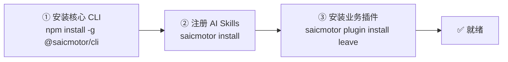
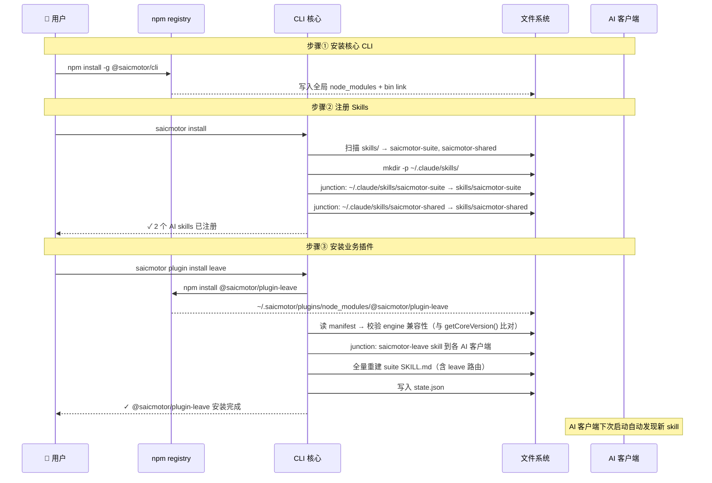
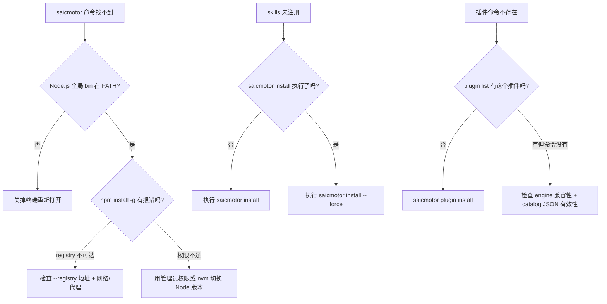

# 03 — 安装全流程

> 从零到第一个命令的完整旅程。覆盖 npm 安装、Skills 注册、插件安装、验证步骤。

---

## 3.1 三步安装模型



### ① 安装核心 CLI

```bash
npm install -g @saicmotor/cli --registry=<内部 registry>
```

**这条命令做了什么**：
- 从 registry 下载 `@saicmotor/cli` 包（含编译后的 JS 产物）
- 安装到 Node.js 全局目录，`saicmotor` 命令可用
- **不**触发任何自动注册——没有 postinstall hook

### ② 注册 AI Skills

```bash
saicmotor install
```

**这条命令做了什么**：

```
saicmotor install
  ├─ 扫描 CLI 包内 skills/ 目录 → 找到 saicmotor-suite + saicmotor-shared
  ├─ 确保各 AI 客户端 skills 目录存在
  │    ~/.claude/skills/
  │    ~/.agents/skills/
  │    ~/.codebuddy/skills/
  ├─ 对每个 skill 在每客户端建立 junction（或 symlink / copy）
  └─ 输出：✓ 2 个 AI skills 已注册
```

> 💡 **预期输出**：`✓ 2 个 AI skills 已注册`（`saicmotor-suite` + `saicmotor-shared`）。

### ③ 安装业务插件

```bash
saicmotor plugin install leave --registry=<内部 registry>
```

**这条命令做了什么**：

```
saicmotor plugin install leave
  ├─ "leave" → 自动展开为 @saicmotor/plugin-leave
  ├─ npm install 到 ~/.saicmotor/plugins/node_modules/@saicmotor/plugin-leave
  ├─ 读取 manifest → 校验 engine 兼容性
  ├─ registerPluginSkills（把插件的 skill 注册到各 AI 客户端）
  ├─ writeSuiteRoutes（全量重建 suite 路由表）
  ├─ saveState（写入 state.json）
  └─ 输出：✓ @saicmotor/plugin-leave 安装完成，1 个 skills 已注册
```

---

## 3.2 安装时序全图



---

## 3.3 `saicmotor install` vs `plugin install` — 分工明确

这是中级工程师最困惑的地方（[FAQ #1](../A1-faq.md#q1-saicmotor-install-和-plugin-install-的关系)），一张表说清楚：

| | `saicmotor install` | `saicmotor plugin install <name>` |
|---|---|---|
| **谁调用** | 用户手动（安装 CLI 后跑一次） | 用户手动（每装一个插件跑一次） |
| **注册什么** | 内核 skills：suite + shared | 该插件的 skills |
| **触发的连锁操作** | 注册 skills 到 AI 客户端 | 注册 skills + **刷新 suite 路由表** |
| **必须性** | 必须（否则 AI 发现不了 saicmotor） | 必须（否则业务命令不存在） |
| **可重复执行吗** | 可以，`--force` 强制重装 | 可以，`--json` 静默输出 |

> 💡 **黄金规则**：`saicmotor install` 只跑一次。之后每次 `plugin install/uninstall/enable/disable` 都会自动更新 suite 路由表——你不需要再手动跑 `saicmotor install`。

---

## 3.4 验证安装的检查清单

```bash
# 1. 核心命令可用
saicmotor --version    # 输出与 package.json 同步的动态版本（getCoreVersion()）
saicmotor --help       # → 含 install, uninstall, plugin, auth 等

# 2. Skills 落盘成功
ls ~/.claude/skills/   # → saicmotor-suite, saicmotor-shared

# 3. 插件命令存在（装插件后）
saicmotor leave --help  # → leave 子命令列表

# 4. Suite 路由表正确
cat ~/.claude/skills/saicmotor-suite/SKILL.md
# → 含 "请假 → saicmotor-leave" 等路由条目
```

---

## 3.5 安装失败排查



---

## ❓ 自学检查

1. 如果用户只执行 `npm install -g @saicmotor/cli` 而不执行 `saicmotor install`，AI Agent 能发现 saicmotor 吗？
2. 安装一个插件后，suite 路由表是什么时候更新的？需要用户手动做什么吗？
3. `saicmotor --help` 的输出在装插件前和装插件后有什么区别？为什么？

> **答案** → [A1 FAQ §自测答案](./A1-faq.md#自测答案)

## 下一步

- [04 插件系统](./04-plugin-system.md) — 深入了解插件的加载、生命周期、状态管理
- [05 Skills 与 Suite](./05-skills-and-suite.md) — AI Agent 发现机制深入