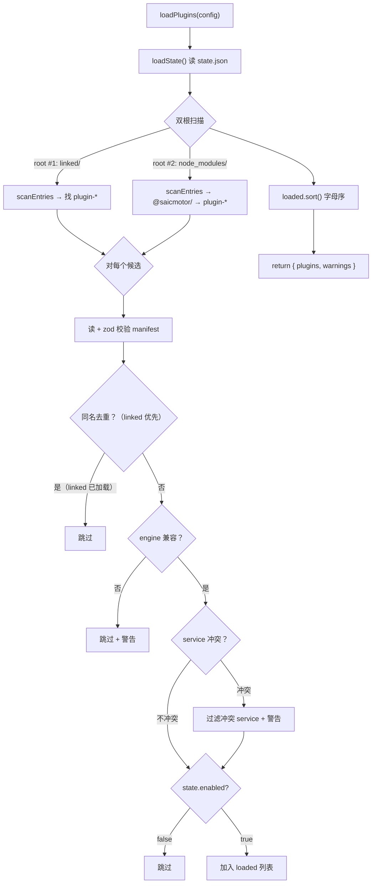
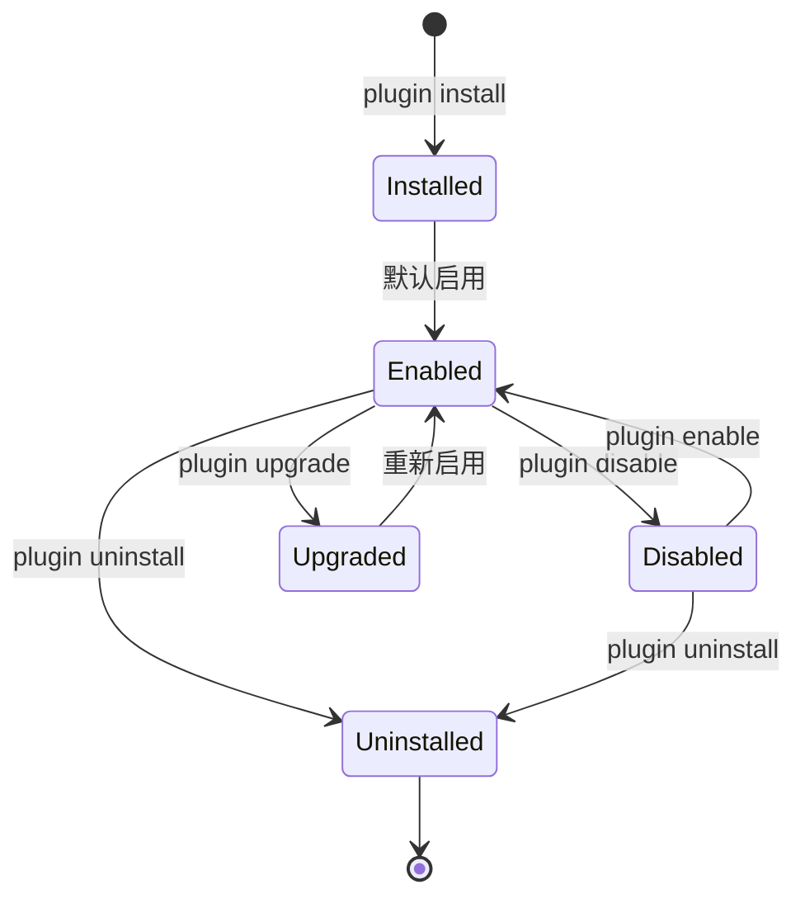

# 04 — 插件系统

> 业务能力以独立 npm 包分发，CLI 启动时扫描加载。本章覆盖插件的结构、加载器、生命周期和状态管理。

---

## 4.1 插件包结构

```
plugin-<name>/                          ← 独立的 npm 包
├── package.json                        ← @saicmotor/plugin-<name>
├── saicmotor.plugin.json               ← 🔴 插件 manifest（核心声明文件）
├── catalog/
│   └── services/
│       └── <name>.json                 ← 🟡 服务声明（API 接口 + 参数 schema）
├── skills/
│   └── saicmotor-<name>/
│       └── SKILL.md                    ← 🟡 AI Agent 操作手册
├── scripts/                            ← ⚪ 自定义脚本源码（可选，编译后放到 dist/scripts/）
│   └── <service>/
│       └── <resource>/
│           └── <method>.ts
├── src/                                ← ⚪ 辅助源码
└── test/                               ← ⚪ 测试
```

| 图例 | 含义 |
|:---:|------|
| 🔴 | 必须 — 缺了插件无法加载 |
| 🟡 | 必须 — 缺了命令无法注册 / AI 无法发现 |
| ⚪ | 可选 — 需要时才加 |

---

## 4.2 Manifest 字段详解

`saicmotor.plugin.json` 是插件的"身份证"和"功能声明"。

```typescript
{
  name: string;                          // 必须 "@saicmotor/plugin-*"
  engine: string;                        // semver range，如 "^0.8.0"
  catalog?: string[];                    // catalog glob 列表
  skills?: string[];                     // skills 目录列表
  scripts?: string;                      // scripts 根目录（须指向编译产物 .js 目录）
  routes?: Record<string, string>;       // suite 意图路由
}
```

### 字段逐一解释

| 字段 | 为什么需要 | 缺了会怎样 |
|------|-----------|-----------|
| `name` | loader 用它标识插件、去重、存 state | 插件无法被识别 |
| `engine` | semver 兼容检查——防止新版本 CLI 加载不兼容的旧插件 | 不兼容时跳过并打印警告 |
| `catalog` | 告诉 loader 去哪儿找 catalog JSON | 不声明则不在插件目录下扫描 service |
| `skills` | 告诉 registrar 注册哪些 skill 目录 | AI Agent 发现不了你的业务能力 |
| `scripts` | 告诉 findScript 去哪儿找自定义脚本覆盖 | 脚本不会被找到 |
| `routes` | 你声明"我能处理什么意图"，引擎默认不包含你的路由 | suite 路由表中没有你的条目，AI 路由不到你 |

> ⚠️ **关于 `scripts` 字段的重要说明**（FAQ #2）：
>
> `manifest.scripts` 必须指向**编译后的 `.js` 产物目录**（如 `"dist/scripts"`），不是 `.ts` 源码目录。引擎只查找 `.js` 文件。
>
> **已知问题**：当前三个参考插件（leave/attendance/user）的 manifest 声明 `"scripts": "scripts"` 指向 `.ts` 源码目录——其脚本覆盖实际从未生效。它们的测试通过 `SAICMOTOR_SCRIPTS` 环境变量覆盖了查找路径。新插件按 `"scripts": "dist/scripts"` 声明即可正常工作。
>
> 详见 [FAQ #2](./A1-faq.md#q2-manifestscripts-字段为什么指向编译产物目录)。

---

## 4.3 加载器：loadPlugins()



### 关键决策表

| 决策 | 规则 | 为什么 |
|------|------|--------|
| **同名插件** | linked 优先于 registry | dev 调试时本地版本覆盖已安装版本 |
| **同名 service** | 先加载者优先；后加载者该 service 被过滤（警告） | 防止两个插件抢同一个命令，行为确定 |
| **不兼容 engine** | 跳过加载，输出警告 | 防止 API 不兼容导致运行时崩溃 |
| **disabled 插件** | 跳过不加载（不卸载文件） | 禁用的插件文件保留，随时可重新启用 |
| **catalog 坏文件** | 单文件跳过，其他正常 | 一个 JSON 写错不拖垮整个插件 |

### scanEntries 的 Windows 兼容

```typescript
// src/plugin/loader.ts:25
if (!e.isDirectory() && !e.isSymbolicLink()) continue;
```

`linked/` 下的插件用 junction（Windows 版 symlink）建立。Windows 的 `fs.Dirent.isDirectory()` 对 junction 返回 `false`，所以必须同时检查 `isSymbolicLink()`，否则所有 linked 插件都会被跳过。

---

## 4.4 插件生命周期



### 生命周期命令对照

| 命令 | 行为 | 连锁影响 |
|------|------|----------|
| `plugin install <name>` | npm install → 读 manifest → registerPluginSkills → saveState → writeSuiteRoutes | 命令可用 + skills 落盘 + suite 更新 |
| `plugin uninstall <name>` | unregisterPluginSkills → npm uninstall → saveState → writeSuiteRoutes | 命令消失 + skills 删除 + suite 收缩 |
| `plugin enable <name>` | state.enabled = true → saveState → registerPluginSkills → writeSuiteRoutes | 命令恢复 + skills 恢复 + suite 更新 |
| `plugin disable <name>` | state.enabled = false → saveState → unregisterPluginSkills → writeSuiteRoutes | 命令消失 + skills 删除 + suite 收缩 |
| `plugin upgrade <name>` | npm update → reload | 版本更新 |
| `plugin list [--json]` | loadPlugins() 双根扫描 | 只读，无副作用 |

### disable 的完整连锁反应

```
plugin disable leave
  ├─ 1. state.json: leave.enabled = false
  ├─ 2. unregisterPluginSkills(["skills/saicmotor-leave"])
  │      → 删除 ~/.claude/skills/saicmotor-leave（junction）
  │      → 删除 ~/.agents/skills/saicmotor-leave（junction）
  │      → 删除 ~/.codebuddy/skills/saicmotor-leave（junction）
  ├─ 3. writeSuiteRoutes()
  │      → buildSuiteRoutes() — leave 的路由不再被收集
  │      → generateSuiteSkill() — SKILL.md 不再含 leave 行
  │      → registerSkill("saicmotor-suite") — 更新 suite junction
  └─ 4. 下次 CLI 启动 → loader 跳过 disabled 插件 → leave 命令消失
```

> 💡 **核心洞察**：disable 不仅仅隐藏命令——它让 AI Agent 完全感知不到这个插件的存在。AI 不会在 suite 中看到路由、不会读到 skill 内容、不会尝试拼出已被禁用的命令。这是一个**全栈禁用**。

---

## 4.5 状态持久化

`~/.saicmotor/plugins/state.json`：

```json
{
  "plugins": {
    "@saicmotor/plugin-leave": {
      "name": "@saicmotor/plugin-leave",
      "version": "0.8.0",
      "enabled": true,
      "source": "registry",
      "skills": ["skills/saicmotor-leave"],
      "routes": { "请假": "saicmotor-leave", "休假": "saicmotor-leave" }
    }
  }
}
```

| 字段 | 说明 |
|------|------|
| `source` | `"registry"`（npm 安装）或 `"linked"`（dev link）；linked 额外带 `linkedPath` |
| `enabled` | `false` 时 loader 跳过该插件 |
| `skills` | 记录已注册的 skill 目录，供卸载时清理 |
| `routes` | 缓存插件声明的意图路由 |

---

## 4.6 插件开发者常犯的 5 个错误

| # | 错误 | 表现 | 纠正 |
|---|------|------|------|
| 1 | `"scripts": "scripts"` 指向 .ts 源码 | 脚本从不执行 | 改为 `"scripts": "dist/scripts"` |
| 2 | manifest 缺少 `engine` 字段 | zod 校验失败，插件被跳过 | 加上 `"engine": "^0.8.0"` |
| 3 | `routes` 不声明 | suite 路由表不含你的插件，AI 路由不到 | 在 manifest 加 `"routes": { "关键词": "saicmotor-xxx" }` |
| 4 | skill 目录名与 SKILL.md 的 `name` 不一致 | AI 发现不了或匹配错误 | 确保目录名 = frontmatter name |
| 5 | `saicmotor install` 以为会注册插件 skills | 插件 skills 未注册 | 插件 skills 由 `plugin install` 自动注册 |

---

## ❓ 自学检查

1. linked/ 下的插件和 node_modules/ 下的插件在加载优先级上有什么区别？为什么这样设计？
2. `plugin disable` 除了隐藏命令外，还做了什么？为什么说这是"全栈禁用"？
3. 如果两个插件都声明了同一个 service name（如 `leave`），会发生什么？

> **答案** → [A1 FAQ §自测答案](./A1-faq.md#自测答案)

## 下一步

- [05 Skills 与 Suite](./05-skills-and-suite.md) — AI Agent 发现机制深入
- [10 插件开发指南](./10-plugin-development.md) — 动手开发你的第一个插件