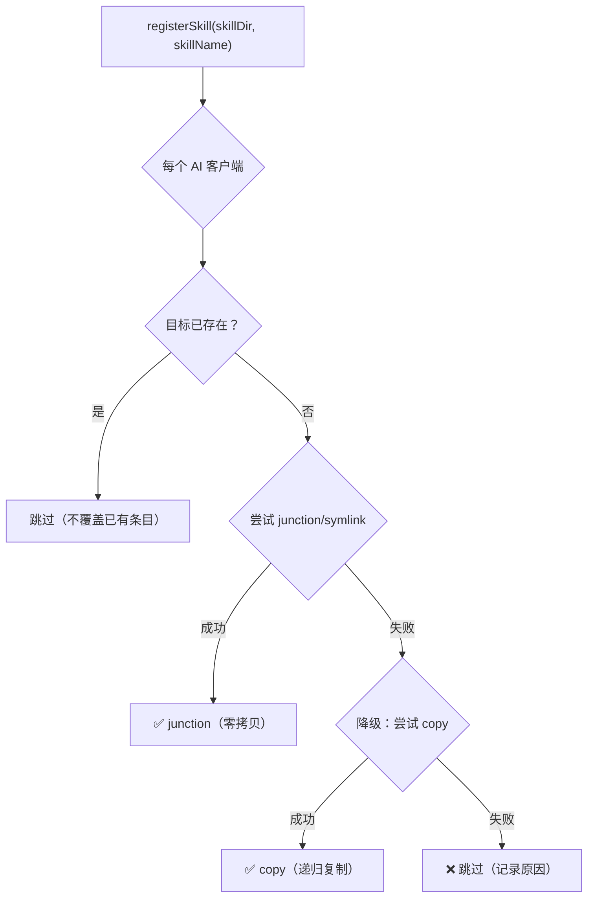
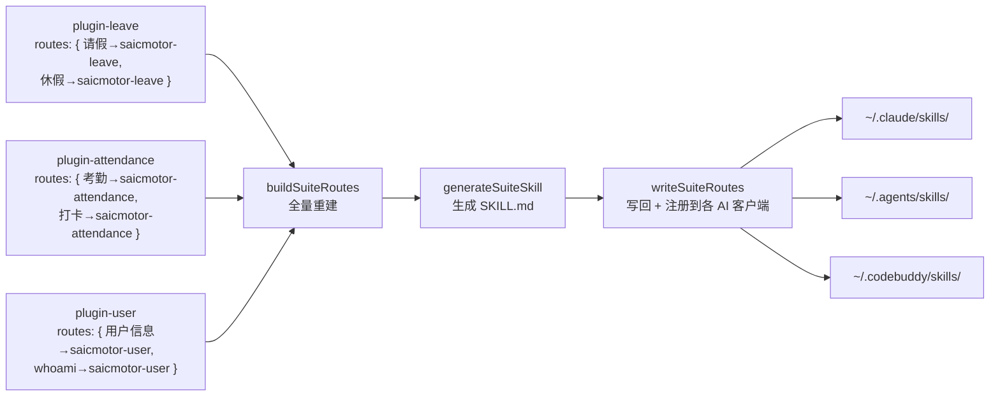
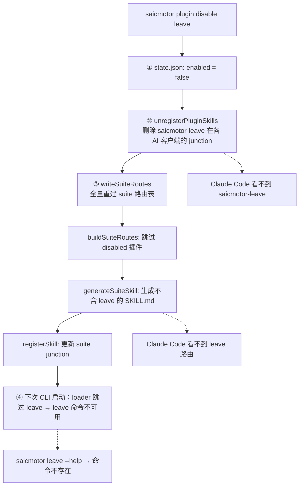
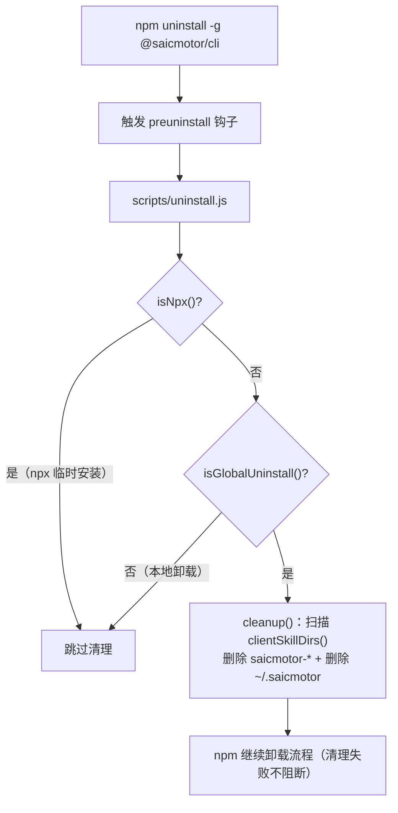

# 05 — Skills 注册与 Suite 路由

> Skills 是 AI Agent 发现和调用 saicmotor 能力的唯一入口。本章深入 Skills 注册机制、Suite 路由聚合原理、以及它们的连锁关系。

---

## 5.1 背景：AI 客户端的 Skill 机制

在你深入 saicmotor 的实现之前，先理解 AI 客户端（Claude Code、Cursor、CodeBuddy）的 skill 机制：

```
~/.claude/skills/                    ← Claude Code 的 skills 目录
├── saicmotor-suite/                 ← saicmotor 的入口 skill
│   └── SKILL.md                     ← AI 读它发现 saicmotor 的能力
├── saicmotor-shared/                ← 共享能力（认证、配置等）
│   └── SKILL.md
├── saicmotor-leave/                 ← 请假插件贡献
│   └── SKILL.md
└── ... (其他 skill)
```

**AI 客户端做的事**：
1. 启动时扫描 `~/.claude/skills/`（或对应路径）
2. 读取每个子目录下的 `SKILL.md`
3. 将 skill 加载到 AI 的"知识库"
4. 当你向 AI 提需求时，AI 在其知识库中匹配最相关的 skill
5. 找到对应 skill 后，按 SKILL.md 中的指示执行命令

> 💡 **关键理解**：saicmotor 不实现 skill 机制——它只是把自己的 SKILL.md 文件**注册**（放）到 AI 客户端的 skills 目录下。注册后，AI 客户端的原有机制自动生效。

---

## 5.2 注册策略

`registerSkill(skillDir, skillName)` 为每个 AI 客户端目录建立链接，优先级：



| 策略 | 说明 | 触发条件 |
|------|------|----------|
| **junction** | Windows: `fs.symlinkSync(src, dest, "junction")`；Unix: symlink | 默认首选，零拷贝 |
| **copy** | `copyDirSync` 递归复制整个 skill 目录 | junction/symlink 失败时降级 |
| **skipped** | 目标已存在，不覆盖 | 已有同名条目 |

> 💡 **为什么 junction 优先？** junction/symlink 是零拷贝的——修改源文件后目标自动更新。插件升级后 AI 看到的永远是最新版本的 SKILL.md。

---

## 5.3 AI 客户端映射

Skills 注册到各 AI 客户端的 skills 目录：

| AI 客户端 | Skills 目录 | 说明 |
|-----------|-------------|------|
| Claude Code | `~/.claude/skills/` | Claude Code 的 skill 机制 |
| Cursor / Agent | `~/.agents/skills/` | Cursor 的 Agent 模式 |
| CodeBuddy | `~/.codebuddy/skills/` | CodeBuddy 的 skill 机制 |

> ⚠️ **维护注意**：新增 AI 客户端支持需在两处同步代码：
> - `packages/cli/src/plugin/registrar.ts` → `AI_CLIENT_SKILL_DIRS`
> - `packages/cli/scripts/uninstall.js` → `clientSkillDirs()`
>
> 两处的原因：uninstall.js 是 CommonJS，preuninstall 钩子无法 import TS 模块。详见 [FAQ #6](./A1-faq.md#q6-为什么-uninstalljs-和-registrarts-各维护一份-ai-客户端列表)。

---

## 5.4 Suite 路由聚合

`saicmotor-suite` 是 AI Agent 的**统一入口 skill**——Agent 先读它来理解"哪些意图对应哪个业务 skill"。



### 全量重建 vs 增量追加

Suite 路由表采用**全量重建、非增量追加**策略：

```markdown
---
name: saicmotor-suite
description: "saicmotor 统一入口 skill"
---

# saicmotor-suite

| 意图 | 入口 Skill |
|------|------------|
| 请假 | saicmotor-leave |
| 休假 | saicmotor-leave |
| 考勤 | saicmotor-attendance |
| 打卡 | saicmotor-attendance |
| 用户信息 | saicmotor-user |
| whoami | saicmotor-user |

> 此文件由 saicmotor 注册器自动生成，请勿手动编辑。
```

**为什么全量重建？** 因为卸载一个插件后，它的路由会自动从表中消失——不需要手动清理。增量追加容易产生"幽灵路由"（插件卸载了但路由还在）。

### Suite 路由更新的触发时机

| 操作 | 是否触发 suite 更新 | 说明 |
|------|:---:|------|
| `plugin install` | ✅ | 安装后立即更新 |
| `plugin uninstall` | ✅ | 卸载后立即收缩 |
| `plugin enable` | ✅ | 启用后恢复路由 |
| `plugin disable` | ✅ | 禁用后移除路由 |
| `plugin upgrade` | ✅ | 升级后刷新 |
| `saicmotor install` | ❌ | 只注册内核 skills，不修改 suite 路由 |

> 💡 **两步式但同步发生**：`registerPluginSkills` 只注册 skills（不刷新 suite）；suite 刷新由紧随其后的 `writeSuiteRoutes()` 完成。两步在同一命令执行内串联，用户看不到中间状态。

---

## 5.5 disable 的完整连锁反应（图解）

这是整个系统中最关键的连锁机制：



**三个维度的"不可见"**：
| 维度 | disable 前 | disable 后 |
|------|-----------|-----------|
| CLI 命令 | `saicmotor leave balance query` 可用 | 命令消失 |
| AI Skill | AI 可读 `saicmotor-leave/SKILL.md` | junction 删除，AI 读不到 |
| Suite 路由 | 表中含 `请假 → saicmotor-leave` | 表中无 leave 条目 |

---

## 5.6 卸载时的同步清理

两个清理路径确保无残留：

### 路径 1：`saicmotor uninstall`（用户主动）

```
saicmotor uninstall
  → unregisterAllSkills()    ← 扫描并删除所有 saicmotor-* 条目
  → rm -rf ~/.saicmotor      ← 删除本地数据
  → npm uninstall -g         ← 自删 npm 包
```

### 路径 2：`npm uninstall -g`（preuninstall 兜底）



两个守卫：
- **`isGlobalUninstall()`**：`npm_config_global === "true"` — 本地 `npm uninstall` 不会误删全局数据
- **`isNpx()`**：`npm_command === "exec"` — `npx @saicmotor/cli` 临时安装不会触发清理
- **永不抛异常** — 清理失败不阻断 npm 卸载

---

## ❓ 自学检查

1. 为什么 suite 路由表采用"全量重建"而不是"增量追加"？
2. `plugin disable` 后，AI Agent 还能通过什么方式发现已被禁用的插件吗？为什么？
3. 如果用户直接 `rm -rf ~/.saicmotor/plugins/node_modules/@saicmotor/plugin-leave` 而不是用 `plugin uninstall`，会发生什么？

> **答案** → [A1 FAQ §自测答案](./A1-faq.md#自测答案)

## 下一步

- [06 执行引擎](./06-engine-pipeline.md) — 引擎管道深入
- [A1 FAQ](./A1-faq.md) — 常见疑问解答