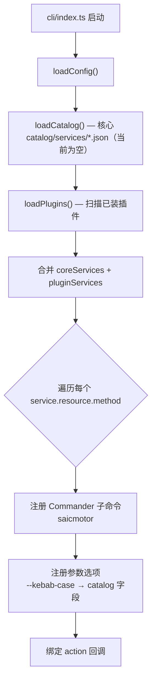
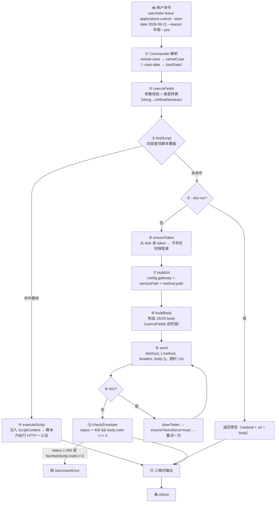
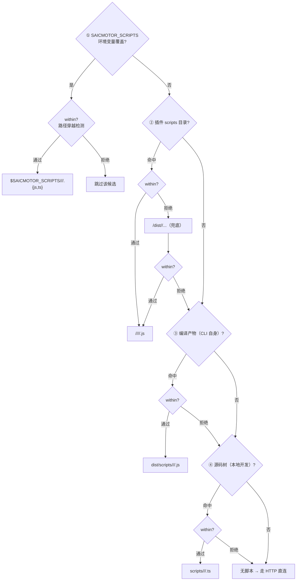
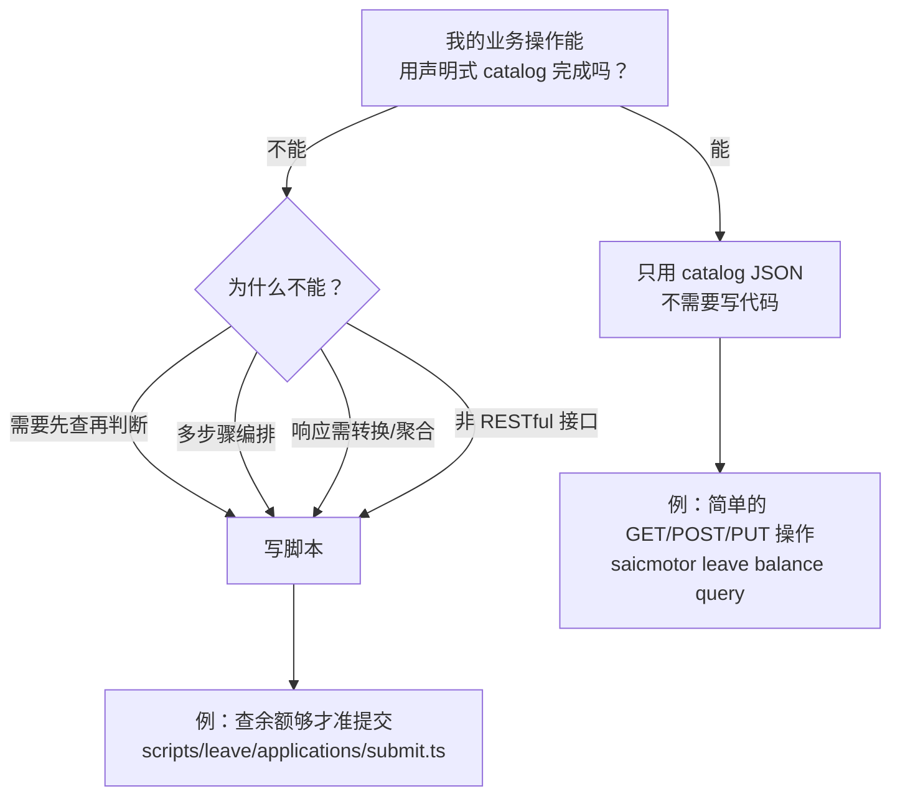

# 06 — 执行引擎

> CLI 执行引擎负责将用户的命令字符串转化为 HTTP 请求、执行脚本、格式化输出。本章覆盖从命令注册到结果输出的完整管道。

---

## 6.1 命令注册

CLI 使用 Commander 12，在启动时动态注册命令树：



### 命令命名规则

```
saicmotor <service.name> <resource名> <method名> [--参数]
    ↓           ↓               ↓              ↓
saicmotor leave  balance      query    --format pretty
```

**来源**：一条 catalog JSON 自动产生三级 Commander 子命令。不需要任何手动注册代码。

---

## 6.2 执行管道（完整时间轴）



---

## 6.3 管道各步骤详解

### ① Commander 解析

Commander 根据 catalog JSON 的 `requestBody` 字段自动注册 `--kebab-case` 参数：

```typescript
// cli/index.ts:42-43
for (const [fieldName, field] of Object.entries(method.requestBody ?? {})) {
  leaf.option(`--${toKebab(fieldName)} <value>`, field.description ?? fieldName);
}
```

`--start-date` → 解析器中用 `toCamel(toKebab(fieldName))` 映射回 `startDate`。

### ② coerceFields — 参数校验 + 类型转换

```typescript
// engine/request.ts:9-38
switch (field.type) {
  case "integer":  Number(value) → 整数校验
  case "number":   Number(value) → 数字校验
  case "boolean":  value === "true" || value === "1"
  default:         string 原样传递
}
```

> ⚠️ 如果必填参数缺失或类型不匹配，抛 `SaicmotorError("validation", ...)` → exit code 2。

### ③ findScript — 四层脚本查找（含路径穿越防护）



**`within()` 围栏**：每条候选路径在检查文件是否存在之前，都先通过 `within(baseDir, candidate)` 校验候选文件确实仍在 base 目录内。`within()` 的实现为：

```typescript
// engine/script.ts:21-24
function within(base: string, candidate: string): boolean {
  const rel = path.relative(path.resolve(base), path.resolve(candidate));
  return rel !== "" && !rel.startsWith("..") && !path.isAbsolute(rel);
}
```

这阻止了三类路径穿越攻击：
1. **`../` 穿越**：`rel.startsWith("..")` 检测——候选路径从非预期的上级目录进入。
2. **绝对路径注入**：`path.isAbsolute(rel)` 检测——防止注入类似 `/etc/passwd` 的绝对路径。
3. **base 自身**：`rel !== ""` 检测——排除 `base` 目录本身被当作脚本文件。

如果 `SAICMOTOR_SCRIPTS` 环境变量被设置为某个目录后，一个插件声明了 `"scripts": "../../../etc"`，`within()` 在文件系统被触碰之前就将其拦截。

> ⚠️ **关于第②层 `dist/` 兜底的说明**（FAQ #8）：
>
> 引擎在插件脚本目录查找时尝试了两个路径：
> ```typescript
> path.join(plugin.rootDir, plugin.manifest.scripts, `${rel}.js`)         // 主路径
> path.join(plugin.rootDir, "dist", plugin.manifest.scripts, `${rel}.js`) // 兜底
> ```
> 这是因为 `tsc` 的 outDir 可能被配置为 `dist`（即源码在 `scripts/`，编译到 `dist/scripts/`），或直接将 `scripts/` 内的 `.ts` 编译到同目录的 `.js`。两条路径覆盖了两种编译输出布局。

### ⑥ ensureToken — 认证

详见 [07 认证体系](./07-auth-flow.md)。

### ⑨ send — HTTP 请求

```typescript
// engine/http.ts:17-49
fetch(input.url, { method, headers, body, signal, redirect: "manual" })
```

- 超时 15 秒（`AbortController` + `setTimeout`）
- 自动解析 JSON 响应（检查 `Content-Type`）
- 网络异常抛 `SaicmotorError("network", ...)` → exit code 4

### ⑪ checkEnvelope — 响应校验

```typescript
// engine/run.ts:21-29
if (resp.status >= 400) → SaicmotorError("upstream", ...)          // exit code 5
if (Number(body.code) !== 0) → SaicmotorError("upstream", ...)  // exit code 5
//         ↑ Number() 包装，防止服务端返回字符串 "0" 时误判
```

---

## 6.4 脚本执行的上下文注入

当 `findScript()` 命中脚本时，引擎通过 `ScriptContext` 注入运行时能力。`ScriptContext` 的类型定义来自 `@saicmotor/sdk`（而非 CLI 本地定义），这是为了让插件开发者仅依赖 SDK 即可获得完整类型，无需安装 CLI 包。

```typescript
// 来自 @saicmotor/sdk
interface ScriptContext {
  config: Config;                              // 网关配置（含 gateway 地址）
  service: Service;                            // catalog service 声明
  method: Method;                              // 当前 method
  values: Record<string, unknown>;             // 用户传参（已过 coerceFields）
  dryRun: boolean;                             // --dry-run 标志
  ensureToken: () => Promise<string>;          // 引擎注入的 token 获取函数
}

**脚本的责任边界**：
- 脚本负责：自己的业务逻辑、HTTP 调用、前置/后置处理
- 引擎负责：提供 config + token 获取 + 参数校验后的值
- 脚本不负责：参数校验（引擎已完成）、输出格式化（调用方处理）

---

## 6.5 脚本覆盖 vs HTTP 直连：决策树



| 场景 | 声明式（catalog JSON） | 脚本覆盖（scripts/） |
|------|:---:|:---:|
| 简单 CRUD（GET/POST/PUT） | ✅ | 不需要 |
| 参数校验不需要额外逻辑 | ✅ | 不需要 |
| 前置校验（查余额够才让提交） | ❌ | ✅ |
| 多步骤编排（先登 A 取 token 再调 B） | ❌ | ✅ |
| 响应处理/转换/聚合 | ❌ | ✅ |
| 调用非标 HTTP 接口 | ❌ | ✅ |

---

## 6.6 错误处理体系

`SaicmotorError` 是框架自定义错误类，定义在 `@saicmotor/sdk` 中。它按 `category` 分类并携带语义化 `exitCode`。

### 为什么用 `isSaicmotorError()` 结构判断而不是 `instanceof`

框架使用结构判断函数来识别错误类型：

```typescript
// packages/cli/src/cli/error.ts
import { type SaicmotorError } from "@saicmotor/sdk";

export function isSaicmotorError(e: unknown): e is SaicmotorError {
  return (
    typeof e === "object" && e !== null &&
    typeof (e as { category?: unknown }).category === "string" &&
    typeof (e as { exitCode?: unknown }).exitCode === "number"
  );
}
```

不用 `instanceof` 的原因：插件和 CLI 各自依赖一份 `@saicmotor/sdk`。Node.js 的 `instanceof` 靠原型链判断，而同一个类在两个不同的 `node_modules/@saicmotor/sdk/` 副本中是不同的运行时对象——`instanceof` 会判定为 `false`，即使错误确实是 `SaicmotorError`。

结构判断不看原型链，只看对象本身的 shape——它要求对象具备 `category: string` 和 `exitCode: number` 两个自有属性。只要一个 JavaScript 对象符合这个 shape，函数就认为它是 `SaicmotorError`，无论它来自哪个 `node_modules` 副本。

### 错误类别与退出码

```typescript
type ErrorCategory = "validation" | "auth" | "network" | "upstream" | "spec";

class SaicmotorError extends Error {
  readonly category: ErrorCategory;   // 错误类别
  readonly hint?: string;             // 修复提示
  readonly upstream?: {               // 上游错误详情
    code?: unknown;
    message?: string;
  };
  get exitCode(): number;             // 语义化退出码
}
```

| category | 触发场景 | exit code | 常见修复 |
|----------|----------|:---:|------|
| `validation` | 必填参数缺失 / 类型不对 | 2 | 检查参数拼写和类型 |
| `auth` | 未登录 / token 无效 | 3 | `saicmotor auth login` |
| `network` | 网络不可达 / 超时 / DNS | 4 | 检查网关地址、网络连接 |
| `upstream` | HTTP 4xx/5xx / body.code ≠ 0 | 5 | 检查网关日志 |
| `spec` | catalog/manifest 声明不合法 | 6 | 校验 JSON schema |

### 管道的容错哲学：9 个 catch 块

引擎管道各处散落着 catch 块，它们的共同设计原则是"降级不阻断"：

- **catalog 目录不可读** / **state.json 损坏**：回退空列表 / 空插件表，不阻断 CLI 启动。代价是当前会话看起来像"没有已装插件"，但 CLI 仍然可用。
- **插件 manifest 解析失败** / **catalog 坏文件**：跳过该文件，push warning，继续加载其余插件/服务。一个插件的 JSON 错误不传染给整个生态。
- **插件脚本目录不可用**：`findScript()` 在插件循环中 catch，静默跳过——脚本覆盖是可选优化，插件不可用时不阻止 HTTP 直连回退。
- **skill junction 创建失败**：降级为 copy；copy 失败则跳过该客户端——注册操作是尽力而为的，一个客户端的失败不影响其他客户端。
- **卸载时 skill 删除失败** / **suite 路由刷新失败**：卸载已经是最佳努力的清理操作，单个文件删除失败不应让用户觉得"卸载卡住了"。
- **package.json 找不到**：`getCoreVersion()` 回退 `"0.0.0"`，CLI 仍可启动。

每个 catch 都有注释解释为什么该位置的错误可以被安全降级。没有吞噬错误就不了声的 catch——每个降级都有后果注释。

---

## 6.7 输出格式

| 格式 | 用法 | 效果 |
|------|------|------|
| `json` | `--format json`（默认） | `{"ok":true,"data":{...}}` |
| `table` | `--format table` | ASCII 表格（需返回数组数据） |
| `pretty` | `--format pretty` | 缩进美化 JSON |

---

## ❓ 自学检查

1. `--start-date` 参数是怎么映射到 `startDate` 字段的？kebab-case 和 camelCase 的转换发生在哪里？
2. 什么情况下需要写自己的脚本而不是只用 catalog JSON？举一个实际业务场景。
3. 如果网关返回 HTTP 500 错误，用户会看到什么？退出码是多少？

> **答案** → [A1 FAQ §自测答案](./A1-faq.md#自测答案)

## 下一步

- [07 认证体系](./07-auth-flow.md) — exchange/password 深入
- [10 插件开发指南](./10-plugin-development.md) — 脚本开发完整指南