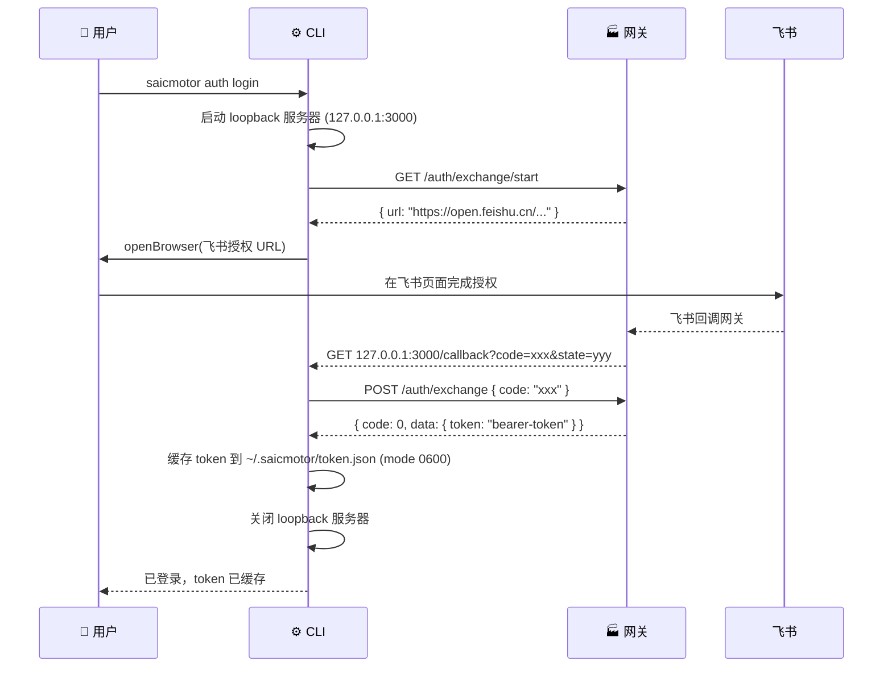
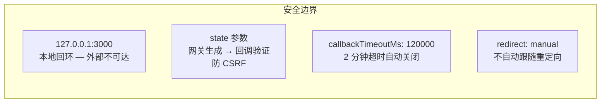
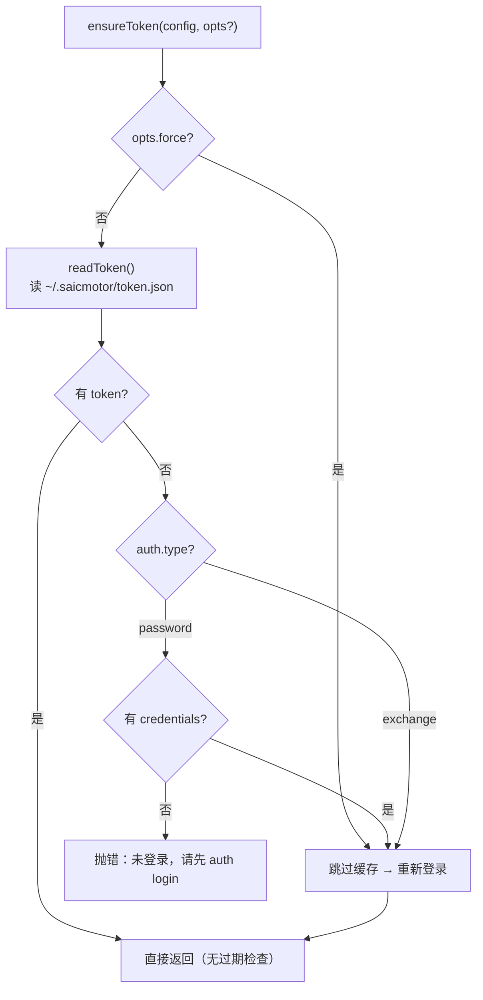
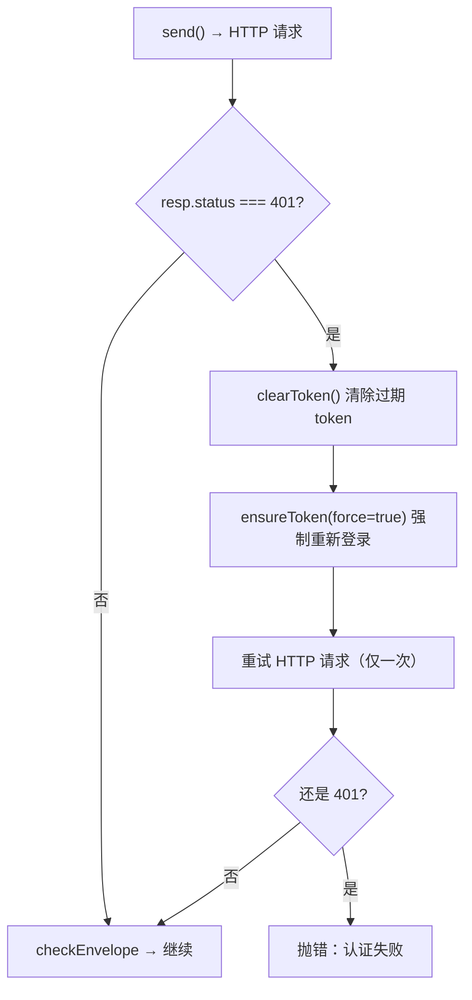

# 07 — 认证体系

> saicmotor 支持 exchange（飞书 OAuth）和 password 两种认证协议，默认 exchange。本章覆盖认证流程、token 管理、自动重试机制和安全性分析。

---

## 7.1 两种认证模式

| 模式 | 默认？ | 适用场景 | Token 存储 |
|------|:---:|------|------|
| **exchange**（飞书 OAuth） | ✅ 默认 | 生产环境，浏览器授权 | `~/.saicmotor/token.json` |
| **password** | ❌ 需显式启用 | 本地开发/测试/CI | `~/.saicmotor/token.json` + `credentials.json` |

---

## 7.2 Exchange 模式（飞书 OAuth）完整流程



### 关键步骤

**① 启动 loopback 服务器**：CLI 在 `127.0.0.1:3000` 启动一个临时 HTTP 服务器，等待网关的 OAuth 回调。

**② 获取飞书授权 URL**：`GET /auth/exchange/start` → 网关返回飞书 OAuth 授权页面的 URL。

**③ 弹出浏览器**：CLI 用 `openBrowser()` 打开系统默认浏览器。

**④ 飞书回调**：用户在飞书页面完成授权后，飞书回调网关 → 网关回调 CLI 的 loopback 服务器（`127.0.0.1:3000/callback?code=xxx&state=yyy`）。

**⑤ 交换 token**：CLI 用获取的 code 向网关 POST `/auth/exchange`，换回 bearer token。

**⑥ 缓存 token**：写入 `~/.saicmotor/token.json`，权限 `0600`（只有本用户可读写）。

### 安全性分析



| 安全措施 | 说明 |
|----------|------|
| **127.0.0.1 回环** | loopback 服务器绑定 `127.0.0.1`，外部网络完全不可达 |
| **state 参数** | 网关在 `/auth/exchange/start` 响应中生成 state，回调时验证匹配（防 CSRF） |
| **超时机制** | `callbackTimeoutMs: 120000`（2 分钟），超时后服务器自动关闭 |
| **端口冲突** | 3000 被占用时，OAuth 登录直接失败 → 提示用户释放端口或重新配置 |
| **redirect: manual** | HTTP client 设置 `redirect: "manual"`，不自动跟随重定向 |

> 💡 **端口冲突怎么办？** `loopbackPort` 配置项在 `config.ts` 的 `DEFAULT_CONFIG.auth.loopbackPort` 中，可通过用户配置（`~/.saicmotor/config.json`）覆盖。如果 3000 端口长期被占用，修改此项即可。

---

## 7.3 Password 模式

通过环境变量显式启用：

```bash
# Windows PowerShell
$env:SAICMOTOR_AUTH_TYPE="password"
saicmotor auth login --username <工号> --password <密码>

# Mac / Linux
SAICMOTOR_AUTH_TYPE=password saicmotor auth login --username <工号> --password <密码>
```

凭证缓存到 `~/.saicmotor/credentials.json`（`mode 0600`），token 同理缓存在 `token.json`。

> ⚠️ password 模式仅用于本地开发/测试/CI，生产环境不建议使用。

---

## 7.4 Token 管理与 401 自动重试

### ensureToken 决策树



> ⚠️ **关键设计**：token 缓存是**磁盘文件**（每次调用 `ensureToken()` 都重新 `readToken()`），不是内存缓存。`token.json` 只存 token 字符串本身，**没有过期时间字段**。过期不主动检测，唯一发现途径是运行时 401。

### 401 自动重试（只重试一次）



```typescript
// engine/run.ts:73-79
let token = await ensureToken(config);
let resp = await execute(config, service.servicePath, method, token, values);
if (resp.status === 401) {
  clearToken();                                    // 清除过期 token
  token = await ensureToken(config, { force: true }); // 强制重新登录
  resp = await execute(config, service.servicePath, method, token, values);
}
```

**只重试一次**——如果重试后仍然 401，说明不是 token 过期问题（可能是真的无权限），直接抛错。

> 以上代码中的 `config` 参数类型是 CLI 侧的 `Config`（来自 `packages/cli/src/config.ts`，包含 `auth` 字段），而非 SDK 的 `Config`（`packages/sdk/src/config-types.ts`，仅含 `gateway`）。认证逻辑完全在 CLI 层闭环，SDK 对 auth 一无所知。

---

## 7.5 Auth Transport

所有 HTTP 请求通过 `applyAuth()` 统一注入认证头：

```typescript
// 默认配置：
// tokenHeader = "Authorization"
// tokenPrefix = "Bearer"
headers["Authorization"] = `Bearer ${token}`;
```

Header 名和前缀可通过 `config.auth.tokenHeader` / `tokenPrefix` 配置。

---

## 7.6 安全约束一览

| 约束 | 实现 |
|------|------|
| 写操作确认 | 非 GET 请求需 `--yes` 或 `--dry-run` |
| 凭证权限 | `credentials.json` 和 `token.json` 以 `mode 0600` 写入 |
| 惰性过期 | Token 不过期不重登，仅 401 触发重登 |
| 本地回环 | OAuth 回调只在 `127.0.0.1` 监听 |
| 退出码 | 成功 → exit 0 + stdout；错误 → exit 非零 + stderr |
| 403/非401 | 不重试，直接抛 upstream 错误 |

---

## ❓ 自学检查

1. exchange 模式中，loopback 服务器为什么绑定 `127.0.0.1` 而不是 `0.0.0.0`？有什么安全意义？
2. token 过期后是怎么被发现的？为什么不存过期时间主动检测？
3. 如果网关返回 403（而非 401），引擎会做什么？为什么和 401 的行为不同？

> **答案** → [A1 FAQ §自测答案](./A1-faq.md#自测答案)

## 下一步

- [08 配置体系](./08-config-system.md) — 改一个文件就能上线
- [09 构建与发布](./09-build-and-publish.md) — npm 发布流程