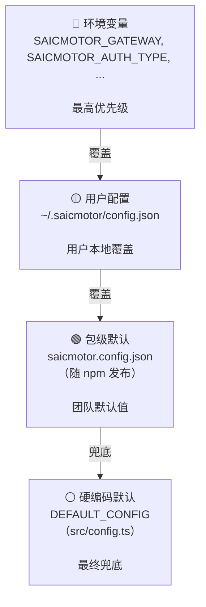
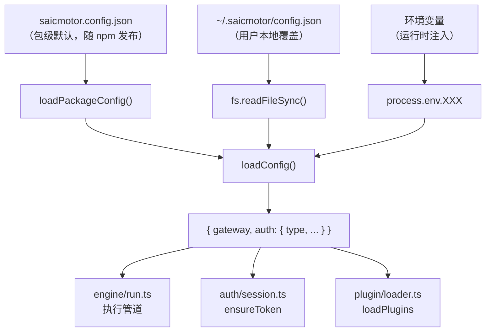
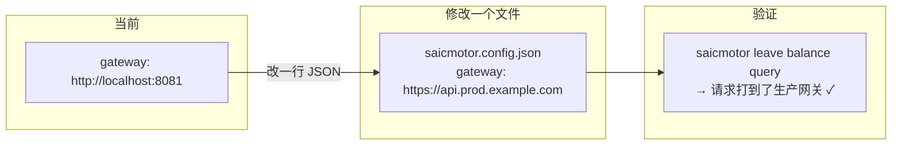

# 08 — 配置体系

> saicmotor CLI 的全部配置入口：内置默认值、包级配置文件、用户配置文件、环境变量覆盖。核心思想：**如果认证方式不变，改一个文件就能上线。**

---

## 8.1 配置优先级（瀑布图）



```
如果有环境变量 → 用它（最高优先）
否则如果有用户配置 → 用它
否则如果有包级默认 → 用它
否则用硬编码兜底值
```

---

## 8.2 各层配置文件详解

### 一、包级默认配置：`saicmotor.config.json`

```json
{
  "installUrl": "@saicmotor/cli",
  "defaults": {
    "gateway": "http://localhost:8081"
  }
}
```

| 字段 | 说明 | 当前值 | 需变更？ |
|------|------|--------|:---:|
| `installUrl` | AI 安装指引引用的包名 | `@saicmotor/cli` | ✅ 不变 |
| `defaults.gateway` | 网关地址（无用户配置 & 无环境变量时） | `http://localhost:8081` | 🔴 发布前必改 |

> 💡 **黄金规则**：发布生产前，**只改这一个文件就够了**（如果认证方式仍为 exchange OAuth 且网关路由规范一致）。

### 二、硬编码默认值：`src/config.ts`

```typescript
export const DEFAULT_CONFIG: Config = {
  gateway: pkgConfig.defaults?.gateway ?? "http://localhost:8081",
  auth: {
    type: "exchange",
    loginPath: "/auth/login",
    tokenPath: "data.token",
    tokenHeader: "Authorization",
    tokenPrefix: "Bearer",
    startPath: "/auth/exchange/start",
    exchangePath: "/auth/exchange",
    loopbackHost: "127.0.0.1",
    loopbackPort: 3000,
    callbackTimeoutMs: 120000,
  },
};
```

| 字段 | 说明 | 需变更？ |
|------|------|:---:|
| `auth.type` | 默认认证类型（飞书 OAuth） | ✅ 不变 |
| `auth.loginPath` | 密码登录接口路径 | ⚠️ 按实际网关路由确认 |
| `auth.tokenPath` | 响应中 token 的 JSONPath（如 `data.token`） | ⚠️ 按实际响应结构确认 |
| `auth.startPath` | exchange 流程起始路径 | ⚠️ 按实际 OAuth 端点确认 |
| `auth.exchangePath` | exchange 换 token 路径 | ⚠️ 按实际 OAuth 端点确认 |
| `auth.loopbackPort` | OAuth 回调端口 | 🟡 端口冲突时修改 |
| `auth.tokenHeader` | HTTP 认证头 | 🟢 通常不变 |
| `auth.tokenPrefix` | token 前缀 | 🟢 通常不变 |

> 💡 `gateway` 的硬编码兜底值 `"http://localhost:8081"` 永远不该在生产被访问——它在优先级链的最末端。前三层任意一层有值即跳过它。

### 三、用户配置文件：`~/.saicmotor/config.json`

用户可覆盖任意字段（部分覆盖，非全量替换）：

```json
{
  "gateway": "https://api.production.example.com",
  "auth": {
    "type": "password",
    "loginPath": "/v2/auth/login"
  }
}
```

读取逻辑（`config.ts:58-72`）：
- `gateway`：环境变量 → 用户配置 → 包级默认 → 硬编码
- `auth`：浅合并 `DEFAULT_CONFIG.auth` ← 用户 `auth` ← `SAICMOTOR_AUTH_TYPE`

### 四、环境变量

| 变量 | 覆盖项 | 优先级 | 使用文件 |
|------|--------|:---:|------|
| `SAICMOTOR_HOME` | 数据根目录（替代 `~/.saicmotor`） | 最高 | `src/config.ts:51` |
| `SAICMOTOR_GATEWAY` | 网关地址 | 最高 | `src/config.ts:65` |
| `SAICMOTOR_AUTH_TYPE` | 认证类型 `"password"` / `"exchange"` | 最高 | `src/config.ts:69` |
| `SAICMOTOR_USERNAME` | 用户名（CI/非交互环境） | — | `src/auth/store.ts:24` |
| `SAICMOTOR_PASSWORD` | 密码（CI/非交互环境） | — | `src/auth/store.ts:25` |
| `SAICMOTOR_CATALOG` | catalog 目录覆盖（测试/定制） | 最高 | `src/config.ts:75` |
| `SAICMOTOR_SCRIPTS` | 脚本目录覆盖（测试/定制，绕过四层查找） | 最高 | `src/engine/script.ts:43` |

---

## 8.3 配置加载全链路



---

## 8.4 发布生产前必须变更项



| 优先级 | 配置项 | 当前值 | 生产值 | 位置 |
|:---:|--------|--------|--------|------|
| 🔴 | `defaults.gateway` | `http://localhost:8081` | 生产网关 URL | `saicmotor.config.json` ← **唯一必改** |
| ⚠️ | `auth.loginPath` | `/auth/login` | 确认与网关路由一致 | `config.ts`（不一致时改） |
| ⚠️ | `auth.startPath` | `/auth/exchange/start` | 确认与 OAuth 端点一致 | `config.ts`（不一致时改） |
| ⚠️ | `auth.exchangePath` | `/auth/exchange` | 确认与 OAuth 端点一致 | `config.ts`（不一致时改） |
| ⚠️ | `auth.tokenPath` | `data.token` | 确认响应 JSON 结构 | `config.ts`（结构不同时改） |
| 🟡 | `auth.loopbackPort` | `3000` | 避免常见端口冲突 | `config.ts`（冲突时改） |
| 🟢 | 其余 auth.* 字段 | — | 通常不变 | — |

> 💡 **经验总结**：如果认证方式不变（仍为 exchange OAuth），且网关路由遵循同一套规范（`/auth/login`、`/auth/exchange/start`、`/auth/exchange`），那么**只改 `saicmotor.config.json` 里的 `gateway` 字段就够了**。
>
> `loopbackHost: "127.0.0.1"` 和 `loopbackPort: 3000` 是 OAuth 本地回调服务器，不涉及生产环境。`tokenHeader`/`tokenPrefix`（`Authorization`/`Bearer`）是 HTTP 标准，无需改动。

---

## 8.5 本地数据文件总览

所有数据存储在 `~/.saicmotor/`（或 `$SAICMOTOR_HOME/`）：

| 文件/目录 | 用途 | 权限 |
|-----------|------|:---:|
| `config.json` | 用户配置（gateway、auth 覆盖） | 644 |
| `credentials.json` | 用户名/密码（password 模式） | 600 |
| `token.json` | 缓存的认证 token | 600 |
| `plugins/node_modules/` | npm 安装的插件包 | — |
| `plugins/linked/` | dev link 的插件 junction | — |
| `plugins/state.json` | 插件启用/禁用状态 | 600 |

---

## ❓ 自学检查

1. 如果有环境变量 `SAICMOTOR_GATEWAY`、用户配置 `gateway`、包级默认 `gateway` 三者都设置了，哪个会生效？
2. 发布生产前唯一必须改的配置是哪个文件的哪个字段？为什么其他配置通常不用动？
3. `~/.saicmotor/token.json` 和 `~/.saicmotor/credentials.json` 为什么用 600 权限而 `config.json` 用 644？

> **答案** → [A1 FAQ §自测答案](./A1-faq.md#自测答案)

## 下一步

- [09 构建与发布](./09-build-and-publish.md) — npm 发布全流程
- [A2 排障速查](./A2-troubleshooting.md) — 配置相关常见问题