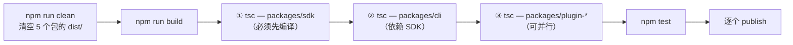
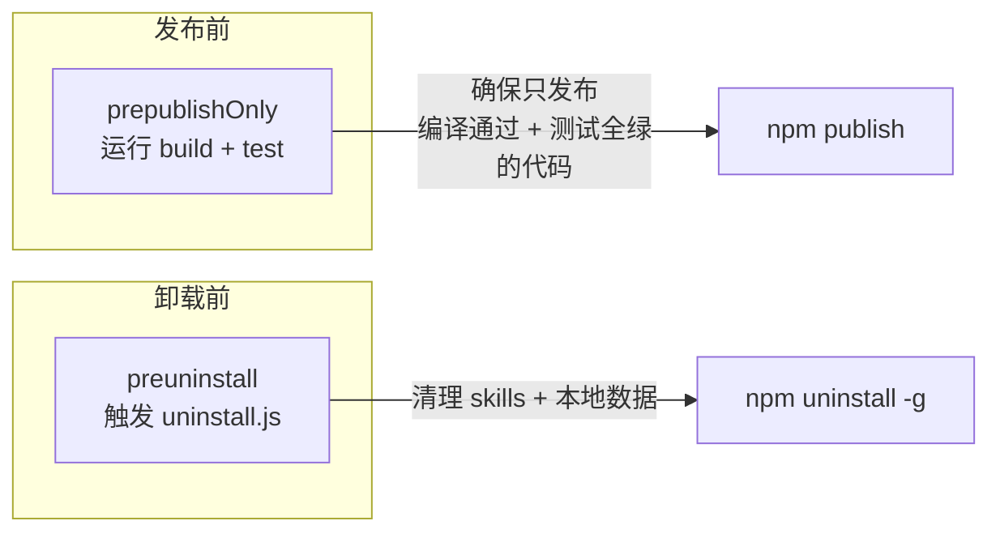
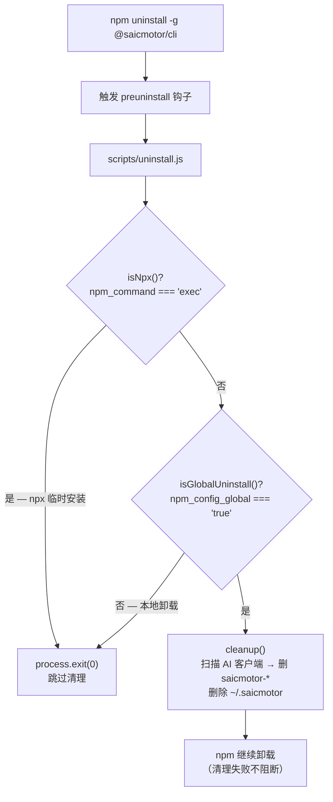
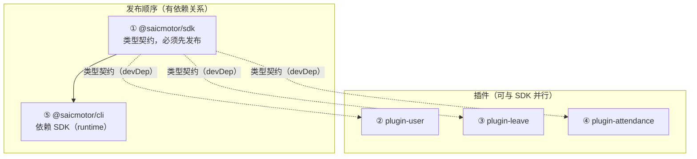

# 09 — 构建与发布

> saicmotor 是 npm workspaces monorepo，5 个包通过内部 registry 分发。本章覆盖构建流程、发布策略、lifecycle hooks 和历史教训。

---

## 9.1 Monorepo 构建流程



**构建顺序约束**：`@saicmotor/sdk` 是 `@saicmotor/cli` 的 **runtime dependency**，SDK 必须先于 CLI 编译。插件之间无编译依赖，可并行。

### 当前构建脚本

```json
"build": "npm run build --workspace=packages/sdk && npm run build --workspaces"
```

> ⚠️ **已知问题**：`--workspaces` 包含所有 workspace，SDK 会被编译两次——先单独一次，再在 `--workspaces` 中第二次。行为无害。

---

## 9.2 files 字段策略

**逐文件显式列出，不依赖目录粗粒度通配**（来自历史教训）。

CLI 包实际配置：

```json
{
  "files": [
    "README.md",
    "dist/src/**/*.js",
    "dist/scripts/**/*.js",
    "skills/**/*.md",
    "catalog/**/*.json",
    "scripts/run.js",
    "scripts/uninstall.js",
    "saicmotor.config.json"
  ]
}
```

| 策略 | 说明 |
|------|------|
| **不用 `*` + `.npmignore`** | 排斥法容易意外泄露源码、测试、配置 |
| **关键脚本逐文件单列** | `scripts/run.js`、`scripts/uninstall.js` 逐文件列出而非整目录打包 |
| **新增文件需同步** | 加新文件/目录时记得更新 `files` 字段 |

---

## 9.3 Lifecycle Hooks



| Hook | 触发时机 | 用途 | 历史 |
|------|----------|------|------|
| `prepublishOnly` | `npm publish` 前 | 运行 build + test，确保只发布编译通过且测试全绿的代码 | — |
| `preuninstall` | `npm uninstall -g` 前 | 清理 skills + 本地数据（`scripts/uninstall.js`） | 曾有 postinstall hook，已移除 |

> ⚠️ **历史教训 — 为什么没有 postinstall**：
>
> 早期版本有 `postinstall` hook 在安装后自动注册 AI skills。但 npm v11 的 `allow-scripts` 白名单对 `-g` 全局安装无效，导致 postinstall 被阻止，skills 未注册。用户需手动执行 `saicmotor install`。
>
> 因此 skills 注册收回到 `saicmotor install` 命令（CLI 内核），不依赖 npm lifecycle 环境。这彻底免疫了 npm 白名单问题。

### preuninstall 守卫



- **`isGlobalUninstall()`**：本地 `npm uninstall`（无 `-g`）不触发清理，防止删掉全局数据
- **`isNpx()`**：`npx @saicmotor/cli` 临时安装不触发清理
- **永不抛异常**——任何失败都被静默吞掉，npm 卸载不被阻断

---

## 9.4 发布流程



### 发布命令

```bash
# 1. 清空 + 重新编译
npm run clean
npm run build

# 2. 运行测试（确保全绿）
npm test

# 3. 发布各包（SDK 必须最先发布）
npm publish --registry=<内部 registry> --workspace=packages/sdk
npm publish --registry=<内部 registry> --workspace=packages/plugin-user
npm publish --registry=<内部 registry> --workspace=packages/plugin-leave
npm publish --registry=<内部 registry> --workspace=packages/plugin-attendance
npm publish --registry=<内部 registry> --workspace=packages/cli    # CLI 最后
```

### 验证发布

```bash
npm view @saicmotor/cli version --registry=<内部 registry>
npm view @saicmotor/sdk version --registry=<内部 registry>
npm view @saicmotor/plugin-leave version --registry=<内部 registry>
```

> 💡 **`--registry` flag 优于 `.npmrc`**：flag 是显式的、一次性的，不会影响本机其他 npm 包的安装行为。

---

## 9.5 本地测试发布（Verdaccio）

```bash
# 启动 Verdaccio
docker run -d --rm --name verdaccio -p 4873:4873 verdaccio/verdaccio

# 登录
npm login --registry=http://localhost:4873
# 默认用户名/密码：admin / 123456（如有自定义则按该配置）

# 发布
npm publish --registry=http://localhost:4873 --workspace=packages/cli

# 验证
npm view @saicmotor/cli version --registry=http://localhost:4873
```

---

## 9.6 历史教训速查表

| 教训 | 来源 | 当前做法 |
|------|------|----------|
| **files 字段必须显式** | 飞书 CLI 教训 | 逐文件列出，不用 `*` + `.npmignore` |
| **npx 检测** | 早期版本 npx 触发 postinstall 清理 | preuninstall 中检测 `npm_command === "exec"` |
| **preuninstall 有守卫** | 本地卸载不应删全局数据 | `npm_config_global` + npx 双重守卫 |
| **--registry flag 优于 .npmrc** | 全局 .npmrc 影响其他包 | 主推 `--registry` flag |
| **skills 注册不依赖 lifecycle hook** | npm v11 白名单对 `-g` 失效 | 收回 `saicmotor install` 命令 |

---

## ❓ 自学检查

1. 为什么 SDK 必须先于 CLI 编译和发布？如果先发布 CLI 会出什么问题？
2. 用户执行 `npm uninstall @saicmotor/cli`（不带 -g）会触发 skills 和数据清理吗？为什么？
3. 如果一个新的插件包没有在 `files` 字段中包含 `skills/` 目录，发布后会发生什么？

> **答案** → [A1 FAQ §自测答案](./A1-faq.md#自测答案)

## 下一步

- [10 插件开发指南](./10-plugin-development.md) — 完整插件开发流程
- [A2 排障速查](./A2-troubleshooting.md) — 构建和发布相关常见问题