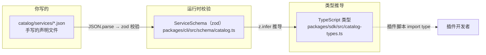
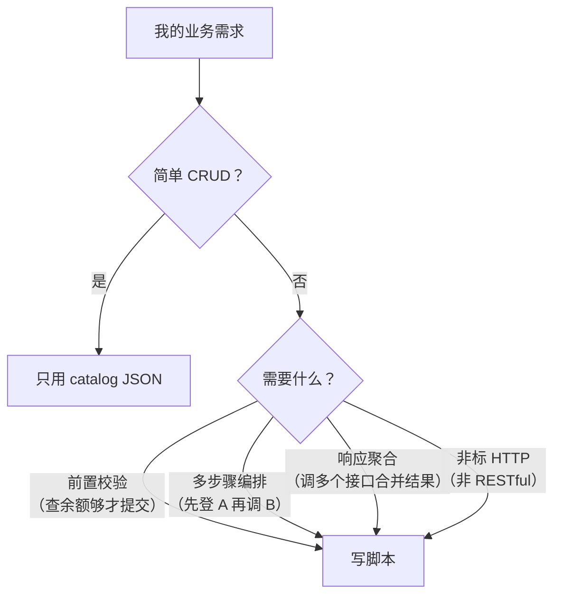

# 10 — 插件开发指南

> 面向插件开发者：不 clone 核心仓库、不碰 `src/`，在独立工程里完成全部业务开发。

---

## 10.1 5 分钟出一个插件

```bash
# 1. 生成骨架
saicmotor create plugin my-system

# 2. 进入工程
cd plugin-my-system
npm install

# 3. 编辑 API 声明（最重要的一步）
#    → catalog/services/my-system.json

# 4. 编辑 AI 操作手册
#    → skills/saicmotor-my-system/SKILL.md

# 5. 本地调试验证
saicmotor dev
saicmotor plugin list         # → 确认 linked ✓
saicmotor my-system --help    # → 确认命令可用

# 6. 发布
saicmotor validate .
npm publish --registry=<内部 registry>
```

---

## 10.2 项目结构

```
plugin-<name>/
├── package.json                     ← npm 包名 @saicmotor/plugin-<name>
├── tsconfig.json                    ← TypeScript 编译配置
├── saicmotor.plugin.json            ← 🔴 插件 manifest（核心声明）
├── catalog/
│   └── services/
│       └── <name>.json              ← 🟡 API 声明
├── skills/
│   └── saicmotor-<name>/
│       └── SKILL.md                 ← 🟡 AI Agent 操作手册
├── scripts/                         ← ⚪ 脚本源码（编译到 dist/scripts/）
│   └── <service>/
│       └── <resource>/
│           └── <method>.ts
├── src/                             ← ⚪ 辅助源码
└── test/                            ← ⚪ 测试
```

| 图例 | 含义 |
|:---:|------|
| 🔴 | 必须 |
| 🟡 | 必须 |
| ⚪ | 可选 |

### 骨架生成详情

`saicmotor create plugin my-system` 生成的工程中：

- `saicmotor.plugin.json` 的 `engine` 字段值为 `>=${getCoreVersion()}`——运行时从 `packages/cli/package.json` 读取当前核心版本号（如 `>=0.8.0`），确保插件声明的兼容范围与发布时的核心版本精确匹配。

- `package.json` 中 `@saicmotor/sdk` 的版本声明也是 `>=${CORE_VERSION}`（放在 `devDependencies`）。

- **0.x 版本区间策略**：`>=`（开放上界）而非 `^`。原因是 0.x 阶段 minor 提升即 breaking change，`^` 的上界锁定（`<1.0.0`）在这里是正确的——但这同样适用于 `>=`。选择 `>=` 的动机是脚手架生成的是"起点区间"而非"锁定区间"：每当核心发新版时重新脚手架一趟，`>=` 自然兜住此后所有新版。工程生成后用户可根据自身稳定性需求缩小为 `^`。跳 1.0 后推荐恢复 `^`。

### SDK 依赖：`dependencies` vs `devDependencies`

`@saicmotor/sdk` 提供了两类导出：

| 导出类别 | 示例 | 用途 |
|----------|------|------|
| 类型（`type`） | `ScriptContext`、`ScriptFn`、`Config` | 编译时类型注解，编译后擦除 |
| 值（value） | `SaicmotorError`、`EXIT_CODES` | 运行时实例化或引用 |

放法分两种，标准来自 npm 生态中 `dependencies` 与 `devDependencies` 的原始语义：

- **只用类型或 zod schema**（纯 catalog/manifest 声明、仅类型注解的脚本）：放 `devDependencies`。编译后类型擦除，published 安装时不需要 SDK。
- **运行时 import 值**（脚本中 `import { SaicmotorError } from "@saicmotor/sdk"`）：必须放 `dependencies`。published 安装时脚本由插件自己的 `node_modules` 解析 SDK——如果 SDK 不在 `dependencies`，`npm install` 不会安装它，脚本在运行时 `import` 失败。

脚手架默认将 SDK 放在 `devDependencies`。如果你在脚本中写了 `throw new SaicmotorError(...)`，必须将其移到 `dependencies`。忘记这一点的后果是：本地开发 `tsx` 运行正常（有 workspace hoisted SDK），npm publish 后用户安装运行直接报 `Cannot find module '@saicmotor/sdk'`。

---

## 10.3 声明式开发（零代码）

**原则：catalog JSON 能描述就不写 script。**

```json
// catalog/services/my-system.json
{
  "name": "my-system",
  "title": "我的业务系统",
  "servicePath": "/api/my-system",
  "resources": {
    "items": {
      "methods": {
        "list": {
          "id": "items.list",
          "path": "/items",
          "httpMethod": "GET",
          "description": "查询列表"
        },
        "create": {
          "id": "items.create",
          "path": "/items",
          "httpMethod": "POST",
          "description": "创建记录",
          "requestBody": {
            "name": { "type": "string", "required": true, "description": "名称" },
            "count": { "type": "integer", "required": false, "description": "数量" }
          }
        }
      }
    }
  }
}
```

**这条 JSON 自动生成命令**：
```bash
saicmotor my-system items list
saicmotor my-system items create --name "示例" --count 5 --yes
```

不需要写任何 TypeScript 代码——引擎自动完成参数解析、HTTP 请求、格式输出。

---

## 10.4 Catalog ↔ Zod Schema ↔ TypeScript 类型：三者关系

这是中级工程师最困惑的概念（[FAQ #5](./A1-faq.md#q5-catalog-json--zod-schema--typescript-类型的关系)）：



| 概念 | 是什么 | 在哪里 |
|------|--------|--------|
| **Catalog JSON** | 你手写的声明文件，描述 API 接口 | `catalog/services/*.json`（插件包内） |
| **Zod Schema** | 运行时校验规则，JSON 加载后用它检查合法性 | `packages/cli/src/schema/catalog.ts` |
| **TypeScript 类型** | 编译时类型，和 zod schema **不是同一份代码**但语义等价 | `packages/sdk/src/catalog-types.ts` |

> ⚠️ **注意**：zod schema 和 TypeScript 类型是**两个独立的定义**（分别在 CLI 和 SDK 包中），需要手动保持同步。
>
> - `catalog-types.ts`：手动维护的 TS interface——给插件脚本开发者提供类型提示
> - `schema/catalog.ts`：zod schema——运行时校验 catalog JSON
>
> 如果你在 catalog JSON 中加了一个新字段，命令行不会报错，但 `coerceFields()` 不会处理它——因为它只处理 `method.requestBody` 中声明的字段。zod schema 也不认识它——`ServiceSchema.parse()` 不会报错（因为 zod 默认忽略未知字段），但新字段不会有任何效果。

### Catalog 声明与 zod schema

Catalog JSON 的 schema 由 `@saicmotor/sdk` 提供——`ServiceSchema`、`ResourceSchema`、`MethodSchema`、`FieldSchema` 都从 SDK 包导出（`packages/sdk/src/catalog.ts`）。插件开发者不需要在自己的工程中定义 zod schema——manifest 和 catalog 的校验由 CLI 引擎在加载时完成。这些 schema 只是插件开发者的参考——理解哪些字段是被引擎识别的、哪些会被忽略。

---

## 10.5 脚本开发（必要时落代码）

### 判定：什么时候需要写 script？



### 脚本签名

```typescript
import type { ScriptContext, ScriptFn, RunResult } from "@saicmotor/sdk";

const submit: ScriptFn = async (ctx: ScriptContext): Promise<RunResult> => {
  // ctx.config     — 网关配置（含 gateway 地址）
  // ctx.service    — 当前 service 声明
  // ctx.method     — 当前 method 声明（path, httpMethod）
  // ctx.values     — 用户传参（已校验 + 类型转换）
  // ctx.dryRun     — 是否 --dry-run
  // ctx.ensureToken() — 获取/刷新 auth token

  if (ctx.dryRun) {
    return { ok: true, data: { dryRun: true } };
  }

  const token = await ctx.ensureToken();
  const url = `${ctx.config.gateway}${ctx.service.servicePath}${ctx.method.path}`;

  const response = await fetch(url, {
    method: ctx.method.httpMethod,
    headers: {
      "Content-Type": "application/json",
      "Authorization": `Bearer ${token}`,
    },
    body: JSON.stringify(ctx.values),
  });

  const body = await response.json();
  return { ok: true, data: body.data };
};

export default submit;
```

**错误处理**：如果上游返回了非预期状态，脚本应该抛出 `SaicmotorError`，让 CLI 引擎按统一的 envelope 格式输出：

```typescript
import { SaicmotorError } from "@saicmotor/sdk";
// ...
if (resp.status >= 400) {
  throw new SaicmotorError("upstream", `上游 HTTP ${resp.status}`);
}
```

### 脚本文件位置

脚本的目录树必须与 catalog JSON**完全对应**：

```
catalog/services/my-system.json
  → name: "my-system"
  → resources.items.methods.submit

对应脚本源码路径：
scripts/my-system/items/submit.ts

编译产物（引擎实际查找）：
dist/scripts/my-system/items/submit.js
```

> ⚠️ **关键**：`manifest.scripts` 指向**编译后的 `.js` 产物目录**（如 `"dist/scripts"`），不是 `.ts` 源码目录。引擎只查找 `.js` 文件。
>
> ```json
> { "scripts": "dist/scripts" }   ← ✅ 正确
> { "scripts": "scripts" }        ← ❌ 源码是 .ts，引擎不认
> ```

---

## 10.6 SKILL.md 规范

```markdown
---
name: saicmotor-my-system
version: 0.1.0
description: "我的业务系统——AI Agent 用它判断意图"
metadata:
  requires:
    bins: ["saicmotor"]
---

# 我的业务系统

简要说明用途和范围。

## Shortcuts

| Shortcut | 说明 |
|----------|------|
| `items list` | 查询列表 |
| `items create` | 创建记录（写操作，需要 `--yes`） |

## 命令详情

### `items list` — 查询列表

saicmotor my-system items list

### `items create` — 创建记录

saicmotor my-system items create --name <名称> --yes
```

### SKILL.md 写作检查清单

- [ ] `name` 与 skill 目录名一致（如 `saicmotor-my-system`）
- [ ] `description` 写清"管什么、不管什么"——AI 靠它匹配意图
- [ ] 写操作命令标注 `--yes` 要求
- [ ] 示例命令可以直接复制运行
- [ ] manifest 中声明了 `routes`（如 `"routes": { "关键词": "saicmotor-xxx" }`）

---

## 10.7 manifest 完整字段参考

```typescript
{
  "name": "@saicmotor/plugin-xxx",      // 必须与 package.json name 一致
  "engine": ">=0.8.0",                  // semver，声明兼容的核心版本（0.x 阶段用 >=）
  "catalog": ["catalog/services/*.json"], // catalog glob 列表
  "skills": ["skills/saicmotor-xxx"],    // skill 目录列表
  "scripts": "dist/scripts",             // ⚠️ 必须指向编译后的 .js 产物
  "routes": {                            // 意图路由
    "业务关键词": "saicmotor-xxx",
    "另一个说法": "saicmotor-xxx"
  }
}
```

---

## 10.8 本地联调

```bash
# 在插件工程根目录
saicmotor dev
# → ✓ dev link 已建立 → ~/.saicmotor/plugins/linked/plugin-my-system

# 验证
saicmotor plugin list
# → @saicmotor/plugin-my-system@dev  linked  ✓

saicmotor my-system --help  # 确认命令可用

# 联调完解除
saicmotor dev --stop
```

> 💡 linked 插件**覆盖**同名 registry 插件（linked 优先）。

---

## ❓ 自学检查

1. 如果我在 catalog JSON 中定义了一个 `requestBody` 字段但不在 `catalog-types.ts` 中声明对应的 TypeScript 类型，脚本里还能用这个字段吗？
2. 我的插件 manifest 写 `"scripts": "scripts"` 指向 `.ts` 源码，`npm run build` 后脚本会生效吗？为什么？
3. 不声明 `routes` 字段的插件，AI Agent 还能发现它吗？通过什么方式？

> **答案** → [A1 FAQ §自测答案](./A1-faq.md#自测答案)

## 下一步

- [04 插件系统](./04-plugin-system.md) — 理解插件如何被 CLI 加载
- [05 Skills 与 Suite](./05-skills-and-suite.md) — 让 AI 发现你的插件
- [A1 FAQ](./A1-faq.md) — 常见疑问解答