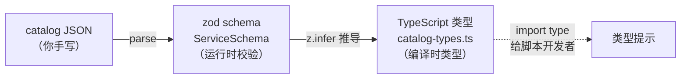

# A1 — FAQ（常见疑问解答）

> 收集中级工程师（3年经验）角色阅读全部文档和代码后提出的疑问，以及扩展 FAQ。

---

## Q1: `saicmotor install` 和 `plugin install` 的关系？

**疑问**：`saicmotor install` 注册的是"内核 skills"（suite + shared），而 `plugin install` 也会注册 skills。这两个操作有什么关系？我能跳过 `saicmotor install` 直接装插件吗？

**回答**：

```
saicmotor install          →  注册内核 skills（suite + shared）到 AI 客户端
saicmotor plugin install   →  注册该插件的 skills + 刷新 suite 路由表
```

**不能跳过 `saicmotor install`**。原因：
- `saicmotor-suite` 是 AI Agent 发现所有业务能力的**统一入口**。没有它，AI 不知道"请假"对应哪个 skill。
- `saicmotor-shared` 包含认证、配置、排障等共享知识，业务 skill 可能引用它。
- `plugin install` 在注册插件 skills 后会调用 `writeSuiteRoutes()` 刷新 suite，但不会创建 `saicmotor-suite` 本身。

**正确顺序**：
```bash
npm install -g @saicmotor/cli   # ① 先装核心
saicmotor install                # ② 注册内核 skills（只跑一次）
saicmotor plugin install leave   # ③ 装插件（每装一个跑一次）
```

> 🔗 详见 [03 安装全流程](./03-installation-flow.md#33-saicmotor-install-vs-plugin-install--分工明确)

---

## Q2: `manifest.scripts` 字段为什么指向编译产物目录？

**疑问**：文档说 `scripts` 是"scripts 根目录"，但 `plugin-developer.md` 提到必须指向 `.js` 产物。三个官方参考插件都声明 `"scripts": "scripts"` 指向 `.ts`——它们的脚本覆盖实际从未生效？为什么文档不直接在 manifest 字段说明里标出？

**回答**：

引擎 `findScript()` 只查找 `.js` 文件（`src/engine/script.ts:56-58`）：

```typescript
path.join(plugin.rootDir, plugin.manifest.scripts, `${rel}.js`)
```

如果 `manifest.scripts = "scripts"`，引擎会在 `<plugin-root>/scripts/<svc>/<res>/<method>.js` 查找——但源码目录里只有 `.ts` 文件。

**正确做法**：声明编译产物目录：

```json
{ "scripts": "dist/scripts" }
```

**为什么三个参考插件有这个 bug？** 它们的测试通过 `SAICMOTOR_SCRIPTS` 环境变量覆盖了查找路径（四层查找的第①层），掩盖了 manifest 配置错误。这是已知待修复项（todo 已登记）。

> 🔗 详见 [10 插件开发指南 §10.5](./10-plugin-development.md#105-脚本开发必要时落代码) 和 [06 执行引擎 §6.3 ③ findScript](./06-engine-pipeline.md#63-管道各步骤详解)

---

## Q3: AI Agent 怎么"发现" saicmotor-suite？

**疑问**：suite SKILL.md 只是一个静态 markdown 表，AI Agent 是怎么读到它的？AI 客户端的 skills 目录到底是什么概念？

**回答**：

这不是 saicmotor 发明的机制——是 AI 客户端（Claude Code、Cursor、CodeBuddy）自身的 skill 系统：

1. **AI 客户端启动时**：扫描 `~/.claude/skills/` 下所有子目录，读取每个 `SKILL.md`
2. **加载到知识库**：将 skill 内容注入到 AI 的上下文（context）中
3. **用户提问时**：AI 在知识库中搜索最匹配的 skill，按 SKILL.md 中的指示执行

saicmotor 只做了**一件事**：用 junction/symlink/copy 把自己的 SKILL.md 放到 AI 客户端的 skills 目录下。之后 AI 客户端的原有机制自动生效。

```
saicmotor 做的事               AI 客户端做的事
─────────────────               ─────────────────
创建 junction：                  扫描 skills/ →
~/.claude/skills/                发现 SKILL.md →
  saicmotor-suite/SKILL.md      加载到知识库
  saicmotor-leave/SKILL.md
  ...（其他 skill）
```

> 🔗 详见 [05 Skills 与 Suite §5.1](./05-skills-and-suite.md#51-背景ai-客户端的-skill-机制) 和 [01 核心概念 §1.2](./01-concepts.md#12-skill--秘书的岗位手册)

---

## Q4: loopback 服务器安全吗？

**疑问**：在 `127.0.0.1:3000` 启动本地 HTTP 服务器等 OAuth 回调——端口冲突怎么办？怎么防 CSRF？超时后会自动关闭吗？

**回答**：

| 关注点 | 回答 |
|--------|------|
| **外部可达性** | loopback 绑定 `127.0.0.1`（不是 `0.0.0.0`），外部网络完全不可达 |
| **CSRF 防护** | 网关在 `/auth/exchange/start` 响应中生成 `state` 参数，回调时校验匹配 |
| **端口冲突** | 3000 被占用时 OAuth 登录直接失败 → 提示用户释放端口或通过 `~/.saicmotor/config.json` 修改 `loopbackPort` |
| **超时** | `callbackTimeoutMs: 120000`（2 分钟），超时后服务器自动关闭 |
| **redirect** | HTTP client 设置 `redirect: "manual"`，不自动跟随重定向 |

这本质上是 OAuth 2.0 PKCE 的标准 loopback redirect 模式，安全性由 OAuth 协议本身保证。

> 🔗 详见 [07 认证体系 §7.2](./07-auth-flow.md#72-exchange-模式飞书-oauth完整流程)

---

## Q5: Catalog JSON ↔ Zod Schema ↔ TypeScript 类型的关系？

**疑问**：catalog 是 JSON 文件，代码里用 `ServiceSchema.parse(raw)` 校验，SDK 里有 `catalog-types.ts`。如果我在 JSON 里加一个字段但 zod schema 不认识会怎样？zod schema 和 TypeScript 类型是什么关系？

**回答**：



**三者不是同一份代码**——zod schema 在 CLI 包（`src/schema/catalog.ts`），TS 类型在 SDK 包（`src/catalog-types.ts`），需手动保持同步。

**加了未知字段会怎样？**
- `ServiceSchema.parse()`：zod 默认**忽略**未知字段，不报错
- `coerceFields()`：只处理 `method.requestBody` 中声明的字段，未知字段被忽略
- 新字段不会有任何效果——CLI 不会注册它对应的参数选项

> 🔗 详见 [10 插件开发指南 §10.4](./10-plugin-development.md#104-catalog--zod-schema--typescript-类型三者关系)

---

## Q6: 为什么 `uninstall.js` 和 `registrar.ts` 各维护一份 AI 客户端列表？

**疑问**：两个文件各有一份 `AI_CLIENT_SKILL_DIRS` 的拷贝，新增客户端需两处同步。为什么不动态生成？

**回答**：

这是技术限制导致的权衡：

- `registrar.ts`：TypeScript 模块，CLI 正常运行时使用
- `uninstall.js`：**CommonJS 脚本**，作为 preuninstall hook 执行——此时 npm 已开始卸载过程，TypeScript 模块可能已不可用

**为什么不动态生成？** 这是一个明确的改进方向。可行的方案：
- 构建时将 `AI_CLIENT_SKILL_DIRS` 从 `registrar.ts` 提取到共享 JSON 文件
- `uninstall.js` 读取该 JSON（纯 Node.js `require`）
- 或在 build 时自动内联写入 `uninstall.js`

当前状态：两处手动维护，文档明确标注。

> 🔗 详见 [05 Skills 与 Suite §5.3](./05-skills-and-suite.md#53-ai-客户端映射)

---

## Q7: linked/ 下为什么不是 `@saicmotor/plugin-*` 而是 `plugin-*`？

**疑问**：`linked/` 下的目录为什么直接叫 `plugin-reimbursement` 而不是 `@saicmotor/plugin-reimbursement`？

**回答**：

`linked/` 是 saicmotor 自己的约定目录，不是 npm 的 `node_modules/`：

| 目录 | 谁创建 | 结构 | 扫描策略 |
|------|--------|------|----------|
| `node_modules/` | npm install | 遵循 npm scope：`@saicmotor/plugin-*` | `scanEntries()` 先找 `@` 开头目录再进找 `plugin-*` |
| `linked/` | `saicmotor dev` | saicmotor 约定：`plugin-*` | `scanEntries()` 直接找 `plugin-*` |

`scanEntries()` 对两个根目录采用**不同策略**：
```typescript
// linked/ → 直接找 plugin-*
if (e.name.startsWith("plugin-")) { result.push(...) }

// node_modules/ → 先找 @scope → 再找 plugin-*
else if (e.name.startsWith("@")) { /* 进入 scope 目录 */ }
```

`saicmotor dev` 用 `fs.symlinkSync(src, dest, "junction")` 建立链接，目标名就是 `plugin-<name>`。

> 🔗 详见 [02 系统架构 §2.6](./02-architecture.md#26-linked-目录设计为什么不是-saicmotorplugin-)

---

## Q8: findScript 四层查找为什么插件还要查 dist/？

**疑问**：既然 `manifest.scripts` 应该指向编译产物目录，为什么还要尝试 `dist/` 前缀？

**回答**：

```typescript
// engine/script.ts:56-60
path.join(plugin.rootDir, plugin.manifest.scripts, `${rel}.js`)         // 主路径
path.join(plugin.rootDir, "dist", plugin.manifest.scripts, `${rel}.js`) // 兜底
```

这是一个兼容性设计——覆盖两种 `tsc` 编译布局：

| tsc outDir | 源码位置 | 产物位置 | manifest.scripts 应声明 |
|------------|----------|----------|------------------------|
| 无（同目录编译） | `scripts/xxx.ts` | `scripts/xxx.js` | `"scripts"` |
| `"dist"` | `scripts/xxx.ts` | `dist/scripts/xxx.js` | `"dist/scripts"` |

如果 manifest 声明 `"scripts": "scripts"` 但 tsc outDir 是 `dist`，产物就在 `<plugin-root>/dist/scripts/<svc>/<res>/<method>.js`——主路径找不到，兜底路径命中。

> 🔗 详见 [06 执行引擎 §6.3 ③](./06-engine-pipeline.md#63-管道各步骤详解)

---

## 扩展 FAQ

### EQ1: 插件升级后旧版 skill junction 会残留吗？

不会。`registerSkill()` 检测到目标已存在时跳过（不覆盖），但 `plugin upgrade` 触发的是完整 install 流程——npm update 会替换包文件，junction 指向的路径不变（junction 指向的是磁盘路径，升级后旧路径的 SKILL.md 内容已更新）。

### EQ2: 两个插件声明了同一个 routes key 怎么办？

`buildSuiteRoutes()` 使用 `Object.assign(routes, plugin.manifest.routes)` ——后加载的覆盖先加载的。加载顺序由插件字母序决定，可预测。

### EQ3: 如何彻底卸载不残留任何东西？

```bash
saicmotor uninstall
```

一键清除：全部 skills + 本地数据 + npm 包。验证：

```bash
saicmotor --version                  # → 命令不可用
ls ~/.claude/skills/saicmotor-*      # → 无结果
ls ~/.saicmotor                       # → 目录不存在
```

---

## 自测答案

### 00 一页全貌

1. `leave` = service.name, `balance` = resource 名, `query` = method 名
2. 不需要改核心代码。需要写 catalog JSON + SKILL.md
3. `~/.saicmotor/token.json`。过期后运行时收到 401 → 自动清除 token → 触发重新登录

### 01 核心概念

1. AI 启动时扫描 `~/.claude/skills/` → 发现 saicmotor-suite → 读路由表 → 匹配"请假"到 saicmotor-leave → 读 saicmotor-leave SKILL.md → 按文档拼出命令
2. catalog/services/meeting-room.json + skills/saicmotor-meeting-room/SKILL.md。不需要改核心
3. `saicmotor install` 注册内核 skills（suite+shared）；`plugin install` 注册业务 skills + 刷新 suite 路由表

### 02 系统架构

1. 只需改编排层（Skills）+ 声明层（Catalog）。不需要改执行层（Engine）和插件层（Plugin System）
2. CLI → SDK：runtime dependency（直接 import）；插件 → SDK：devDependency（仅类型提示，不 import 到代码）
3. Commander 解析 → coerceFields → findScript → ensureToken → send → checkEnvelope → 格式化输出

### 03 安装全流程

1. 不能。AI 读不到 saicmotor-suite 路由表，不知道"请假"对应什么命令
2. `plugin install` 内部自动调用 `writeSuiteRoutes()`，用户不需要手动做任何事
3. 装前：只有 install, uninstall, plugin, auth 等框架命令。装后：多了 leave, attendance 等业务命令。因为业务命令全部来自插件

### 04 插件系统

1. linked 优先于 node_modules——dev 调试时本地版本覆盖已安装版本，方便联调
2. 注销 skills + 刷新 suite 路由表——命令消失 + AI 读不到 skill + suite 表中无路由
3. 先加载者优先；后加载者的同名 service 被过滤（打印警告）

### 05 Skills 与 Suite

1. 卸载插件后路由自动消失——增量追加会产生"幽灵路由"（插件卸载了但路由还在）
2. 不能。三管齐下：命令消失、skill junction 删除、suite 路由移除
3. skill junction 仍在（state.json 没更新），但状态不准确。应该用 `plugin uninstall`

### 06 执行引擎

1. Commander 注册参数时用 `toKebab()`（camelCase → kebab-case），action 中通过 `toCamel()` 还原
2. 需要先查余额再决定是否提交的场景——声明式无法表达"先查再判断"逻辑
3. `SaicmotorError("upstream", "HTTP 500")`，退出码 5

### 07 认证体系

1. `127.0.0.1` 是本地回环地址，外部网络不可达，防止远程攻击者向 loopback 服务器注入虚假回调
2. 通过运行时 401 发现。不存过期时间是因为服务端可能随时 revoke token——客户端过期检查不准确
3. 403 不重试——403 是权限不足（不是 token 过期），重试也解决不了

### 08 配置体系

1. 环境变量最高——`SAICMOTOR_GATEWAY` 覆盖一切
2. `saicmotor.config.json` 的 `defaults.gateway`。其他 auth 路径通常与网关规范一致
3. token 和 credentials 是敏感凭证（600 = 仅本用户读写），config.json 无敏感信息（644 = 所有人可读）

### 09 构建与发布

1. CLI 依赖 SDK 的 runtime import，SDK 类型不存在时 CLI 编译失败
2. 不会——`isGlobalUninstall()` 检查 `npm_config_global === "true"`，不加 `-g` 时不触发
3. AI Agent 读不到 SKILL.md，插件虽然在 plugin list 中有条目但 AI 无法发现其业务能力

### 10 插件开发

1. 可以。`ctx.values` 包含所有通过 `coerceFields` 处理过的值，即使没有 TS 类型也能 `ctx.values.myField`
2. 不会。引擎只找 `.js` 文件，`"scripts"` 目录里是 `.ts`。改为 `"dist/scripts"` 并在 files 中包含
3. 不能通过 suite 路由发现，但 AI 可以通过 skill description 匹配（不推荐依赖于此）